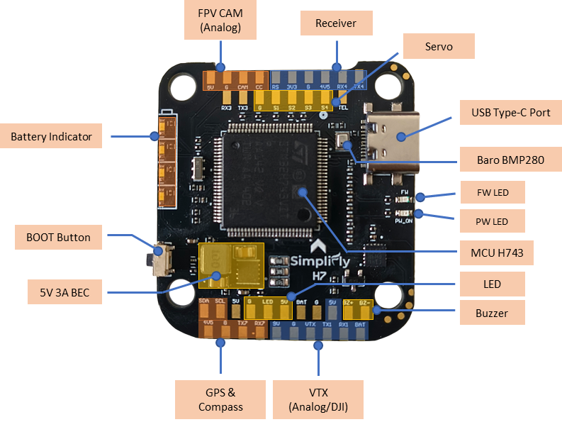
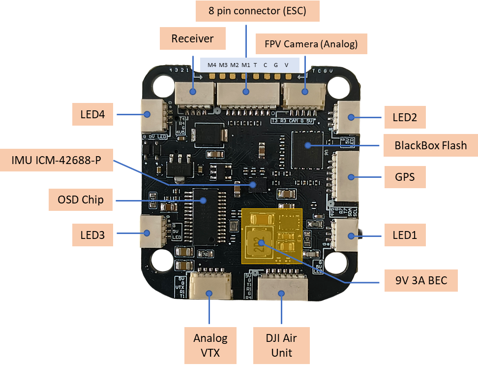

# SimpliFly H7 Flight Controller

The SimpliFly H7 is a flight controller manufactured by [MACFOS](https://www.robu.in).

**Purchase link:** [SimpliFly H7 on robu.in](https://www.robu.in)

## Features

- STM32H743 microcontroller running at 480 MHz
- ICM42688P IMU (SPI, mounted on bottom of PCB)
- BMP280 barometer (I2C)
- AT7456E (MAX7456) OSD chip
- W25Q128FV 128 Mbit (16 MB) onboard dataflash for logging
- 5 UARTs (UART1, UART3, UART4, UART5[RX-only], UART7)
- 4 motor outputs (BDshot capable, all on TIM8)
- 4 servo outputs (TIM4)
- 1 LED strip output (NeoPixel, TIM3)
- I2C for external compass
- Analog RSSI input
- Battery voltage and current sensing
- Buzzer support (inverted, open-drain)
- 9V, 3A regulator, GPIO controlled
- Camera trigger output (CC pad, GPIO relay)
- MicroSD card not present; uses onboard dataflash for logging

## Pinout

### ESC Connector Wiring

The ESC interface is an **8-pin connector** located on the bottom of the board. Pin 1 is on the left when viewed from the bottom with the connector facing you.

| Pin | Label | Function                     | Notes                           |
|-----|-------|------------------------------|---------------------------------|
| 1   | M4    | Motor 4 signal               | TIM8_CH4                        |
| 2   | M3    | Motor 3 signal               | BDshot capable (TIM8_CH3)       |
| 3   | M2    | Motor 2 signal               | TIM8_CH2                        |
| 4   | M1    | Motor 1 signal               | BDshot capable (TIM8_CH1)       |
| 5   | T     | ESC Telemetry RX (UART5)     | RX only                         |
| 6   | C     | Current sense input          | Connect to ESC current signal   |
| 7   | G     | Ground                       |                                 |
| 8   | V     | Battery voltage input        | Connect to battery positive      |

> **Note:** All 4 motor signal pins (M1–M4) share TIM8 and must use the same output protocol (PWM / DShot / BDshot). ESC telemetry is on SERIAL5 — set `SERIAL5_PROTOCOL = 16` (ESC Telemetry) in Mission Planner.

## UART Mapping

| SERIAL Port | Pad Label         | Default Protocol | Notes                    |
|-------------|-------------------|------------------|--------------------------|
| SERIAL0     | USB               | USB              |                          |
| SERIAL1     | TX1, RX1          | DJI FPV (VTX)   | DMA enabled              |
| SERIAL3     | TX3, RX3          | None             | DMA enabled              |
| SERIAL4     | TX4, RX4          | RC Input         | DMA enabled              |
| SERIAL5     | T (ESC connector) | ESC Telemetry    | RX only, no DMA          |
| SERIAL7     | TX7, RX7          | GPS              | DMA enabled              |

## PWM Output

The SimpliFly H7 supports up to 9 PWM outputs.

| Output | Pad Label | Timer    | BDshot | Function             |
|--------|-----------|----------|--------|----------------------|
| PWM1   | M1        | TIM8_CH1 | Yes    | Motor 1              |
| PWM2   | M2        | TIM8_CH2 | Yes    | Motor 2              |
| PWM3   | M3        | TIM8_CH3 | Yes    | Motor 3              |
| PWM4   | M4        | TIM8_CH4 | Yes    | Motor 4              |
| PWM5   | S1        | TIM4_CH1 | Yes    | Servo 1              |
| PWM6   | S2        | TIM4_CH2 | Yes    | Servo 2              |
| PWM7   | S3        | TIM4_CH3 | Yes    | Servo 3              |
| PWM8   | S4        | TIM4_CH4 | Yes    | Servo 4              |
| PWM9   | LED       | TIM3_CH2 | No     | LED Strip (NeoPixel) |

**Timer groups** — all outputs in the same timer group must use the same protocol:

- Group 1: PWM1, PWM2, PWM3, PWM4 (TIM8) — supports PWM, DShot, BDshot
- Group 2: PWM5, PWM6, PWM7, PWM8 (TIM4) — supports PWM, DShot, BDshot
- Group 3: PWM9 (TIM3) — LED strip (NeoPixel/WS2812)

The motor ordering follows the Betaflight/X layout (HAL_FRAME_TYPE 12).

## RC Input

RC input is on the **RX4** pad (UART4). The pad has two operating modes selected by `BRD_ALT_CONFIG`:

**Default (`BRD_ALT_CONFIG = 0`)** — Serial RC protocols via UART4:

- Supports all unidirectional protocols: SBUS, DSM, iBus, SRXL, etc. Connect receiver to the RX4 pad. SERIAL4 is configured for RC Input by default — no parameter changes needed.

For CRSF/ELRS (bi-directional):

- Connect receiver TX to the RX4 pad (SERIAL4 is set to RC Input by default)

**Alternate config (`BRD_ALT_CONFIG = 1`)** — PPM via timer capture (TIM2_CH2):

- Set `BRD_ALT_CONFIG = 1` and reboot
- Connect your PPM receiver signal to the RX4 pad

See [Radio Control Systems](https://ardupilot.org/copter/docs/common-rc-systems.html) for more detail.

## OSD Support

The SimpliFly H7 has a built-in AT7456E (MAX7456) OSD chip on SPI2. The OSD is enabled by default (`OSD_TYPE = 1`).

MSP DisplayPort OSD (`OSD_TYPE2 = 5`) is also enabled by default, allowing simultaneous use of an external DisplayPort OSD device. Configure a free UART for MSP to use this feature.

## 9V supply

The 9V supply is always active at boot. It can be switched on/off in software via `RELAY2` (GPIO 81, assigned by default).

To control the 9V supply:

- `RELAY2_PIN` is set to `81` by default — no additional configuration needed
- Use the relay functions in Mission Planner or via RC switch to toggle the 9V rail on/off

## Camera Switch

Camera control is available on the **CC** pad (GPIO 82).

- GPIO 82 is assigned to `RELAY3` by default (`RELAY3_PIN_DEFAULT 82`)
- Set `CAM_RELAY_ON` and associated parameters to control the camera trigger

## GPIOs

| GPIO | Pad Label | Default       | Function                      |
|------|-----------|---------------|-------------------------------|
| 80   | BZ        | HIGH (silent) | Buzzer (inverted, open-drain) |
| 81   | —         | HIGH          | 9V regulator EN (PINIO1)      |
| 82   | CC        | LOW           | Camera control (RELAY3)       |
| 90   | LED       | LOW           | Status LED                    |

## RSSI / Analog Pins

An analog RSSI input is available on the **RSSI** pad (analog pin 10).

Set `RSSI_ANA_PIN = 10` in Mission Planner to enable analog RSSI reading.

## Battery Monitor

The SimpliFly H7 has onboard voltage and current sensing. Default parameters:

| Parameter        | Value |
|------------------|-------|
| `BATT_MONITOR`   | 4 (Analog voltage and current) |
| `BATT_VOLT_PIN`  | 12 (V pad on ESC connector) |
| `BATT_CURR_PIN`  | 11 (C pad on ESC connector) |
| `BATT_VOLT_MULT` | 11.0 (voltage divider ratio: scales raw ADC voltage to actual battery voltage) |
| `BATT_AMP_PERVLT`| 35.4 (adjust for your current sensor) |

The voltage sensor supports up to 2S-6S LiPo batteries. The current scale value may need adjustment depending on the ESC or current sensor used.

## Compass

The SimpliFly H7 does not have a built-in compass. An external compass can be connected via the I2C connector (SCL, SDA pads). ArduPilot will automatically probe for all supported I2C compass types.

## Loading Firmware

Initial firmware load can be done with DFU by plugging in USB with the
bootloader button pressed. Then you should load the "with_bl.hex"
firmware, using your favourite DFU loading tool.

Once the initial firmware is loaded you can update the firmware using
any ArduPilot ground station software. Updates should be done with the
\*.apj firmware files.
