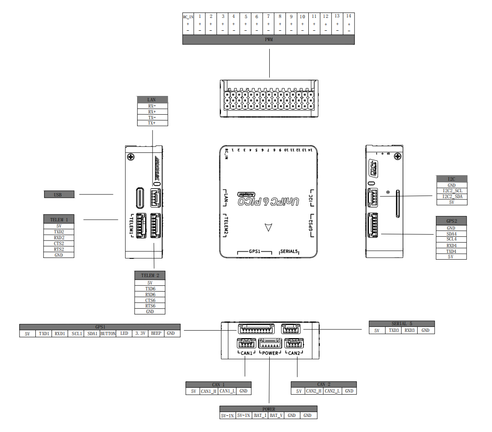

# SIYI UniFC 6 PICO Flight Controller

The SIYI UniFC 6 PICO flight controller is sold by a range of
resellers, linked from [SIYI](https://siyi.biz)

## Features

- STM32H743 microcontroller
- ICM45686 and BMI088 IMUs
- Internal heater for IMU temperature control
- Internal vibration isolation for IMUs
- 2x ICP20100 I2C barometers
- Builtin IST8310 compass
- MicroSD card slot
- 5 UARTs plus USB
- 14 PWM outputs
- I2C and dual CAN ports
- Ethernet port (LAN8742A)
- RCIN port
- External safety Switch
- Voltage monitoring for servo rail and Vcc
- Power input port for external power bricks
- PWM voltage selection (3.3V/5V)
- DFU bootloader support

## Pinout

- Unless noted otherwise all connectors are JST GH1.25mm

## UART Mapping

- SERIAL0 -> USB
- SERIAL1 -> USART2 (Telem1, MAVLink2)
- SERIAL2 -> USART6 (Telem2, MAVLink2)
- SERIAL3 -> USART1 (GPS1)
- SERIAL4 -> UART4 (GPS2)
- SERIAL5 -> USART3 (User)
- SERIAL6 -> USB2 (SLCAN virtual port on USB)

-All UARTs have DMA

The Telem1 and Telem2 ports have RTS/CTS pins, the other UARTs do not have RTS/CTS.

## Connectors

Unless noted otherwise all connectors are JST GH

### TELEM1 port

| Pin | Signal | Volt |
| --- | --- | --- |
| 1 (red) | VCC | +5V |
| 2 (blk) | USART2_TX (OUT) | +3.3V |
| 3 (blk) | USART2_RX (IN) | +3.3V |
| 4 (blk) | USART2_CTS | +3.3V |
| 5 (blk) | USART2_RTS | +3.3V |
| 6 (blk) | GND | GND |

### TELEM2 port

| Pin | Signal | Volt |
| --- | --- | --- |
| 1 (red) | VCC | +5V |
| 2 (blk) | USART6_TX (OUT) | +3.3V |
| 3 (blk) | USART6_RX (IN) | +3.3V |
| 4 (blk) | USART6_CTS | +3.3V |
| 5 (blk) | USART6_RTS | +3.3V |
| 6 (blk) | GND | GND |

### TELEM3 port

| Pin | Signal | Volt |
| --- | --- | --- |
| 1 (red) | VCC | +5V |
| 2 (blk) | USART3_TX (OUT) | +3.3V |
| 3 (blk) | USART3_RX (IN) | +3.3V |
| 4 (blk) | GND | GND |

### GPS1 port

| Pin | Signal | Volt |
| --- | --- | --- |
| 1 (red) | VCC | +5V |
| 2 (blk) | USART1_TX (OUT) | +3.3V |
| 3 (blk) | USART1_RX (IN) | +3.3V |
| 4 (blk) | I2C1_SCL | +3.3V |
| 5 (blk) | I2C1_SDA | +3.3V |
| 6 (blk) | Safety Switch | GND |
| 7 (blk) | Safety LED | GND |
| 8 (blk) | 3.3V | 3.3 |
| 9 (blk) | Buzzer | GND |
| 10(blk) | GND | GND |

### GPS2, Telem4/I2C port

| Pin | Signal | Volt |
| --- | --- | --- |
| 1 (red) | VCC | +5V |
| 2 (blk) | UART4_TX (OUT) | +3.3V |
| 3 (blk) | UART4_RX (IN) | +3.3V |
| 4 (blk) | I2C4_SCL | +3.3V |
| 5 (blk) | I2C4_SDA | +3.3V |
| 6 (blk) | GND | GND |

### I2C port

| Pin | Signal | Volt |
| --- | --- | --- |
| 1 (red) | VCC | +5V |
| 2 (blk) | I2C2_SCL | +3.3 |
| 3 (blk) | I2C2_SDA | +3.3 |
| 4 (blk) | GND | GND |

### CAN1 port

| Pin | Signal | Volt |
| --- | --- | --- |
| 1 (red) | VCC | +5V |
| 2 (blk) | CAN1_H | +12V |
| 3 (blk) | CAN1_L | +12V |
| 4 (blk) | GND | GND |

### CAN2 port

| Pin | Signal | Volt |
| --- | --- | --- |
| 1 (red) | VCC | +5V |
| 2 (blk) | CAN2_H | +12V |
| 3 (blk) | CAN2_L | +12V |
| 4 (blk) | GND | GND |

### POWER1 port

| Pin | Signal | Volt |
| --- | --- | --- |
| 1 (red) | VCC | +5V |
| 2 (red) | VCC | +5V |
| 3 (blk) | CURRENT | +3.3V |
| 4 (blk) | VOLTAGE | +3.3V |
| 5 (blk) | GND | GND |
| 6 (blk) | GND | GND |

### Ethernet port

| Pin | Signal | Volt |
| --- | --- | --- |
| 1 (red) | RX- | +3.3V |
| 2 (blk) | RX+ | +3.3V |
| 3 (blk) | TX- | +3.3V |
| 4 (blk) | TX+ | +3.3V |

### RC-IN port

| Pin | Signal | Volt |
| --- | --- | --- |
| 1 (-) | GND | GND |
| 2 (+) | VDD_5V_RC | +5V |
| 3 (s) | RC_IN | +3.3V |

### I/O PWM OUT port

| Pin | Signal | Volt |
| --- | --- | --- |
| (-) | GND | GND |
| (+) | VDD_SERVO | 0~9.7V externally supplied |
| 1-14 | CH1~14 | +3.3V |

## RC Input

RC input is configured on the RCIN pin, at one end of the PWM IO connector,
and supports all ArduPilot uni-directional protocols. For bi-directional
protocols, such as CRSF/ELRS,  a full UART will need to be used.
See [RC Systems](https://ardupilot.org/copter/docs/common-rc-systems.html)
for setup and connection information.

## PWM Output

The SIYI UniFC 6 PICO supports up to 14 PWM outputs, all directly
attached to the STM32H743. While all 14 channels support PWM protocols,
only channels 1~12 support DShot. Outputs 1-8 support BDShot.

All 14 PWM outputs have GND on the top row, 5V on the middle row and
signal on the bottom row.

The 14 PWM outputs are in 4 groups:

- PWM 1, 2, 3 and 4 in group1
- PWM 5, 6, 7 and 8 in group2
- PWM 9, 10, 11 and 12 in group3
- PWM 13 and 14 in group4

Channels within the same group need to use the same output rate. If
any channel in a group uses DShot then all channels in the group need
to use DShot.

## Battery Monitoring

The board has a dedicated power monitor ports on a 6 pin connector.
If the included power monitor is not used, battery parameters will
need to be changed for the type of power brick which is connected.

The default parameters for battery monitoring are provided:

- BATT_MONITOR 4 (Analog Voltage and Current)
- BATT_VOLT_PIN 4
- BATT_CURR_PIN 5
- BATT_VOLT_MULT 18.182 (adjust as needed if included power monitor not utilized)
- BATT_AMP_PERVLT 36.364 (adjust as needed if included power monitor not utilized)

## Compass

The SIYI UniFC 6 PICO has one builtin IST8310 compass. Usually, users disable this,
and an externally mounted compass is used to avoid power/motor interference.

## GPIOs

The 14 PWM ports can be used as GPIOs (relays, buttons, RPM etc).

The numbering of the GPIOs for PIN variables in ArduPilot is:

- PWM1 50
- PWM2 51
- PWM3 52
- PWM4 53
- PWM5 54
- PWM6 55
- PWM7 56
- PWM8 57
- PWM9 58
- PWM10 59
- PWM11 60
- PWM12 61
- PWM13 62
- PWM14 63

## Analog Inputs

The SIYI UniFC 6 PICO has 2 analog inputs located on the Power connector.

- ADC Pin2 -> Battery Current Sensor
- ADC Pin6 -> Battery Voltage

## IMU Heater

The IMU heater in the SIYI UniFC 6 PICO can be controlled with the
BRD_HEAT_TARG parameter, which is in degrees C.

## Loading Firmware

Firmware for the SIYI UniFC 6 PICO is available from
[ArduPilot Firmware Server](https://firmware.ardupilot.org) in folders marked "SIYI-UniFC-6-Pico".

The board comes pre-installed with an ArduPilot compatible bootloader,
allowing the loading of *.apj firmware files with any ArduPilot
compatible ground station.

The board also supports DFU (Device Firmware Upgrade) mode for
bootloader installation. To enter DFU mode, hold the bootloader
button while powering the board or use the DFU reboot command.
