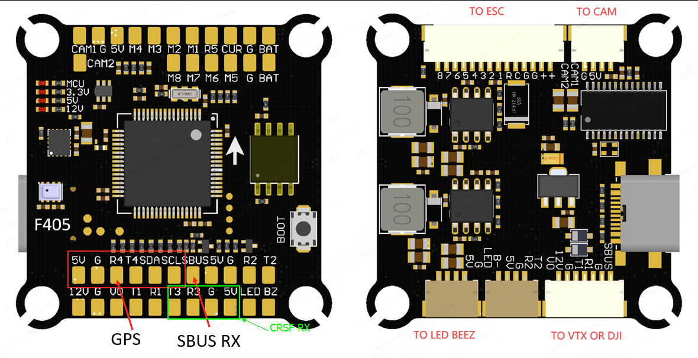

# SPEDIX F405 Flight Controller

The SPEDIX F405 is a flight controller based on the STM32F405 MCU.

## Features

* MCU - STM32F405 32-bit processor running at 168 MHz
* IMU - ICM42688
* Barometer - SPL06
* OSD - AT7456E
* Onboard Flash: 4MByte
* 6x UARTs
* 9x PWM Outputs (8 Motor Output, 1 LED)
* Battery input voltage: 2S-6S
* Dual Camera inputs
* BEC 3.3V 0.5A
* BEC 5V 3A
* BEC 9V 3A for video

## Pinout

## UART Mapping

* SERIAL0 -> USB
* SERIAL1 -> UART1 (MSP DisplayPort, DMA-enabled)
* SERIAL2 -> UART2 (SBUS/Spare)
* SERIAL3 -> UART3 (RCin, DMA-enabled)
* SERIAL4 -> UART4 (GPS)
* SERIAL5 -> UART5 (ESC Telemetry)
* SERIAL6 -> UART6 (Spare)

## RC Input

RC input is configured by default via the USART3 RX input. It supports all serial RC protocols except PPM and SBUS.

Note: If the receiver is FPort the receiver must be tied to the USART3 TX pin using an external bi-directional inverter, RSSI_TYPE set to 3,
and SERIAL3_OPTIONS must be set to 7 (invert TX/RX, half duplex). For full duplex like CRSF/ELRS use both
RX3 and TX3 and set RSSI_TYPE also to 3.

The SBUS pad comprises a hardware inverter connected to USART2_RX. If you wish to use SBUS then set SERIAL3_PROTOCOL to something
other than RCIN and set SERIAL2_PROTOCL to RCIN.

## OSD Support

Onboard OSD using OSD_TYPE 1 (MAX7456 driver) is supported by default. Simultaneously, DisplayPort OSD is available on the HD VTX connector.

## PWM Output

The SPEDIX F405 supports up to 9 PWM outputs. The pads for motor output
M1 to M8 are provided on both the motor connectors and on separate pads, plus
M9 on a separate pad for LED strip (default configuration) or another PWM output.

The PWM is in 4 groups:

* PWM 1-4 in group1
* PWM 5-6 in group2
* PWM 7-8 in group3
* PWM 9 in group4

Channels within the same group need to use the same output rate. If
any channel in a group uses DShot then all channels in the group need
to use DShot. Channels 1-4 support bi-directional dshot.

## Battery Monitoring

The board has a built-in voltage sensor and external current sensor input. The voltage sensor can handle up to 6S
LiPo batteries.

The correct battery setting parameters are:

 - :ref:BATT_MONITOR<BATT_MONITOR> = 4
 - :ref:BATT_VOLT_PIN<BATT_VOLT_PIN__AP_BattMonitor_Analog> = 12
 - :ref:BATT_CURR_PIN<BATT_CURR_PIN__AP_BattMonitor_Analog> = 11 (CURR pin)
 - :ref:BATT_VOLT_MULT<BATT_VOLT_MULT__AP_BattMonitor_Analog> = 11.0
 - :ref:BATT_AMP_PERVLT<BATT_AMP_PERVLT__AP_BattMonitor_Analog> = 50

## Compass

The board has no onboard compass. External compass modules can be connected via the I2C bus (SDA/SCL).

## Camera control

GPIO 82 controls the camera output to the connectors marked "CAM1" and "CAM2". Setting this GPIO low switches the video output from CAM1 to CAM2. By default RELAY3 is configured to control this pin and sets the GPIO high.

## Firmware

Firmware for the SPEDIX F405 is available from [ArduPilot Firmware Server](https://firmware.ardupilot.org) under the `SPEDIXF405` target.

## Loading Firmware

To flash firmware initially, connect USB while holding the bootloader button and use DFU to load the `with_bl.hex` file. Subsequent updates can be applied using `.apj` files through a ground station.
