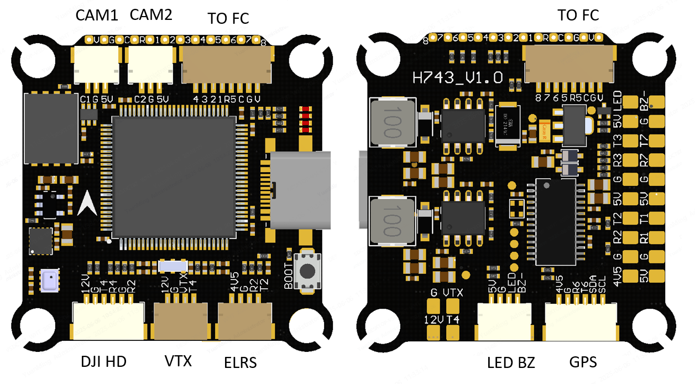

# SPEDIX H743 Flight Controller

The SPEDIX H743 is a flight controller based on the STM32H743 MCU.

## Features

* MCU - STM32H743 32-bit processor running at 480 MHz
* IMU - Dual ICM42688
* Barometer - SPL06
* OSD - MAX7456
* 8x UARTs
* CAN support
* 9x PWM Outputs (8 Motor Output, 1 LED)
* Battery input voltage: 2S-6S
* BEC 3.3V 0.5A
* BEC 5V 3A
* BEC 12V 3A for video, gpio controlled
* Dual camera inputs with switching support

## Pinout

## UART Mapping

* SERIAL0 -> USB
* SERIAL1 -> UART1 (Telem 1, DMA-enabled)
* SERIAL2 -> UART2 (RC Input, DMA-enabled)
* SERIAL3 -> UART3 (Telem 2, DMA-enabled)
* SERIAL4 -> UART4 (MSP DisplayPort, DMA-enabled)
* SERIAL5 -> UART5 (ESC Telemetry)
* SERIAL6 -> UART6 (GPS, DMA-enabled)
* SERIAL7 -> UART7 (Spare)
* SERIAL8 -> UART8 (OTG2)

## RC Input

RC input is configured by default via the USART2 RX input. It supports all serial RC protocols except PPM.

Note: If the receiver is FPort the receiver must be tied to the USART2 TX pin , RSSI_TYPE set to 3,
and SERIAL2_OPTIONS must be set to 7 (invert TX/RX, half duplex). For full duplex like CRSF/ELRS use both
RX2 and TX2 and set RSSI_TYPE also to 3.

## OSD Support

Onboard OSD using OSD_TYPE 1 (MAX7456 driver) is supported by default. Simultaneously, DisplayPort OSD is available on the HD VTX connector.

## PWM Output

The SPEDIX F405 supports up to 9 PWM outputs. The pads for motor output
M1 to M8 are provided on both the motor connectors and on separate pads, plus
M9 on a separate pad for LED strip (default configuration) or another PWM output.

The PWM is in 4 groups:

* PWM 1-4 in group1
* PWM 5-6 in group2
* PWM 7-8 in group3
* PWM 9 in group4

Channels within the same group need to use the same output rate. If
any channel in a group uses DShot then all channels in the group need
to use DShot. Channels 1-8 support bi-directional dshot.

## Battery Monitoring

The board has a built-in voltage sensor and external current sensor input. The voltage sensor can handle up to 6S
LiPo batteries.

The correct battery setting parameters are:

 - :ref:BATT_MONITOR<BATT_MONITOR> = 4
 - :ref:BATT_VOLT_PIN<BATT_VOLT_PIN__AP_BattMonitor_Analog> = 10
 - :ref:BATT_CURR_PIN<BATT_CURR_PIN__AP_BattMonitor_Analog> = 11 (CURR pin)
 - :ref:BATT_VOLT_MULT<BATT_VOLT_MULT__AP_BattMonitor_Analog> = 11.0
 - :ref:BATT_AMP_PERVLT<BATT_AMP_PERVLT__AP_BattMonitor_Analog> = 25

## Compass

No onboard compass. Use external I2C compass via SDA/SCL pads.

## VTX power control

GPIO 82 controls the VTX BEC output to pins marked "12V" and is included on the HD VTX connector. Setting this GPIO low removes voltage supply to this pin/pad. By default RELAY3 is configured to control this pin and sets the GPIO high.

## Camera control

GPIO 83 controls the camera output to the connectors marked "CAM1" and "CAM2". Setting this GPIO low switches the video output from CAM1 to CAM2. By default RELAY4 is configured to control this pin and sets the GPIO high.

## Firmware

Firmware for the SPEDIX H743 is available from [ArduPilot Firmware Server](https://firmware.ardupilot.org) under the `SPEDIXH743` target.

## Loading Firmware

Use DFU (USB + BOOT button) to flash `with_bl.hex` for first time.
Use `.apj` files for subsequent updates via ground station.
