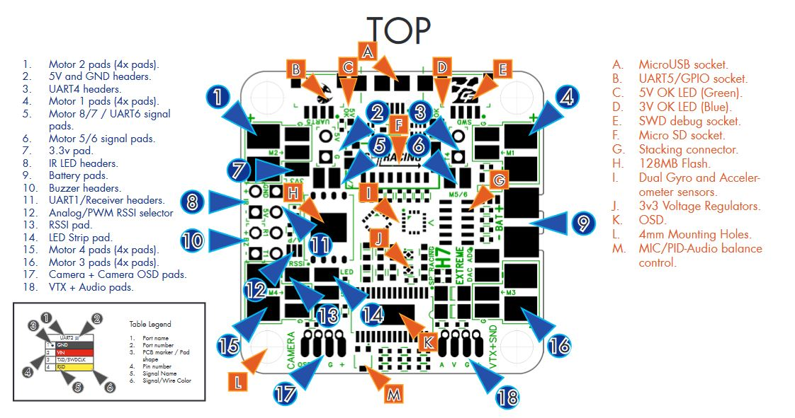

# Serious Pro Racing H6 Extreme Flight Controller

The SPRacingH7 Extreme is a flight controller produced by [Seriously Pro Racing](http://www.seriouslypro.com/).

## Features

 - MCU - STM32H750 32-bit processor running at 400 MHz
 - 128MByte Serial NOR flash via QuadSPI
 - IMUs - 2x ICM20602 (only one enabled by default due to CPU limitations)
 - Barometer - BMP388
 - OSD - AT7456E
 - Onboard Flash: 128Mbits
 - 7x UARTs (1,2,3,4,5,6,8)
 - 11x PWM Outputs (10 Motor Output, 1 LED)
 - Battery input voltage: 2S-6S
 - BEC 5V 1A

## Pinout

## UART Mapping

The UARTs are marked Rn and Tn in the above pinouts. The Rn pin is the
receive pin for UARTn. The Tn pin is the transmit pin for UARTn.

 - SERIAL0 -> USB
 - SERIAL1 -> UART1 (DMA-enabled) RCin
 - SERIAL2 -> UART2 (SmartPort, DMA-enabled, only TX pin)
 - SERIAL3 -> UART3 (DMA-enabled)
 - SERIAL4 -> UART4 (DMA-enabled)
 - SERIAL5 -> UART5 (DMA-enabled)
 - SERIAL6 -> UART6 (On motor pads 7/8, with alt config 1, DMA-enabled)
 - SERIAL8 -> UART8 (DMA-enabled)

## RC Input

RC input is configured on the R1 (UART1_RX) pin. It supports all serial RC
protocols. For protocols requiring half-duplex serial to transmit
telemetry (such as FPort) you should setup SERIAL1 
with half-duplex, pin-swap and inversion enabled.
 
## FrSky Telemetry
 
FrSky Telemetry is supported using the T2 pin (UART2 transmit). You need to set the following parameters to enable support for FrSky S.PORT
 
  - SERIAL2_PROTOCOL 10
  - SERIAL2_OPTIONS 15
  
## OSD Support

The SPRacingH7 supports OSD using OSD_TYPE 1 (MAX7456 driver).

## PWM Output

The SPRacingH7 supports up to 11 PWM outputs. The pads for motor output
M1 to M4 on the motor connectors and M5 to M8 on separate pads, plus
M11 for LED strip or another PWM output. M9 and M10 are only available on the stacking connector.

The PWM is in 5 groups:

 - PWM 1-4   in group1
 - PWM 5, 6  in group2
 - PWM 7, 8  in group3 (can be changed to UART6 TX/RX with alt config 1)
 - PWM 9, 10 in group4
 - PWM 11    in group5 (used for NeoPixel LED)

Channels within the same group need to use the same output rate. If
any channel in a group uses DShot then all channels in the group need
to use DShot. Channels 1-4 support bi-directional dshot.

## Battery Monitoring

The board has a built-in voltage and current sensor. The current
sensor can read up to 130 Amps. The voltage sensor can handle up to 6S
LiPo batteries.

The correct battery setting parameters are:

 - BATT_MONITOR 4
 - BATT_VOLT_PIN 10
 - BATT_CURR_PIN 11
 - BATT_VOLT_MULT 10.9
 - BATT_AMP_PERVLT 28.5

## Compass

The SPRacingH7 does not have a builtin compass, but you can attach an external compass using I2C on the SDA and SCL pads.

## Loading Firmware

Since this board stores the flight control software on external flash the initial firmware load should be done using the
SPRacing SSBL (https://github.com/spracing/ssbl). Please follow the instructions for loading PX4 firmware to load ArduPilot.
A convenience script is provided Tools/scripts/ssbl_uploader.sh to perform the required steps.
It should also be possible to load the ArduPilot bootloader via DFU, but doing so will invalidate your warranty.
