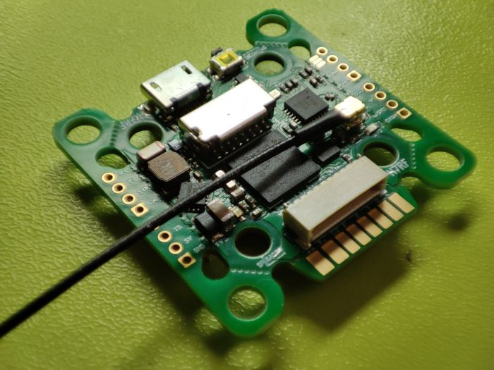
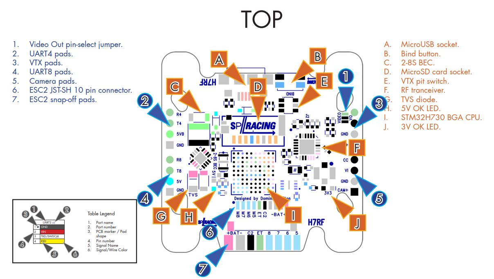
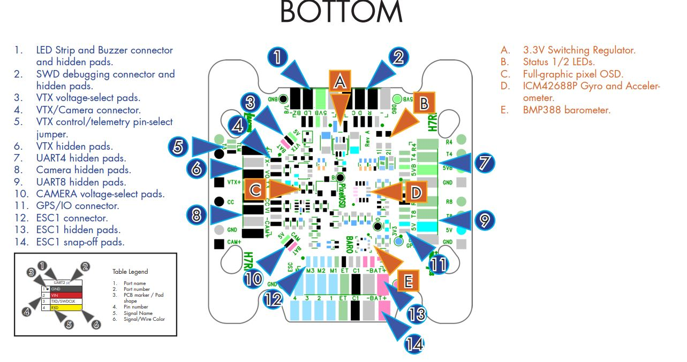
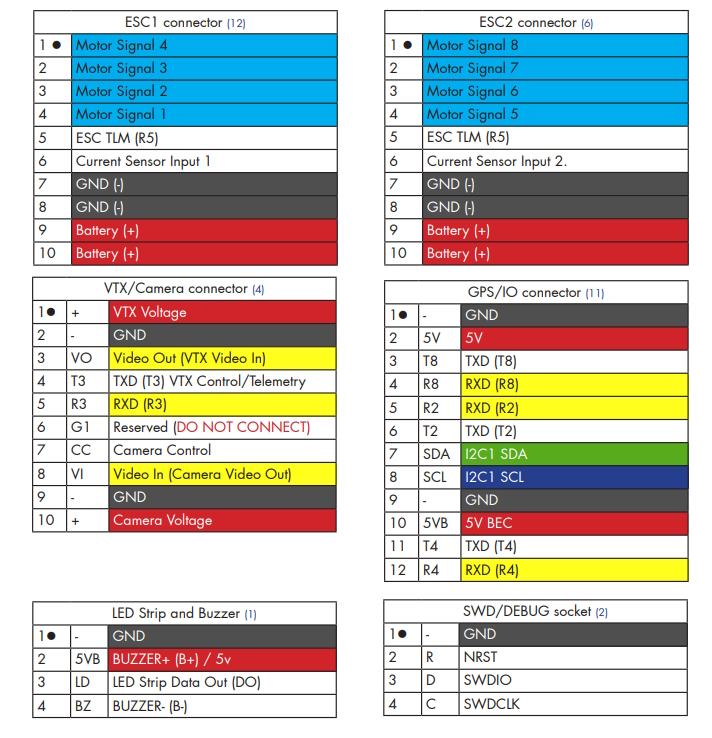

# Serious Pro Racing H7 RF Flight Controller

The SPRacingH7 RF Extreme is a flight controller produced by [Seriously Pro Racing](http://www.seriouslypro.com/).

## Features

 - MCU - STM32H730 32-bit processor running at 520 MHz
 - 2MByte Serial NOR flash via QuadSPI for firmware
 - IMUs - ICM42688
 - Barometer - BMP388
 - OSD - Pixel, not supported currently by ArduPilot
 - I2C port
 - Onboard Flash: 128Mbits
 - Integrated ELRS receiver, not supported currently by ArduPilot 
 - microSD card socket
 - 5x UARTs (2,3,4,5,8)
 - 9x PWM Outputs (8 Motor Output, 1 LED)
 - Battery input voltage: 2S-8S
 - BEC 5V ?A

## Pinout

## UART Mapping

The UARTs are marked Rn and Tn in the above pinouts. The Rn pin is the
receive pin for UARTn. The Tn pin is the transmit pin for UARTn.

 - SERIAL0 -> USB
 - SERIAL2 -> UART2 (RC input)
 - SERIAL3 -> UART3 (DJI)
 - SERIAL4 -> UART4 (GPS)
 - SERIAL5 -> UART5 (ESC Telemetry, RX only)
 - SERIAL8 -> UART8 (USER)
 
 All UARTS are DMA capable

## RC Input

Ardupilot does not currently support the integrated ELRS chip.

RC input is configured on the R2 pin. It supports all serial RC
protocols. PPM is not supoorted. For protocols requiring half-duplex serial to transmit
telemetry (such as FPort) you should setup SERIAL2 as an RC input serial port,
with half-duplex, pin-swap and inversion enabled. For duplex protocols, like CRSF/ELRS, T2 must also be connected to the receiver.
 
  
## Pixel OSD Support

Ardupilot does not currently support the integrated OSD chip. UART3 is setup fir use with DisplayPort goggles with OSD.

## PWM Output

The SPRacingH7 RF supports up to 9 PWM outputs. PWM 1-8 support DShot and Bi-Directional DShot. The pads for motor output
M1 to M4 on ESC connector 1, and M5 to M8 on ESC connector 2, plus
M9 for LED strip or another PWM output.

The PWM is in 5 groups:

 - PWM 1-4   in group1
 - PWM 5-8  in group2
 - PWM 9 (LED)  in group3

Channels within the same group need to use the same output rate. If
any channel in a group uses DShot then all channels in the group need
to use DShot.

## Battery Monitoring

The board has a built-in voltage sesnor and current sensor input from the ESC connectors. The voltage sensor can handle up to 8S
LiPo batteries.

The correct battery setting parameters are:

 - BATT_MONITOR 4
 - BATT_VOLT_PIN 13
 - BATT_CURR_PIN 11
 - BATT_VOLT_MULT 10.9
 - BATT_AMP_PERVLT 28.5 (will need adjustment for the current sensor range of the ESC)

## Compass

The SPRacingH7 RF does not have a builtin compass, but you can attach an external compass using I2C on the SDA and SCL pads.

## User Manual

http://seriouslypro.com/files/SPRacingH7RF-Manual-latest.pdf

## Loading Firmware

Since this board stores the flight control software on external flash the initial firmware load should be done using the
SPRacing SSBL (https://github.com/spracing/ssbl). Please follow the instructions for loading PX4 firmware to load ArduPilot.
A convenience script is provided Tools/scripts/ssbl_uploader.sh to perform the required steps.
It should also be possible to load the ArduPilot bootloader via DFU, but doing so will invalidate your warranty.
