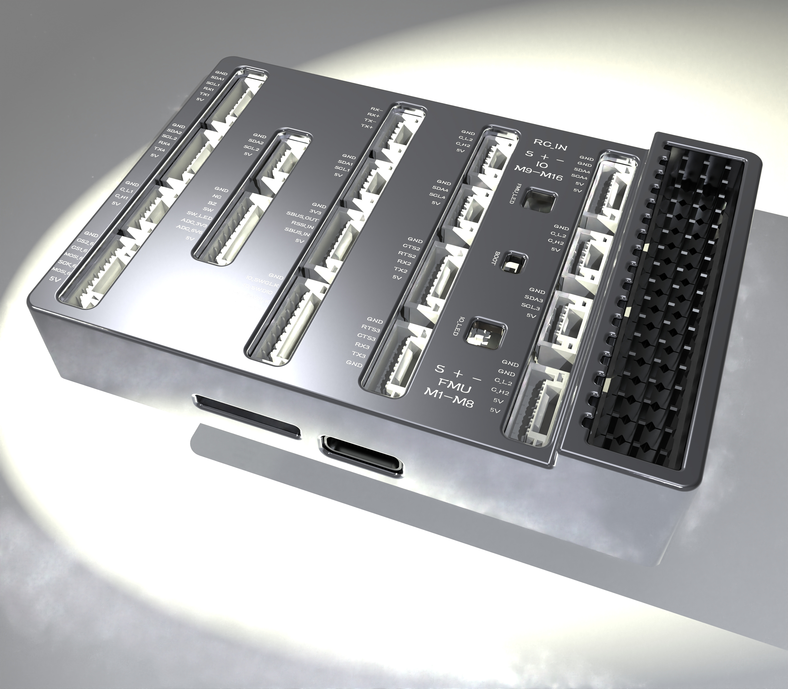

# SULILGH7P1/P2 Flight Controller

## This firmware is compatible with SULILGH7-P1 and SULILGH7-P2.

This is the open-source hardware I have released, and you can find more details at the following link: [OSHW Hub](https://oshwhub.com/shuyedeye/p1-flight-control.)

## Features:

- Separate flight control core design.
- MCU

   STM32H743IIK6 32-bit processor running at 480MHz
   2MB Flash
   1MB RAM

- IO MCU

   STM32F103

- Sensors
- IMU:

   P2:Internal Vibration Isolation for IMUs
   P2:IMU constant temperature heating(1 W heating power).
   With Triple Synced IMUs, BalancedGyro technology, low noise and more shock-resistant:
   IMU1-BMI088(With vibration isolation)
   IMU2-ICM42688-P(With vibration isolation)
   IMU3-ICM20689(No vibration isolation)

- Baro:

   Two barometers:Baro1-BMP581 , Baro2-ICP20100
  Magnetometer:   Builtin IST8310 magnetometer

## UART Mapping

The UARTs are marked Rn and Tn in the above pinouts. The Rn pin is the receive pin for UARTn. The Tn pin is the transmit pin for UARTn.
| Name    | Function | MCU PINS |   DMA   |
| :-----: | :------: | :------: | :------:|
| SERIAL0 | OTG1     | USB      |
| SERIAL1 | Telem1   | USART2   |DMA Enabled |
| SERIAL2 | Telem2   | USART3   |DMA Enabled |
| SERIAL3 | GPS1     | USART1   |DMA Enabled |
| SERIAL4 | GPS2     | UART4    |DMA Enabled |
| SERIAL5 | RC       | UART8    |DMA Enabled |
| SERIAL7 |FMU DEBUG | UART7    |DMA Enabled |
| SERIAL8 | OTG-SLCAN| USB      |

## RC Input

The RCIN pin, which by default is mapped to a timer input, can be used for all ArduPilot supported receiver protocols, except CRSF/ELRS and SRXL2 which require a true UART connection. However, FPort, when connected in this manner, will only provide RC without telemetry.

To allow CRSF and embedded telemetry available in Fport, CRSF, and SRXL2 receivers, a full UART, such as SERIAL5 (UART8) would need to be used for receiver connections. Below are setups using Serial5.

- :ref:`SERIAL5_PROTOCOL<SERIAL5_PROTOCOL>`  should be set to "23".
- CRSF would require  :ref:`SERIAL5_OPTIONS<SERIAL5_OPTIONS>`  set to "0".
- SRXL2 would require :ref:`SERIAL5_OPTIONS<SERIAL5_OPTIONS>` set to "4". And only connect the TX pin.

- The SBUS_IN pin is internally tied to the RCIN pin.

Any UART can also be used for RC system connections in ArduPilot and is compatible with all protocols except PPM. See :ref:`Radio Control Systems <common-rc-systems>` for details.

## PWM Output

The SULILLGH7-P1/P2 flight controller supports up to 16 PWM outputs.
First 8 outputs (labelled 1 to 8) are controlled by a dedicated STM32F103 IO controller.
The remaining 8 outputs (labelled 9 to 16) are the "auxiliary" outputs. These are directly attached to the STM32H753 FMU controller.
All 16 outputs support normal PWM output formats. All 16 outputs support DShot, except 15 and 16.

The 8 IO PWM outputs are in 4 groups:

- Outputs 1 and 2 in group1
- Outputs 3 and 4 in group2
- Outputs 5, 6, 7 and 8 in group3

The 8 FMU PWM outputs are in 4 groups:

- Outputs 1, 2, 3 and 4 in group1
- Outputs 5 and 6 in group2
- Outputs 7 and 8 in group3

Channels within the same group need to use the same output rate. If any channel in a group uses DShot then all channels in the group need to use DShot.

## GPIO

All PWM outputs can be used as GPIOs (relays, camera, RPM etc). To use them you need to set the output’s SERVOx_FUNCTION to -1. The numbering of the GPIOs for PIN variables in ArduPilot is:

| IO Pins |  | FMU Pins |
| --- | --- | --- |
| Name | Value | Option |
|  | Name | Value |
| Option | M1 | 101 |
| MainOut1 |  | M9 |
| 50 | AuxOut1 | M2 |
| 102 | MainOut2 |  |
| M10 | 51 | AuxOut2 |
| M3 | 103 | MainOut3 |
|  | M11 | 52 |
| AuxOut3 | M4 | 104 |
| MainOut4 |  | M12 |
| 53 | AuxOut4 | M5 |
| 105 | MainOut5 |  |
| M13 | 54 | AuxOut5 |
| M6 | 106 | MainOut6 |
|  | M14 | 55 |
| AuxOut6 | M7 | 107 |
| MainOut7 |  | M15 |
| 56 |  | M8 |
| 108 | MainOut8 |  |
| M16 | 57 |  |

## Battery Monitoring

Two DroneCAN power monitor interfaces have been configured
These are set by default in the firmware and shouldn't need to be adjusted.

## Compass

The P1/P2 flight controllers have an integrated IST8310 high-precision magnetometer.

## Analog inputs

The P1/P2 flight controller has 2 analog inputs.

- ADC Pin12 -> ADC 6.6V Sense
- ADC Pin13 -> ADC 3.3V Sense
- RSSI input pin = 103

## Loading Firmware

The board comes pre-installed with an ArduPilot compatible bootloader, allowing the loading of xxxxxx.apj firmware files with any ArduPilot compatible ground station.

Firmware for these boards can be found [here](https://firmware.ardupilot.org/) in sub-folders labeled “SULIGH7-P1-P2”.
