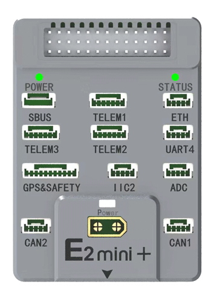
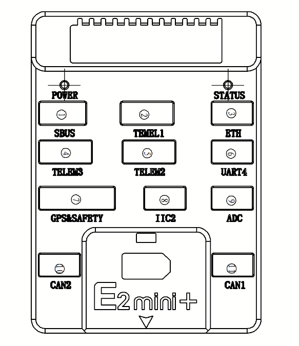
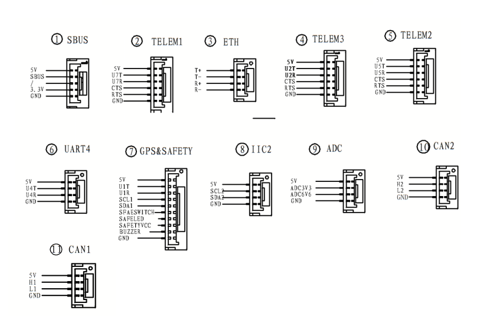
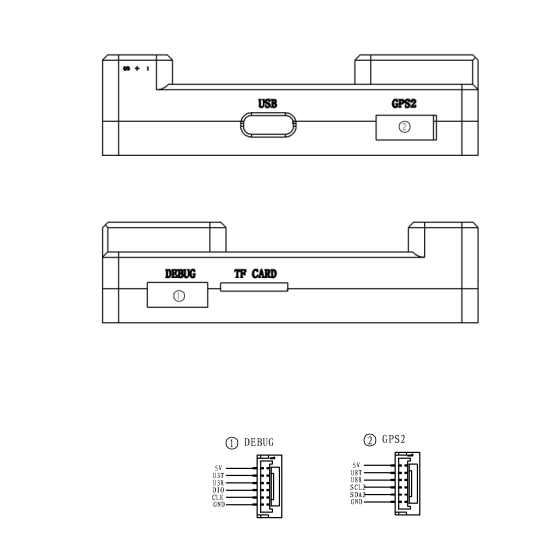

# S-Vehicle E2-mini Flight Controller

The S-Vehicle E2-mini Flight Controller produced by [S-Vehicle](http://svehicle.cn).

## Features

- STM32H743IIK6 microcontroller
- 2 IMUs: Bosch BMI088, InvenSense ICM-42688P
- bmm150 magnetometer
- bmp388 barometers
- microSD card slot
- 1 ETH network interface
- 6 UARTs plus USB
- USB-TypeC port
- 14 PWM outputs
- PPM/SBus input, DSM/SBus input
- 3 I2C ports
- 2 CAN ports
- 100Mbps Ethernet port
- 1 power monitor inputs (XT30 port)

## Pinout

## UART Mapping

- SERIAL0 -> USB (MAVLink2)
- SERIAL1 -> UART7 (TELEM1, MAVLink2)
- SERIAL2 -> UART5 (TELEM2, MAVLink2)
- SERIAL3 -> USART1 (GPS1/Compass/Safety Switch)
- SERIAL4 -> UART8 (GPS2/Compass)
- SERIAL5 -> USART2 (TELEM3,USER)
- SERIAL6 -> UART4 (User)
- SERIAL7 -> USART3 (Debug,USER)
- SERIAL8 -> USART6 (RX pin only, USER)

Except for USART6, all UARTS have full dma capability

## RC Input

SBUS (USART6) can be used as an RC Input.

## PWM Output

The E2mini flight controller supports up to 12 PWM outputs. All outputs except PWM9 and PWM10 support DShot.

The 14 PWM outputs are in 4 groups:

- PWM 1-4 in group1 (TIM5)
- PWM 5-8 in group2 (TIM4)
- PWM 9, 10 in group3 (TIM12)
- PWM 11,12 in group4 (TIM3)

Channels within the same group need to use the same output rate. If any channel in a group uses DShot then all channels in the group need to use DShot.

## GPIOs

The complete list of GPIOS is:

| Label | GPIO number |
|---|---|
| PWM(1) | 50 |
| PWM(2) | 51 |
| PWM(3) | 52 |
| PWM(4) | 53 |
| PWM(5) | 54 |
| PWM(6) | 55 |
| PWM(7) | 56 |
| PWM(8) | 57 |
| PWM(9) | 58 |
| PWM(10) | 59 |
| PWM(11) | 60 |
| PWM(12) | 61 |

## Battery Monitoring

The board has a XT30 port,it can receive power input ranging from 2 to 14s, and it integrates a step-down module internally,in this way, an external voltage reduction module can be avoided, and the board can read the input voltage through the internal ADC.

## Compass

The board has a XT30 port marked POWER, and it can accept voltage inputs ranging from 2 to 14s providing an internal step-down module for the autopilot board power, avoiding the need for an external power module. Default parameters for the battery voltage and current monitor are provided. Note: that only the current consumed by the autopilot and its peripherals is reported.  Separate monitoring of motor current via external ESCs is NOT provided. A DroneCAN current monitor could be used for this.

## Analog Inputs

The E2-mini has one analog inputs.

- ADC Pin9 -> Battery Voltage

## Loading Firmware

Firmware for these boards can be found at the [ArduPilot firmware server](https://firmware.ardupilot.org) in sub-folders labeled "SVehicle-E2-mini".

The board comes pre-installed with an ArduPilot compatible bootloader, allowing the loading of *.apj firmware files with any ArduPilot compatible ground station.
