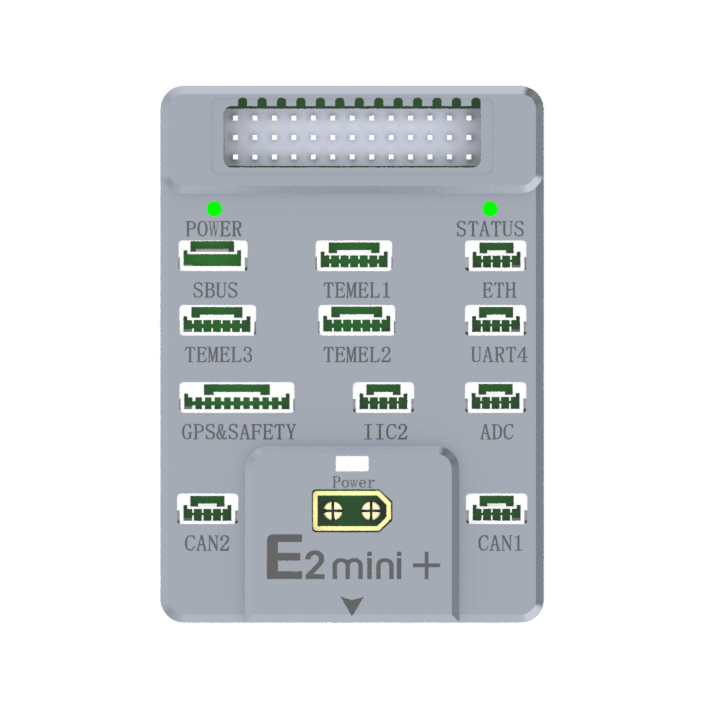
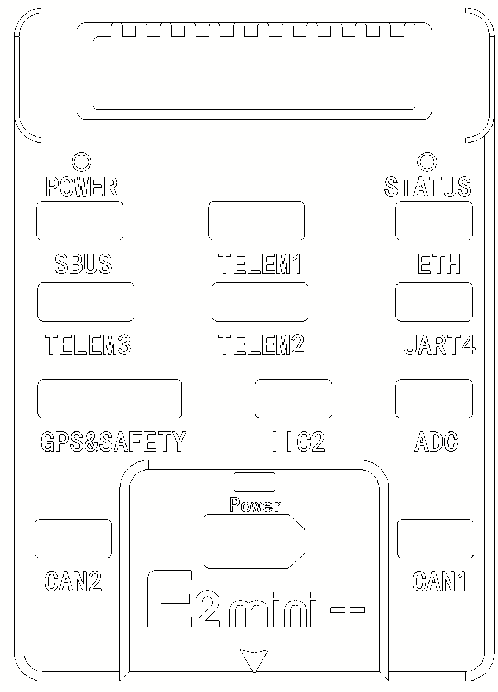
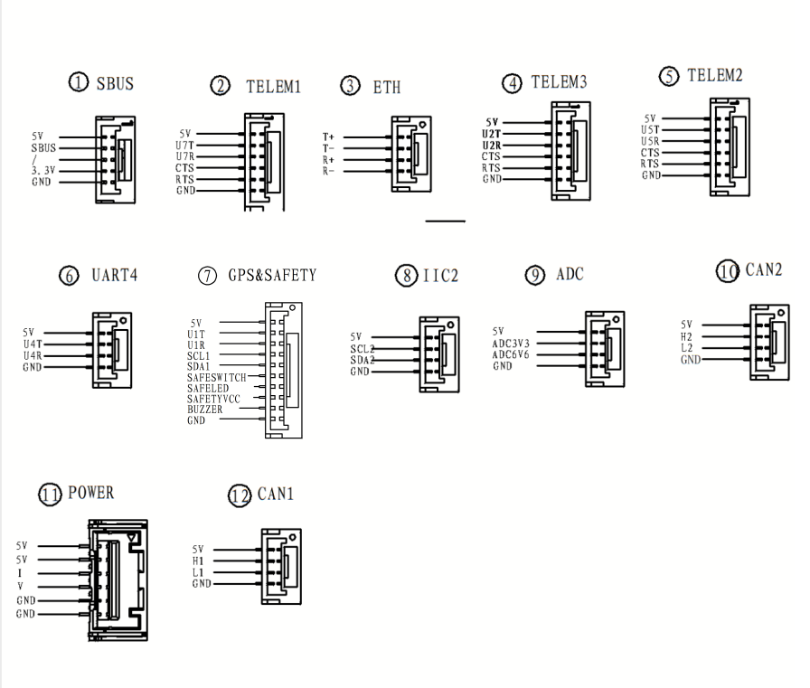
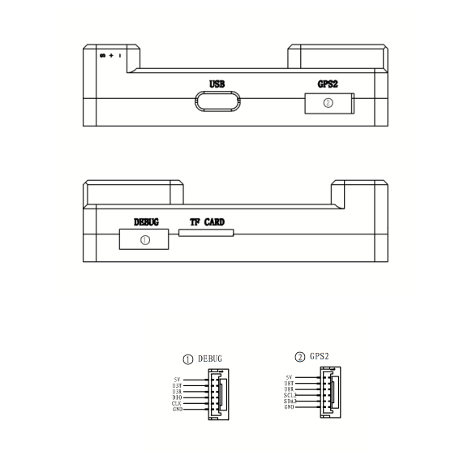
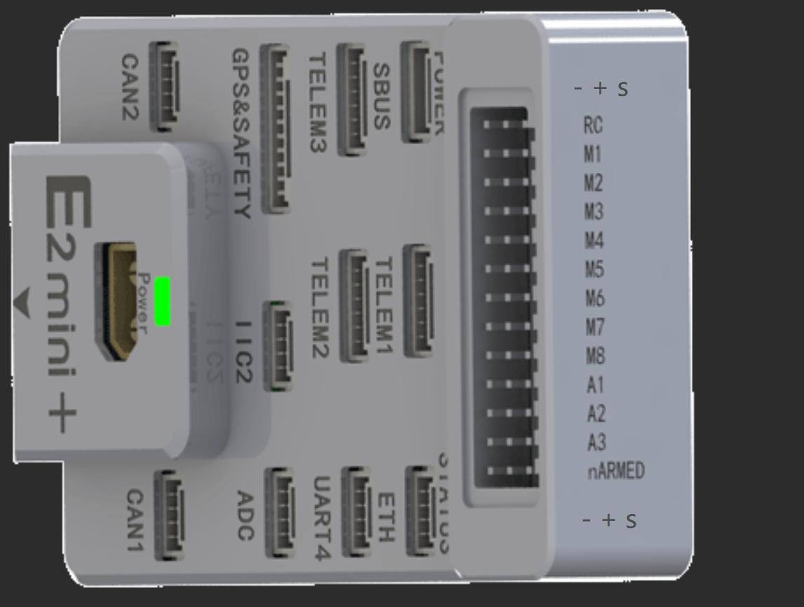

# S-Vehicle E2-mini Flight Controller

The S-Vehicle E2-mini Flight Controller is produced by [S-Vehicle](https://vekopilot.com/controller/E2mini).

## Where to Buy

The S-Vehicle E2-mini can be purchased from the [S-Vehicle Taobao store](https://item.taobao.com/item.htm?app=weixin&bc_fl_src=share-1041486146498975-2-1&bxsign=scdyWkl69wvJGdhJnDBdSiWK5gnrjJ9d2Y1ndnqMR_Jw8EioIEl4LzByNX8EVZwkTGqwo5_BfcKZlQ-EwcNZ2_C8Ql3ICpUPV-pndJc40EAzc9UTF8YpGb3W73pEcVJgDKk&cpp=1&h5_spm=a-tb-item.b-tb-item&id=979235006993&share_crt_v=1&shareurl=true&short_name=h.8WeXfx3Xj8SNGSv&sp_tk=a0dDZWd2cmRheWM%3D&spm=a2159r.13376460.0.0&tbSocialPopKey=shareItem&tk=kGCegvrdayc&un=17b030cf631385228b237b7ae5029d41&un_site=0&ut_sk=1.YJPJSr4nDegDAB9wJv7kqJar_21380790_1785202282800.Copy.1&wxsign=tbwH-h0G86wPTTE9NAvBScV1hwIMX8867mPO_84Sl0Zy99bkwsDry_bvK0YHc9czLIBpOdi-dmdB_vl5K63pEP9Ioe_I66rw9gVnPTOLwvagKSXNAXURPOqkan23tg4_rL9&x-ssr=true).

## Specifications

- Processor
  - STM32H743IIK6 microcontroller
- Sensors
  - Bosch BMI088 IMU
  - InvenSense ICM-42688P IMU
  - BMM150 magnetometer
  - BMP388 barometer
- Interfaces
  - USB Type-C port
  - microSD card slot
  - 100Mbps Ethernet port
  - 8 serial ports plus USB, including one RX-only serial input
  - 2 CAN ports
  - I2C connectors for external GPS/compass peripherals
  - 11 PWM outputs
  - PPM/SBus input and DSM/SBus input
- Power
  - XT30 POWER connector
  - 2S to 14S voltage input
  - Analog voltage and current monitor
- Dimensions
  - 40 x 60 mm
  - 41 g

## Pinout

## Analog Inputs

The AD&IO connector provides two analog inputs:

| Label | Pin | ArduPilot analog input |
|---|---|---|
| ADC6V6 | PC2 | 12 |
| ADC3V3 | PC3 | 13 |

## I2C Connectors

The IIC2 connector maps to `I2C2` and is intended for an external compass or GPS/compass module.

## UART Mapping

| Port | UART | Protocol | TX DMA | RX DMA |
|---|---|---|---|---|
| SERIAL0 | OTG1 | MAVLink2 | No | No |
| SERIAL1 | UART7 | MAVLink2 | Yes | Yes |
| SERIAL2 | UART5 | MAVLink2 | Yes | Yes |
| SERIAL3 | USART1 | GPS | Yes | Yes |
| SERIAL4 | UART8 | GPS | Yes | Yes |
| SERIAL5 | USART2 | MAVLink2 | Yes | Yes |
| SERIAL6 | UART4 | None | Yes | Yes |
| SERIAL7 | USART3 | None | Yes | Yes |
| SERIAL8 | USART6 | RCIN | n/a | Yes |

All configured UARTs have DMA capability. TELEM1, TELEM2, and TELEM3 also provide hardware flow control (RTS/CTS). USART6 is RX only.

## RC Input

RC input is configured by default on the `SBUS` pad. The `SBUS` pad is USART6 RX, which maps to SERIAL8. SERIAL8 is configured for RC input by default (`SERIAL8_PROTOCOL` = `23`), so an SBUS receiver connected to the `SBUS` pad works out of the box. The separate `RC` pad is not used by this hwdef.

For bi-directional or half-duplex protocols such as CRSF/ELRS or SRXL2, a spare full UART must be used instead. SERIAL6 (UART4, User) is available for this; set `SERIAL6_PROTOCOL` to `23`. See [Radio Control Systems](https://ardupilot.org/copter/docs/common-rc-systems.html) for details on setting up UART-based RC protocols.

## PWM Output

The E2-mini flight controller supports 11 PWM outputs, labeled `M1`-`M8` and `A1`-`A3` on the board.

For each PWM output connector, the pins are ordered from top to bottom as `GND` (`-`), `5V` (`+`), and `Signal` (`S`) when viewed as shown in the PWM pinout image.

The outputs are in 4 groups:

- M1-M4 in group1 (TIM5). All four support DShot and bidirectional DShot (BDShot).
- M5-M8 in group2 (TIM4). All four support DShot and bidirectional DShot (BDShot).
- A1-A2 in group3 (TIM12). PWM only, no DShot support.
- A3 in group4 (TIM3). Supports DShot.

Channels within the same group need to use the same output rate. If any channel in a group uses DShot then all channels in the group need to use DShot.

## GPIOs

The complete list of GPIOS is:

| Label | GPIO number |
|---|---|
| M1 | 50 |
| M2 | 51 |
| M3 | 52 |
| M4 | 53 |
| M5 | 54 |
| M6 | 55 |
| M7 | 56 |
| M8 | 57 |
| A1 | 58 |
| A2 | 59 |
| A3 | 60 |
| Buzzer | 77 |

## Battery Monitoring

The board has a XT30 port marked POWER, and it can accept voltage inputs ranging from 2 to 14s providing an internal step-down module for the autopilot board power, avoiding the need for an external power module. Default parameters for the battery voltage and current monitor are provided. Note: that only the current consumed by the autopilot and its peripherals is reported. Separate monitoring of motor current via external ESCs is NOT provided. A DroneCAN current monitor could be used for this.

### Default Parameters

The default battery monitor parameters are set as follows:

- `BATT_MONITOR` : `4` (Analog Voltage and Current)
- `BATT_VOLT_PIN` : `6`
- `BATT_CURR_PIN` : `9`
- `BATT_VOLT_MULT` : `21.0`
- `BATT_AMP_PERVLT` : `24.0`

Ensure physical components match these scaling ratios. If a different power module or current sensor is used, adjust `BATT_VOLT_MULT` and `BATT_AMP_PERVLT` accordingly in Mission Planner or ArduPilot's parameter editor.

## Compass

The E2-mini has a built-in BMM150 compass, but due to interference the board is usually used with an external I2C or DroneCAN compass as part of a GPS/Compass combination.

## Arm/Disarm Status Output (nARMED)

The board provides an `nARMED` status signal on pin **PB5** to drive an external LED or relay, indicating the current flight controller state.

- **Type**: GPIO Push-Pull Output (3.3V logic level).
- **Logic Level**: Active Low.
- **HIGH (3.3V)**: Vehicle is **Disarmed** (Safe state, motors are disabled).
- **LOW (0V)**: Vehicle is **Armed** (Motors are allowed to spin).
- **Default State**: On power-up and during normal boot, the pin defaults to HIGH (Disarmed) for safety.

## Loading Firmware

Firmware for these boards can be found at the [ArduPilot firmware server](https://firmware.ardupilot.org) in sub-folders labeled "SVehicle-E2-mini".

The board comes pre-installed with an ArduPilot compatible bootloader, allowing the loading of *.apj firmware files with any ArduPilot compatible ground station.
