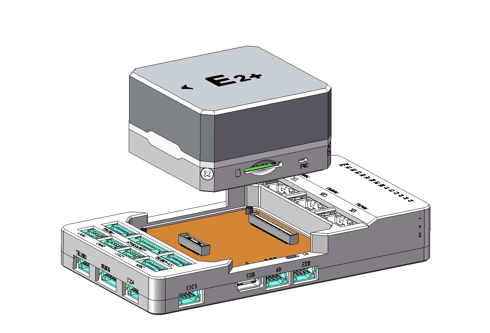
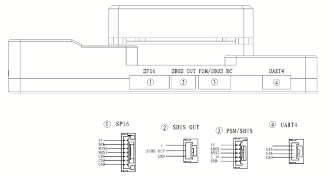
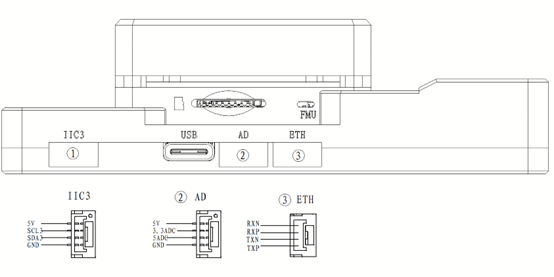
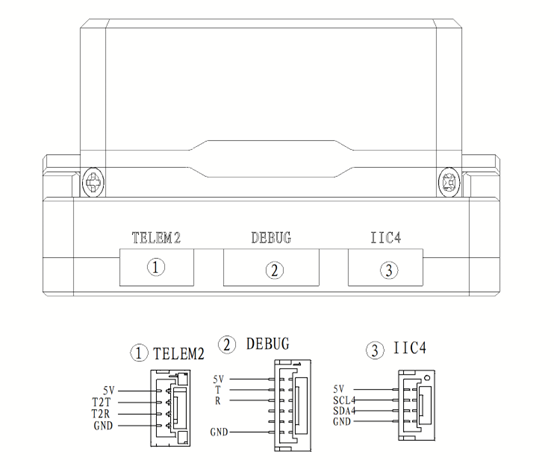

# S-Vehicle E2-Plus Flight Controller

The S-Vehicle E2-Plus Flight Controller produced by [S-Vehicle](http://svehicle.cn).

## Features

- STM32H753IIK6 microcontroller
- STM32F103 microcontroller
- 3 IMUs: Bosch BMI088, InvenSense ICM-20649, InvenSense ICM-42688P
- RM3100 magnetometer
- dual ICP-20100 barometers
- microSD card slot
- 1 ETH network interface
- 6 UARTs plus USB
- USB-TypeC port
- 14 PWM outputs
- PPM/SBus input, DSM/SBus input
- 3 I2C ports
- 2 CAN ports 
- Analog RSSI input
- 100Mbps Ethernet port
- 3 power monitor inputs

# IOMCU

This board has an IOMCU implemented on a STM32F103 microcontroller which, manages 

## Pinout

## UART Mapping

- SERIAL0 -> USB (MAVLink2)
- SERIAL1 -> UART7 (TELEM1, MAVLink2)
- SERIAL2 -> UART5 (TELEM2, MAVLink2)
- SERIAL3 -> USART1 (GPS1/Compass/Safety Switch)
- SERIAL4 -> UART8 (GPS2/Compass)
- SERIAL5 -> USART2 (TELEM3, RS422)
- SERIAL6 -> UART4 (User)
- SERIAL7 -> USART3 (Debug)
- SERIAL8 -> USB Virtual

All UARTs have full DMA capability. TELEM3 can be used as an RS422 interface, the driver is included.

## RC Input

RC input is configured on the RCIN pin, at one end of the servo rail, marked PPM in the above diagram. All ArduPilot supported unidirectional RC protocols can be input here including PPM. For bi-directional or half-duplex protocols, such as CRSF/ELRS a full UART will have to be used. See :ref:`common-rc-systems` for details on USRT setup for other protocols.

## PWM Output

The E2-Plus flight controller supports up to 14 PWM outputs. 
First 8 outputs (labelled M1 to M8) are controlled by a dedicated STM32F103 IOMCU controller. 
The remaining 6 outputs (labelled 9 to 16) are the "auxiliary" outputs. These are directly attached to the STM32H753 FMU controller .

The 14 PWM outputs are:

M1 - M8 are connected to the IOMCU
A1 - A6 are connected to the FMU

M1 - M8 support DShot and are in 3 groups:

- M1, M2 in group 1
- M3, M4 in group 2
- M5, M6, M7, M8 in group 3

The 6 FMU PWM outputs are in 2 groups:

A1 - A4 are in one group. 
A5, A6 are in a 2nd group.

Channels within the same group need to use the same output rate. If any channel in a group uses DShot then all channels in the group need to use DShot.

#### GPIOs

Two of the PWM ports on the FMU labeled A5 and A6, can be used as GPIOs (relays, buttons, RPM etc). To use them you need to limit the number of these pins that are used for PWM by setting the BRD_PWM_COUNT to a number less than 6. For example if you set BRD_PWM_COUNT to 4 then PWM A5 and PWM A6 will be available for use as GPIOs.

The numbering of the GPIOs for PIN variables in ArduPilot is:

- AUX5 54
- AUX6 55

The complete list of GPIOS is:

| Label | GPIO number |
|---|---|
| PWM(1) | 50 |
| PWM(2) | 51 |
| PWM(3) | 52 |
| PWM(4) | 53 |
| PWM(5) | 54 |
| PWM(6) | 55 |
| PWM(7) | 56 |
| PWM(8) | 57 |
| FMU_CAP1 | 58 |
| NFC_GPIO | 60 |
| HEATER_EN | 80 |
| SPEKTRUM_PWR | 73 |
| LED_RED | 90 |
| LED_GREEN | 91 |
| LED_BLUE | 92 |
| SP3_DRDY2 | 93 |
| ALARM | 77 |
| PWM_VOLT_SEL | 81 |
| MAIN(1) | 101 |
| MAIN(2) | 102 |
| MAIN(3) | 103 |
| MAIN(4) | 104 |
| MAIN(5) | 105 |
| MAIN(6) | 106 |
| MAIN(7) | 107 |
| MAIN(8) | 108 |

## Battery Monitoring

The board has connectors for 3 power monitors. The board is configure by default for a DroneCAN power monitor, and also has analog power monitor defaults configured which is enabled. The default PDB included with the E2+ is DroneCAN and must be connected to Power 2. If using a analog power monitor, battery voltage is on pin 6 and current on pin 9 and this should be connected to Power 1.  

## Compass

The E2-Plus has an RM3100 builtin compass, but due to interference the board is usually used with an external I2C or CAN compass as part of a GPS/Compass combination.

## Analog inputs

The E2-Plus has 6 analog inputs.

- ADC Pin9 -> Battery Voltage
- ADC Pin8 -> Battery Current Sensor
- ADC Pin5 -> Vdd 5V supply sense
- ADC Pin13 -> ADC 3.3V Sense
- ADC Pin12 -> ADC 6.6V Sense
- ADC Pin10 -> RSSI voltage monitoring

## Loading Firmware

Firmware for these boards can be found at https://firmware.ardupilot.org in sub-folders labeled "SVehicle-E2".

The board comes pre-installed with an ArduPilot compatible bootloader, allowing the loading of *.apj firmware files with any ArduPilot compatible ground station.
