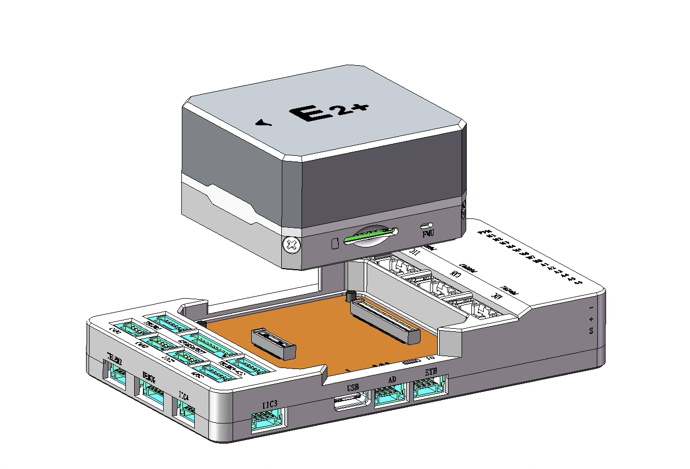

# S-Vehicle E2-Plus Flight Controller

The S-Vehicle E2-Plus Flight Controller produced by [S-Vehicle](http://svehicle.cn).

## Features

- STM32H753IIK6 microcontroller
- STM32F103 microcontroller
- Bosch BMM150 magnetometer
- 3 IMUs: Bosch BMI088, InvenSense ICM-20649, InvenSense ICM-42688P
- Bosch BMM150 magnetometer
- RM3100 magnetometer
- dual ICP-20100 barometers
- microSD card slot
- 1 ETH network interface
- 6 UARTs plus USB
- USB-TypeC port
- 14 PWM outputs
- PPM/SBus input, DSM/SBus input
- 3 I2C ports
- 2 CAN ports 
- Analog RSSI input
- Ethernet port

## Pinout

## UART Mapping

- SERIAL0 -> USB
- SERIAL1 -> UART7 (TELEM1)
- SERIAL2 -> UART5 (TELEM2)
- SERIAL3 -> USART1 (GPS1)
- SERIAL4 -> UART8 (GPS2)
- SERIAL5 -> USART2 (TELEM3)
- SERIAL6 -> UART4 (User)
- SERIAL7 -> USART3 (Debug)
- SERIAL8 -> USB Virtual

TELEM1, TELEM2 and TELEM3 UARTS have RTS/CTS. All have full DMA capability 

## RC Input

RC input is configured on the RCIN pin, at one end of the servo rail, marked PPM in the above diagram. All ArduPilot supported unidirectional RC protocols can be input here including PPM. For bi-directional or half-duplex protocols, such as CRSF/ELRS a full UART will have to be used.

## PWM Output

The E2-Plus flight controller supports up to 14 PWM outputs.

The 14 PWM outputs are in 6 groups:

- PWM 1-4 in group1 (TIM5)
- PWM 5 and 6 in group2 (TIM4)
- PWM 7 and 8 in group3 (TIM1)
- PWM 9, 10 and 11 in group4 (TIM8)
- PWM 12 in group5 (TIM15)
- PWM 13 and 14 in group6 (TIM12)

Channels within the same group need to use the same output rate. If any channel in a group uses DShot then all channels in the group need to use DShot. Outputs 1-4 support BDShot.

First first 8 PWM outputs of E2-Plus flight controller support switching between 3.3V voltage and 5V voltage output. It can be switched to 5V by setting GPIO 80 high by setting up a Voltage-Level Translator to control it.

## Battery Monitoring

The board has a dedicated power monitor ports on 6 pin connectors(POWER A). The correct battery setting parameters are dependent on the type of power brick which is connected.

## Compass

The E2-Plus has an RM3100 and BM1088 builtin compass, but due to interference the board is usually used with an external I2C or CAN compass as part of a GPS/Compass combination.

## Analog inputs

The E2-Plus has 6 analog inputs.

- ADC Pin9 -> Battery Voltage
- ADC Pin8 -> Battery Current Sensor
- ADC Pin5 -> Vdd 5V supply sense
- ADC Pin13 -> ADC 3.3V Sense
- ADC Pin12 -> ADC 6.6V Sense
- ADC Pin10 -> RSSI voltage monitoring

## Loading Firmware

Firmware for these boards can be found at https://firmware.ardupilot.org in sub-folders labeled "SVehicle-E2".

The board comes pre-installed with an ArduPilot compatible bootloader, allowing the loading of *.apj firmware files with any ArduPilot compatible ground station.
