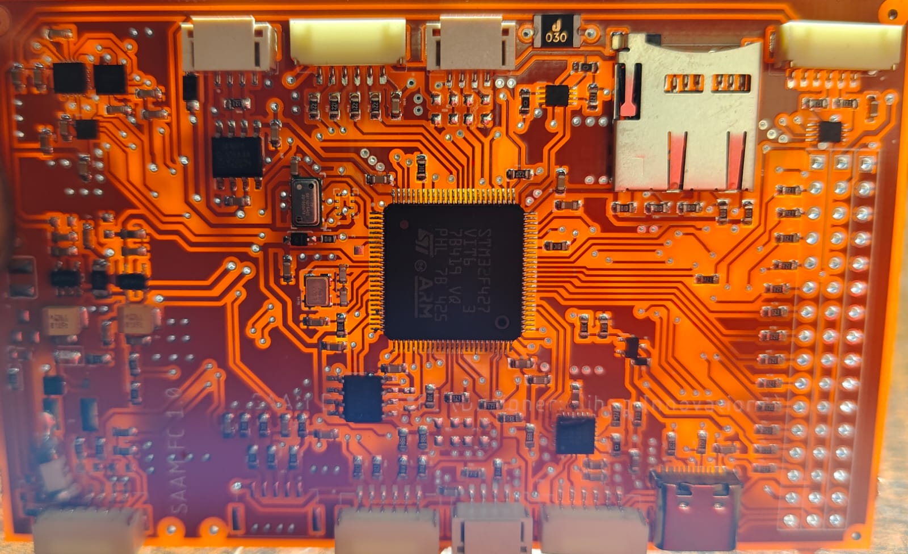
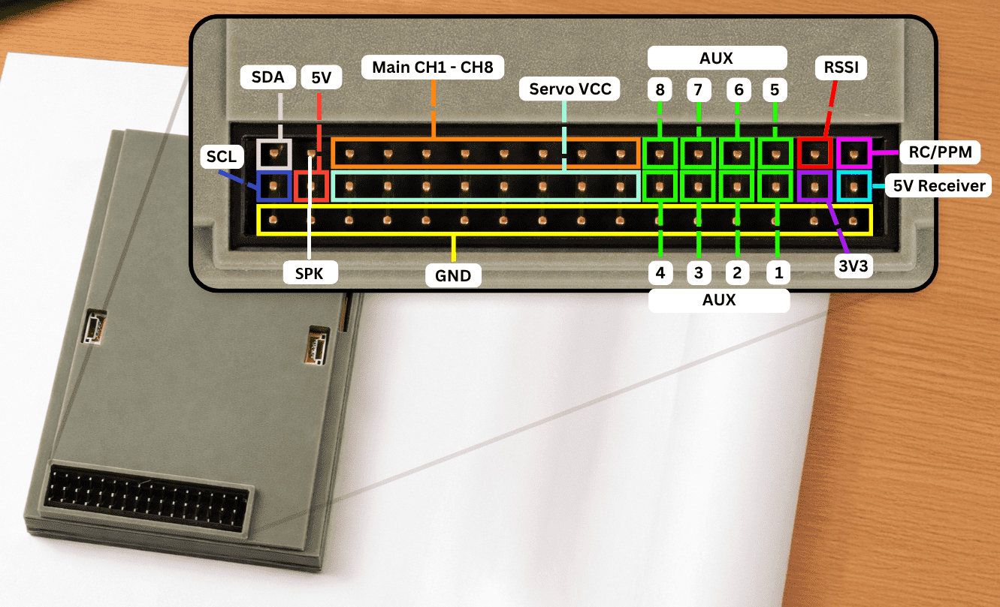
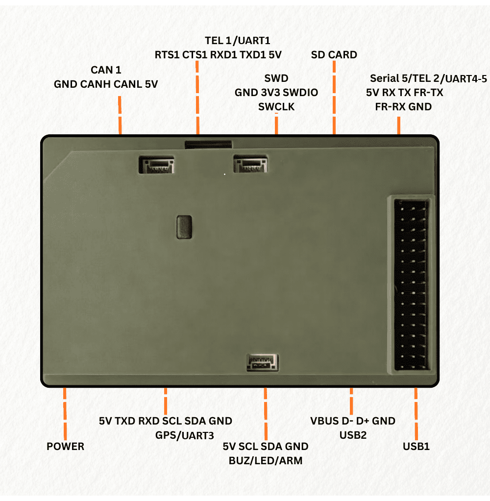

# SaamPixV1_1

The SaamPixV1_1 is an STM32F427-based flight controller produced by
[Saam Drones](https://www.saamdrones.com/). It features dual SPI IMUs,
an onboard barometer, dual compasses, CAN, microSD logging, and
RAMTRON parameter storage. It supports multirotor, fixed-wing, VTOL,
and hybrid UAV applications.

## Features/Specifications

- MCU: STM32F427xx ARM Cortex-M4 with FPU at 168 MHz
- Flash: 2048 KB internal
- SRAM: 256 KB
- IMU 1: ICM20602
- IMU 2: MPU9250 (with onboard AK8963 compass)
- Barometer: MS5611
- Compass 1: LIS3MDL (external SPI)
- Compass 2: AK8963 (via MPU9250)
- RAMTRON parameter storage (16 KB)
- MicroSD card (SDIO interface)
- CAN bus: 1x CAN1
- UARTs: 6 (USART1, USART2, USART3, UART4, UART7, UART8)
  + USB OTG
- I2C: 2 buses (I2C1, I2C2)
- PWM Outputs: 16 channels
- RC Input: PPM, SBUS, DSM/DSM2/DSMX via dedicated pin or
  UART
- USB: micro-USB (OTG1)
- Safety switch: not present

## Where to Buy

Available from [Saam Drones](https://www.saamdrones.com/).

## Pinout

## UART Mapping

| Name | Pin | Function | Notes |
| --- | --- | --- | --- |
| SERIAL0 | USB OTG1 | USB Console | |
| SERIAL1 | USART2 | Telemetry 1 | CTS/RTS on PD3/PD4 |
| SERIAL2 | USART3 | Telemetry 2 | |
| SERIAL3 | UART4 | GPS 1 | |
| SERIAL4 | UART8 | GPS 2 (default) | TX invert GPIO(78) |
| SERIAL5 | USART1 | SBUS input | |
| SERIAL6 | UART7 | Debug UART | |

Note: Some vendor silkscreens use compact labels such as
"SBUS/RSSI" around the receiver area. In ArduPilot mapping these
are separate signals: SBUS serial input is on USART1 RX (PB7),
while RSSI input is the separate digital GPIO on PC1.

## CAN

The SaamPixV1_1 exposes one CAN interface:

- CAN1 RX: PD0
- CAN1 TX: PD1

## PWM Output

The SaamPixV1_1 has 16 PWM outputs. All outputs support PWM and
DShot protocols.

| Outputs | Timer | Notes |
| --- | --- | --- |
| 1-4 | TIM1 | GPIO(50-53) |
| 5-8 | TIM4 | GPIO(54-57) |
| 9-12 | TIM3 | GPIO(58-61) |
| 13-16 | TIM2 | GPIO(62-65) |

Note: All outputs within the same timer group must use the same
protocol.

## RC Input

RC input is configured on RC/PPM input by default and supports
all ArduPilot compatible unidirectional protocols.

SBUS input is available on SERIAL5 (USART1 RX on PB7).

## GPIOs

| GPIO | Pin | Function |
| --- | --- | --- |
| GPIO(0) | PA8 | RUN_LED |
| GPIO(32) | PA7 | ALARM (TIM14) |
| GPIO(50) | PE9 | Servo1 |
| GPIO(51) | PE11 | Servo2 |
| GPIO(52) | PE13 | Servo3 |
| GPIO(53) | PE14 | Servo4 |
| GPIO(54) | PD12 | Servo5 |
| GPIO(55) | PD13 | Servo6 |
| GPIO(56) | PD14 | Servo7 |
| GPIO(57) | PD15 | Servo8 |
| GPIO(58) | PB4 | Servo9 |
| GPIO(59) | PC7 | Servo10 |
| GPIO(60) | PB0 | Servo11 |
| GPIO(61) | PB1 | Servo12 |
| GPIO(62) | PA15 | Servo13 |
| GPIO(63) | PB3 | Servo14 |
| GPIO(64) | PA2 | Servo15 |
| GPIO(65) | PA3 | Servo16 |
| GPIO(66) | PC1 | RSSI digital input |
| GPIO(78) | PB12 | UART8 TX invert (not SBUS) |

## Battery Monitor

The board has an internal voltage and current sensor. The default
battery parameters are:

- `BATT_VOLT_PIN` = 12 (PC2)
- `BATT_CURR_PIN` = 10 (PC0)
- `BATT_VOLT_MULT` = 10.1
- `BATT_AMP_PERVLT` = 17.0

These are set in the hwdef. Adjust `BATT_AMP_PERVLT` to match
your current sensor if using an external one.

## Compass

The SaamPixV1_1 has two built-in compasses:

- LIS3MDL on SPI4 (ROTATION_NONE)
- AK8963 via MPU9250 on SPI4 (ROTATION_ROLL_180_YAW_90)

Due to potential interference from the power supply and PWM
circuits, an external I2C compass as part of a GPS/Compass
module is recommended for best performance.

## Firmware

Firmware for the SaamPixV1_1 can be found at
[firmware.ardupilot.org](https://firmware.ardupilot.org)
in sub-folders labeled "SaamPixV1_1".

## Loading Firmware

The board comes pre-installed with an ArduPilot compatible
bootloader, allowing the loading of `*.apj` firmware files with
any ArduPilot compatible ground station (Mission Planner,
QGroundControl, MAVProxy).

For first-time firmware installation via DFU or STLink, use the
`*_with_bl.hex` file. See
[Loading Firmware onto ChibiOS boards]
(https://ardupilot.org/copter/docs/
common-loading-firmware-onto-chibios-only-boards.html)
for instructions.
