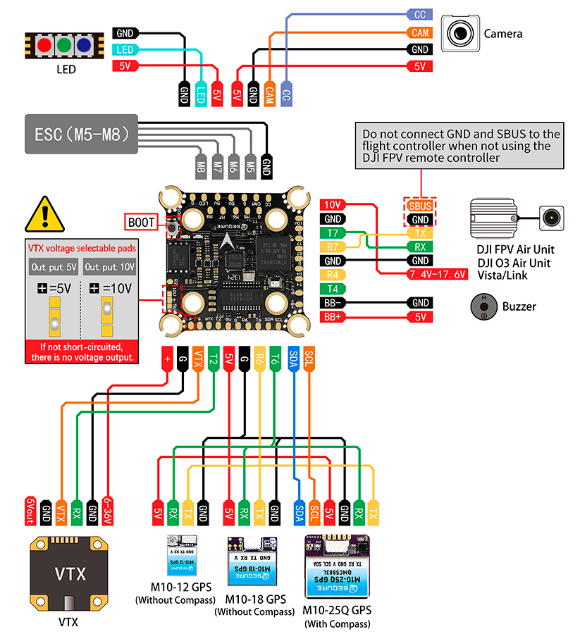
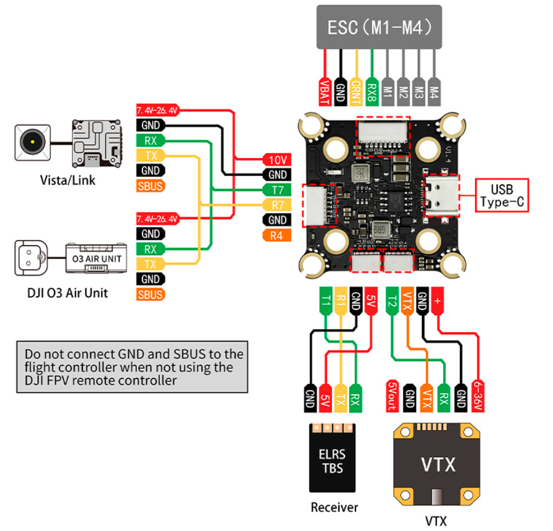

# SequreH743 Flight Controller

The SequreH743 and SequreH743v2 are flight controllers designed and produced by [Sequre](https://sequremall.coms).

## Features

 - MCU - STM32H743xx 32-bit processor running at 480 MHz
 - IMU - MPU6000, ICM42688 (V2 version)
 - Barometer - BMP280 (DPS368 and DPS310 on rev 2)
 - OSD - AT7456E
 - 6x UARTs
 - 9x PWM Outputs (8 Motor Output, 1 LED)

## Pinout

## UART Mapping

The UARTs are marked Rn and Tn in the above pinouts. The Rn pin is the
receive pin for UARTn. The Tn pin is the transmit pin for UARTn.

 - SERIAL0 -> USB (MAVLink2)
 - SERIAL1 -> USART1 (RCIN, DMA-enabled)
 - SERIAL2 -> USART2 (SmartAudio)
 - SERIAL4 -> UART4 (None)
 - SERIAL6 -> USART6 (GPS, DMA-enabled)
 - SERIAL7 -> UART7 (MSP_DisplayPort, DMA-enabled)
 - SERIAL8 -> UART8 (ESCTelemetry)

## RC Input

The default RC input is configured on USART1. RC could  be applied instead to a different UART port such as  and set
the protocol to receive RC data ``SERIALn_PROTOCOL`` = 23 and change :ref:`SERIAL1 _PROTOCOL <SERIAL1 _PROTOCOL>`
to something other than '23'. For rc protocols other than unidirectional, the USART1_TX pin will need to be used:

 - :ref:`SERIAL1_PROTOCOL<SERIAL1_PROTOCOL>` should be set to "23".
 - FPort would require :ref:`SERIAL1_OPTIONS<SERIAL1_OPTIONS>` be set to "15".
 - CRSF would require :ref:`SERIAL1_OPTIONS<SERIAL1_OPTIONS>` be set to "0".
 - SRXL2 would require :ref:`SERIAL1_OPTIONS<SERIAL1_OPTIONS>` be set to "4" and connects only the TX pin.
 - PPM is not supported

## OSD Support

The SequreH743 supports OSD using OSD_TYPE 1 (MAX7456 driver)
 and simultaneously DisplayPort using UART7 on the HD VTX connector.

## VTX Support

The SH1.0-6P connector supports a DJI Air Unit / HD VTX connection. Protocol defaults to DisplayPort. Pin 1 of the connector is 9v so 
be careful not to connect this to a peripheral that can not tolerate this voltage.

## Camera control

GPIO 81 is a pin for PWM camera control which is not supported by ArduPilot. It can be used as a general GPIO pin. By default RELAY2 is configured to control this pin and sets the GPIO high.

## PWM Output

The SequreH743 supports up to 9 PWM or DShot outputs. The pads for motor output
M1 to M9 are provided on both the motor connectors and on separate pads, plus
separate pads for LED strip and other PWM outputs.

The PWM is in 4 groups:

 - PWM 1-4   in group1
 - PWM 5-6   in group2
 - PWM 7-8   in group3
 - PWM 9   in group4

Channels within the same group need to use the same output rate. If
any channel in a group uses DShot then all channels in the group need
to use DShot. Channels 1-8 support bi-directional dshot.

## Battery Monitoring

The board has a internal voltage sensor and connections on the ESC connector for an external current sensor input.
The voltage sensor can handle up to 6S LiPo batteries.

The default battery parameters are:

 - :ref:BATT_MONITOR<BATT_MONITOR> = 4
 - :ref:BATT_VOLT_PIN<BATT_VOLT_PIN__AP_BattMonitor_Analog> = 13
 - :ref:BATT_CURR_PIN<BATT_CURR_PIN__AP_BattMonitor_Analog> = 12 (CURR pin)
 - :ref:BATT_VOLT_MULT<BATT_VOLT_MULT__AP_BattMonitor_Analog> = 11.0
 - :ref:BATT_AMP_PERVLT<BATT_AMP_PERVLT__AP_BattMonitor_Analog> = 17.2

## Compass

The SequreH743 does not have a builtin compass, but you can attach an external compass using I2C on the SDA and SCL pads.

## Loading Firmware

Firmware for these boards can be found `here <https://firmware.ardupilot.org>`__ in sub-folders labeled "SequreH743".

Initial firmware load can be done with DFU by plugging in USB with the
bootloader button pressed. Then you should load the "with_bl.hex"
firmware, using your favourite DFU loading tool.

Once the initial firmware is loaded you can update the firmware using
any ArduPilot ground station software. Updates should be done with the
*.apj firmware files.
