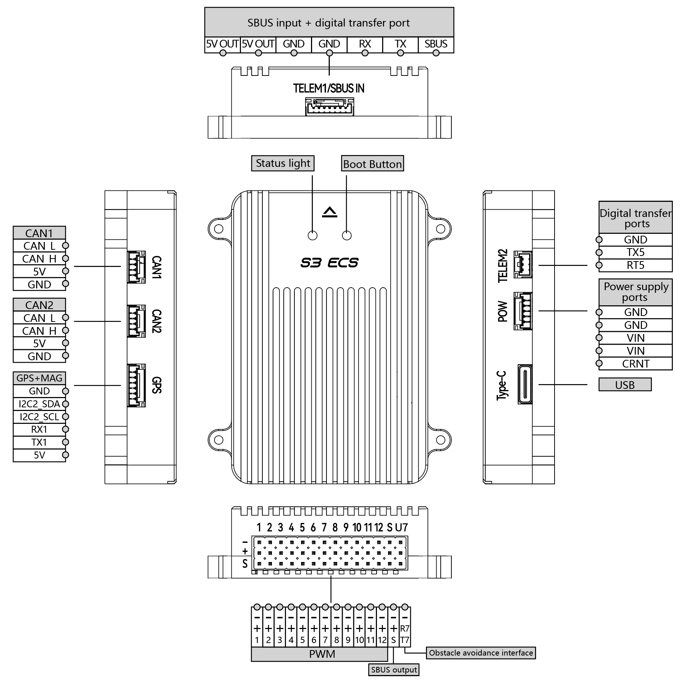

# Skydroid S3 Flight Controller

The Skydroid S3  flight controller is sold by a range of
resellers, linked from [SKYDROID](https://www.skydroid.xin/)

## Features

- STM32H743VIT6 microcontroller
- BMI088 IMU
- internal vibration isolation for IMUs
- MS5611 SPI barometer
- microSD card slot
- 5 UARTs plus USB
- 12 PWM outputs
- I2C port
- 2 CAN ports
- RCIN port
- Internal BEC provides 5V from up to 60V batteries
- Current monitoring input for external

## Pinout

- Unless noted otherwise all connectors are JST GH1.25mm

### TELEM1 & RC port

| Pin     | Signal    | Volt  |
| ------- | --------- | ----- |
| 1 (red) | VCC       | +5V   |
| 2 (red) | VCC       | +5V   |
| 3 (blk) | GND       | GND   |
| 4 (blk) | GND       | GND   |
| 5 (blk) | RX2       | +3.3V |
| 6 (blk) | TX2       | +3.3V |
| 7 (blk) | SBUS (RX4)| +3.3V |

### GPS1 port

| Pin     | Signal    | Volt  |
| ------- | --------- | ----- |
| 1 (blk) | GND       | GND   |
| 2 (blk) | SDA I2C2  | +3.3V |
| 3 (blk) | SCL I2C2  | +3.3V |
| 4 (blk) | RX1       | +3.3V |
| 5 (blk) | TX1       | +3.3V |
| 6 (red) | VCC       | +5V   |

### Telem2 port

| Pin     | Signal   | Volt  |
| ------- | -------- | ----- |
| 1 (blk) | GND      | GND   |
| 2 (blk) | TX5      | +3.3V |
| 3 (blk) | RX5      | +3.3V |

### uart7 port(&pwm)

| Pin          | Signal    | Volt  |
| ------------ | --------- | ----- |
| up(blk)      | GND       | GND   |
| middle (blk) | RX7       | +3.3V |
| down (blk)   | TX7       | +3.3V |

### CAN1 (note: uses non-standard pin order)

| Pin     | Signal | Volt  |
| ------- | ------ | ----- |
| 1 (blk) | CAN_L  | +3.3V |
| 2 (blk) | CAN_H  | +3.3V |
| 3 (red) | VCC    | +5V   |
| 4 (blk) | GND    | GND   |

### CAN1-REV (note: uses non-standard pin order)

| Pin     | Signal | Volt  |
| ------- | ------ | ----- |
| 1 (blk) | CAN_L  | +3.3V |
| 2 (blk) | CAN_H  | +3.3V |
| 3 (red) | VCC    | +5V   |
| 4 (blk) | GND    | GND   |

### POWER1

| Pin     | Signal   | Volt      |
| ------- | -------  | --------- |
| 1 (blk) | GND      | GND       |
| 2 (blk) | GND      | GND       |
| 3 (red) | BAT+     | 5V to 60V |
| 4 (red) | BAT+     | 5V to 60V |
| 5 (blk) | CUR_SENSE| 3.3v max in|

## UART Mapping

- SERIAL0 -> USB
- SERIAL1 -> USART2 (Telem1, MAVLink2)
- SERIAL2 -> UART5 (Telem2, MAVLink2)
- SERIAL3 -> USART1 (GPS)
- SERIAL5 -> USART7 (on PWM output strip, User)
- SERIAL6 -> UART4 (markedd SBUS, RCinput)

-All UARTs have DMA

## RC Input

RC input is configured on the SBUS pin. This input supports all unidirectional protocols. For bi-directional protocols such as CRSF/ELRS, a full UART is required, such as USART1, 2,or 7. See [RC systems](https://ardupilot.org/plane/docs/common-rc-systems.html) for more details.

## PWM Output

The Skydroid supports up to 12 PWM outputs. Outputs 1-8 support DShot and Bi-Directional DShot also.

All 12 outputs have GND on the top row, 5V (supplied by autopilot, avoid ESC BEC conflicts by not attaching their BEC output to this rail, if used) on the middle row and signal on the bottom row. Outputs are grouped based on which timer they use. All outputs in a group must be the same protocol

- PWM 1, 2, 3 and 4 in group1
- PWM 5, 6, 7 and 8 in group2
- PWM 9 -12 are in group 3

## Battery Monitoring

The board has a dedicated power port on a 5 pin connector. Battery volage up to 60V is converted internally to the required 5V and internal supplies. An input for an external current sensor (recommeded) is also provided, as well as monitoring of the battery input voltage.

The default parameters for battery monitoring are provided:

- BATT_MONITOR 4
- BATT_VOLT_PIN 10
- BATT_CURR_PIN 13
- BATT_VOLT_MULT 21
- BATT_AMP_PERVLT 20 (depends on actual external monitor used)

## Compass

There is no compass inside, an external compass is required

## GPIOs

The numbering of the GPIOs for PIN variables in ArduPilot is:

- PWM1 50
- PWM2 51
- PWM3 52
- PWM4 53
- PWM5 54
- PWM6 55
- PWM7 56
- PWM8 57
- PWM9 58
- PWM10 59
- PWM11 60
- PWM12 61

## Loading Firmware

The board comes pre-installed with an ArduPilot compatible bootloader,
allowing the loading of *.apj firmware files with any ArduPilot
compatible ground station.
