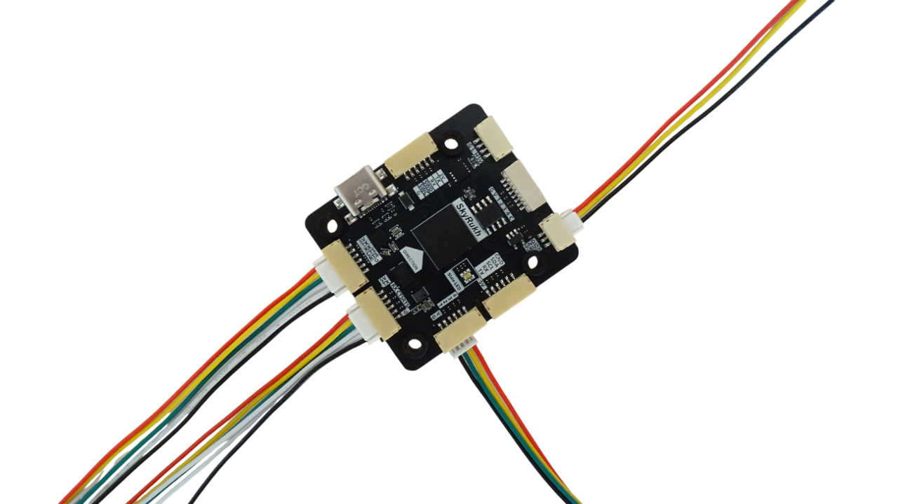
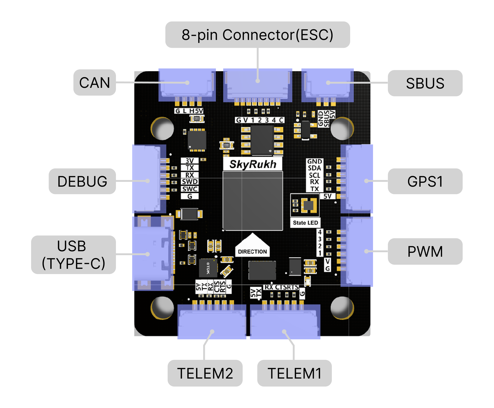
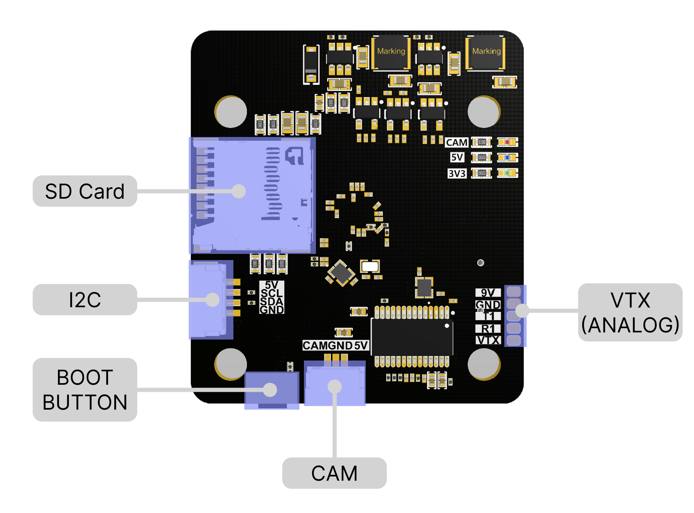

# SkyRukh Surge H7 Flight Controller

The SkyRukh Surge H7 is a flight controller produced by SkyRukh.

## Features

 - MCU - STM32H743 32-bit processor running at 480 MHz
 - IMU - BMI088, ICM20602
 - Barometer - DPS310
 - OSD - MAX7456
 - microSD card slot
 - 7x UARTs
 - CAN port with JST-GH connector
 - External I2C port with JST-GH connector
 - 8x PWM Outputs (4 Motor Output with JST-GH connector)
 - Battery input voltage: 2S-6S
 - builtin RGB LED
 - BEC 3.3V 0.5A
 - BEC 5V 3A
 - BEC 9V 3A for VTX
 - Camera input with JST-GH connector

## Pinout

## UART Mapping

|Port    | UART    | Protocol       |TX DMA |RX DMA |
|--------|---------|----------------|-------|-------|
|SERIAL0 |  USB    |  MAVLink2      |  ✘    |   ✘   |
|SERIAL1 |  USART2 |  MAVLink2      |  ✔    |   ✔   | (TELEM1)
|SERIAL2 |  USART6 |  MAVLink2      |  ✔    |   ✔   | (TELEM2)
|SERIAL3 |  USART3 |  GPS           |  ✔    |   ✔   | (GPS1)
|SERIAL4 |  UART7  |  None          |  ✔    |   ✔   |
|SERIAL5 |  UART4  |  None          |  ✘    |   ✘   | (DEBUG)
|SERIAL6 |  UART5  |  None          |  ✔    |   ✔   |
|SERIAL7 |  UART8  |  None          |  ✔    |   ✔   |

The SERIAL1 and SERIAL2 ports have RTS/CTS pins, the other UARTs do not have RTS/CTS.

## RC Input

RC input is provided through the SBUS connector and supports all unidirectional RC protocols. For bi-directional protocols, such as CRSF/ELRS/SRXL2, a UART with DMA will be need to be used, See https://ardupilot.org/plane/docs/common-rc-systems.html for more information.
  
## OSD Support

The SkyRukh Surge H7 supports OSD using OSD_TYPE 1 (MAX7456 driver).

## PWM Output

The SkyRukh Surge H7 provides a total of 8 PWM outputs with DShot support.

PWM 1-4: Available on standard JST-SH motor connectors, compatible with typical ESC wiring.
PWM 5-8: Available on JST-GH connectors for additional motor/servo outputs.

The 8 PWM outputs are in 3 groups:

- PWM 1,2 and 3 in group1 (TIM5)
- PWM 4,6 and 8 in group2 (TIM4)
- PWM 5 and 7 in group3 (TIM8)

Channels within the same group need to use the same output rate. If any channel in a group uses DShot then all channels in the group need to use DShot.

## Battery Monitoring

The board has a internal voltage sensor and connections on the ESC connector for an external current sensor input. The voltage sensor can handle up to 6S LiPo batteries.

The default battery parameters are:

    - BATT_MONITOR = 4
    - BATT_VOLT_PIN = 16
    - BATT_CUR_PIN = 17 (C pin on ESC connector)
    - BATT_VOLT_MULT = 7.39
    - BATT_AMP_PERVLT = 40 (should be set according to ESC block used)

## Compass

The SkyRukh Surge H7 does not have a built-in compass, but you can connect one either via a GPS module with an integrated compass through the GPS connector, or by using the external I2C port available on a JST-GH connector.

## Loading Firmware

Firmware for these boards can be found at https://firmware.ardupilot.org in sub-folders labeled "SkyRukh_Surge_H7".

The board comes pre-installed with an ArduPilot compatible bootloader, allowing the loading of \*.apj firmware files with any ArduPilot compatible ground station.
