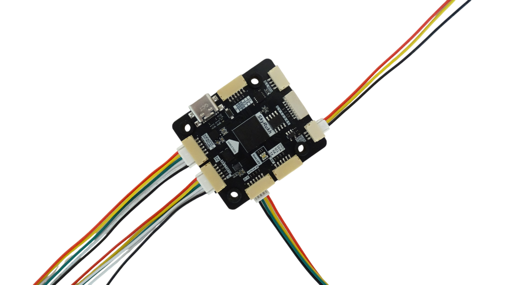
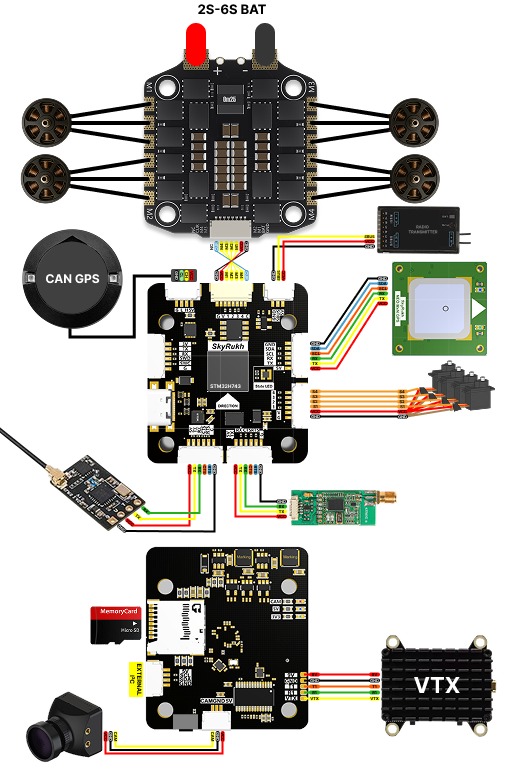

# SkyRukh Surge H7 Flight Controller

The SkyRukh Surge H7 is a flight controller produced by SkyRukh.

## Features

 - MCU - STM32H743 32-bit processor running at 480 MHz
 - IMU - BMI088, ICM20602
 - Barometer - DPS310
 - OSD - MAX7456
 - microSD card slot
 - 7x UARTs
 - CAN port with JST-GH connector
 - External I2C port with JST-GH connector
 - 8x PWM Outputs (4 Motor Output with JST-GH connector)
 - Battery input voltage: 2S-6S
 - builtin RGB LED
 - BEC 3.3V 0.5A
 - BEC 5V 3A
 - BEC 9V 3A for VTX
 - Camera input with JST-GH connector

## Pinout

## UART Mapping

- SERIAL0 -> USB
- SERIAL1 -> USART2 (TELEM1)
- SERIAL2 -> USART6 (TELEM2)
- SERIAL3 -> USART3 (GPS1)
- SERIAL4 -> UART4 
- SERIAL5 -> UART7 (Debug)
- SERIAL6 -> UART5 
- SERIAL7 -> UART8 

The TELEM1 and TELEM2 ports have RTS/CTS pins, the other UARTs do not have RTS/CTS. All have full DMA capability.

## RC Input

RC input is provided through an SBUS connection with inverter control, offering direct SBUS receiver support.
  
## OSD Support

The SkyRukh Surge H7 supports OSD using OSD_TYPE 1 (MAX7456 driver).

## PWM Output

The SkyRukh Surge H7 provides a total of 8 PWM outputs with DShot support.

PWM 1-4: Available on standard JST-SH motor connectors, compatible with typical ESC wiring.
PWM 5-8: Available on JST-GH connectors for additional motor/servo outputs.

All 8 outputs can be configured as PWM or DShot according to the user’s setup.

## Battery Monitoring

The board has no built-in sensors but provides dedicated Battery Voltage Sensor and Battery Current Sensor ADC inputs, both accessible through the JST-SH ESC connector.

## Compass

The SkyRukh Surge H7 does not have a built-in compass, but you can connect one either via a GPS module with an integrated compass through the GPS connector, or by using the external I2C port available on a JST-GH connector.

## Loading Firmware

Firmware for these boards can be found at https://firmware.ardupilot.org in sub-folders labeled "SkyRukh_Surge_H7".

The board comes pre-installed with an ArduPilot compatible bootloader, allowing the loading of \*.apj firmware files with any ArduPilot compatible ground station.
