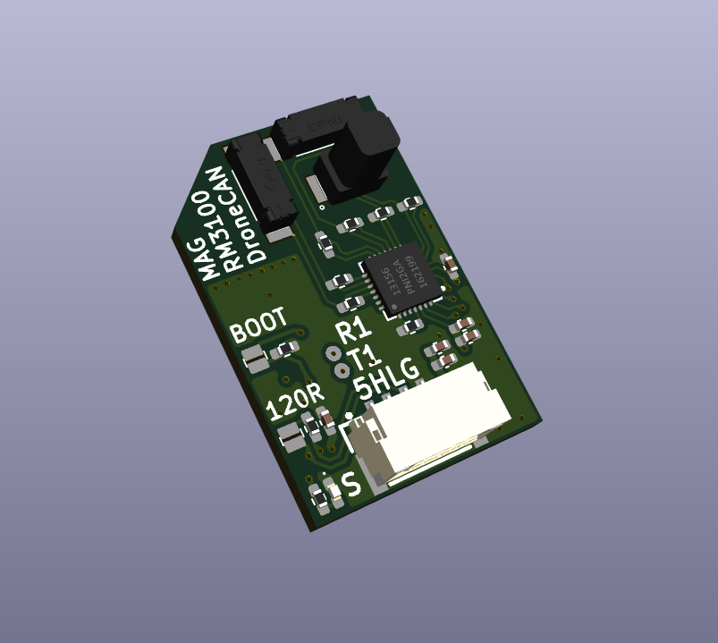

# SkyroninMag

AP_Periph CAN node from Skyronin, built on the `SkyroninL431` base board with
a PNI RM3100 compass populated. Shares its bootloader with `SkyroninL431`.

## Specs

- MCU: STM32L431 (256KB flash)
- CAN: single CAN1 port
- Compass: RM3100 on SPI1, mounted with a 180 degree pitch rotation
- Debug: USART1, 57600 baud

| Parameter                     | Value at 200 cycles   |
| ------------------------------ | ---------------------- |
| Input voltage                 | 4.5 ~ 5.5V @5V pad     |
| Current consumption           | 10mA @5V               |
| Connectivity                  | DroneCAN               |
| Field range                   | -800 to +800 uT        |
| Gain                          | 75 LSB/uT              |
| Sensitivity                   | 13 nT                  |
| Noise                         | 15 nT                  |
| Max pulling rate (single axis) | 440 Hz                |
| Temperature range             | -40 to +85C            |
| Board dimensions              | 25x17x10mm (L x W x H) |
| Connector                     | 4-pin JST-GH1.25       |

