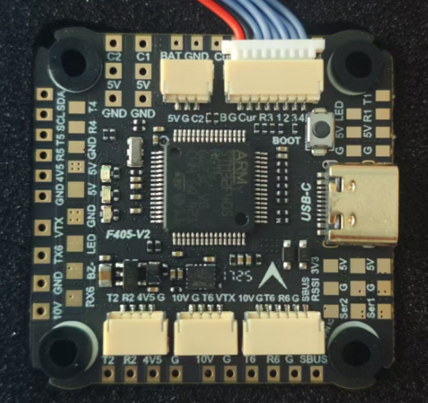

# SkystarsF405v2 Flight Controller

The SkystarsF405v2 is a flight controller designed and produced by [Skystars].

## Features

 - MCU - STM32F405xx 32-bit processor running at 168 MHz
 - IMU1 - Invensense ICM42688
 - Barometer - SPL06
 - OSD - AT7456E
 - 6x UARTs
 - 7x PWM Outputs (4 Motor Output, 2 servo, 1 LED)

## Pinout

## UART Mapping

The UARTs are marked Rn and Tn in the above pinouts. The Rn pin is the
receive pin for UARTn. The Tn pin is the transmit pin for UARTn.

 - SERIAL0 -> USB (MAVLink2)
 - SERIAL1 -> USART1 (Spare, DMA-enabled)
 - SERIAL2 -> USART2 (RCIN, DMA-enabled)
 - SERIAL3 -> USART3 (ESCTelemetry)
 - SERIAL4 -> UART4 (Spare)
 - SERIAL5 -> UART5 (GPS)
 - SERIAL6 -> USART6 (MSP DisplayPort)

## RC Input

The default RC input is configured on USART2. RC could  be applied instead to a different UART port such as  and set
the protocol to receive RC data ``SERIALn_PROTOCOL`` = 23 and change :ref:`SERIAL2 _PROTOCOL <SERIAL2 _PROTOCOL>`
to something other than '23'. For rc protocols other than unidirectional, the USART2_TX pin will need to be used:

 - :ref:`SERIAL2_PROTOCOL<SERIAL2_PROTOCOL>` should be set to "23".
 - FPort would require :ref:`SERIAL2_OPTIONS<SERIAL2_OPTIONS>` be set to "15".
 - CRSF would require :ref:`SERIAL2_OPTIONS<SERIAL2_OPTIONS>` be set to "0".
 - SRXL2 would require :ref:`SERIAL2_OPTIONS<SERIAL2_OPTIONS>` be set to "4" and connects only the TX pin.

SBUS is supported via hardware inversion connected to USART_RX2 and is available on both a solder pad and in the DJI HD connector.

## OSD Support

The SkystarsF405v2 supports OSD using OSD_TYPE 1 (MAX7456 driver)
 and simultaneously DisplayPort using USART6 on the HD VTX connector.

## VTX Support

The SH1.0-6P connector supports a DJI Air Unit / HD VTX connection. Protocol defaults to DisplayPort. Pin 1 of the connector is 10v so 
be careful not to connect this to a peripheral that can not tolerate this voltage.

## PWM Output

The SkystarsF405v2 supports up to 7 PWM or DShot outputs. The pads for motor output
M1 to M4 are provided on both the motor connectors and on separate pads, plus
separate pads for LED strip and other PWM outputs (labelled Ser1 and Ser2).

The PWM is in 3 groups:

 - PWM 1-2   in group1
 - PWM 3-4   in group2
 - PWM 5-6   in group3
 - PWM 7     in group4

Channels within the same group need to use the same output rate. If
any channel in a group uses DShot then all channels in the group need
to use DShot.

## Battery Monitoring

The board has a internal voltage sensor and connections on the ESC connector for an external current sensor input.
The voltage sensor can handle up to 6S LiPo batteries.

The default battery parameters are:

 - :ref:`BATT_MONITOR<BATT_MONITOR>` = 4
 - :ref:`BATT_VOLT_PIN<BATT_VOLT_PIN__AP_BattMonitor_Analog>` = 10
 - :ref:`BATT_CURR_PIN<BATT_CURR_PIN__AP_BattMonitor_Analog>` = 11 (CURR pin)
 - :ref:`BATT_VOLT_MULT<BATT_VOLT_MULT__AP_BattMonitor_Analog>` = 11.0
 - :ref:`BATT_AMP_PERVLT<BATT_AMP_PERVLT__AP_BattMonitor_Analog>` = 25.0

## Analog RSSI input

Analog RSSI uses :ref:`RSSI_PIN<RSSI_PIN>` 12

## Compass

The SkystarsF405v2 does not have a builtin compass, but you can attach an external compass using I2C on the SDA and SCL pads.

## Camera control

GPIO 81 controls the camera output to the connectors marked "CAM1" and "CAM2". Setting this GPIO low switches the video output
from CAM1 to CAM2. By default RELAY2 is configured to control this pin and sets the GPIO high.

## Loading Firmware

Firmware for these boards can be found `here <https://firmware.ardupilot.org>`__ in sub-folders labeled "SkystarsF405v2".

Initial firmware load can be done with DFU by plugging in USB with the
bootloader button pressed. Then you should load the "with_bl.hex"
firmware, using your favourite DFU loading tool.

Once the initial firmware is loaded you can update the firmware using
any ArduPilot ground station software. Updates should be done with the
*.apj firmware files.
