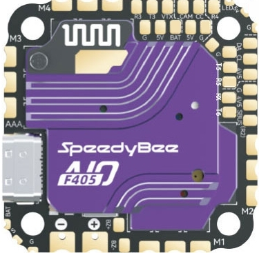

# SpeedyBee F405 AIO 40A Bluejay

https://www.speedybee.com/speedybee-f405-aio-40a-bluejay-25-5x25-5-3-6s-flight-controller

The SpeedyBee F405 AIO is a flight controller produced by [SpeedyBee](https://www.speedybee.com/).

## Features

- MCU: STM32F405 32-bit processor. 1024Kbytes Flash
- IMU: ICM-42688P (SPI)
- Barometer: SPA06-003
- USB VCP Driver (all UARTs usable simultaneously; USB does not take up a UART)
- 6 UARTS (UART1 tied internally to BT module which is not currently supported by ArduPilot)
- 8MBytes for logging
- 5V Power Out: 2.0A max
- Dimensions: 33x33mm
- Mounting Holes: Standard 25.5/25.5mm square to center of holes 
- Weight: 13.6g

- Built-in 40A BlueJay 4in1 ESC
- Supports Oneshot125, Oneshot42, Multishot, Dshot150, Dshot300, Dshot600
- Input Voltage: 3S-6S Lipo
- Continuous Current: 40A
- Bluejay JH-40 48kHz

## Pinout

.. note:: S pin for "Meteor LED" does not work with this firmware

## UART Mapping

The UARTs are marked Rn and Tn in the above pinouts. The Rn pin is the
receive pin for UARTn. The Tn pin is the transmit pin for UARTn.
|Name|Pin|Function|
|:-|:-|:-|
|SERIAL0|COMPUTER|USB|
|SERIAL1|RX1/TX1|USART1 (WiFi, not usable by ArduPilot)|
|SERIAL2|RX2|USART2 (USER, RX tied to SBUS pin, Inverted)|
|SERIAL3|TX3/RX3|USART3 (DisplayPort)|
|SERIAL4|TX4/RX4|UART4 (User)|
|SERIAL5|TX5/RX5|UART5 (GPS)|
|SERIAL6|TX6/RX6|UART6 (RCin, DMA-enabled)|

USART6 supports RX and TX DMA.

## RC Input
 
RC input is configured on UART6. It supports all RC protocols except PPM, FPort, and SBUS. See:ref:`[Radio Control Systems<common-rc-systems>` for details for a specific RC system. :ref:`SERIAL6_PROTOCOL<SERIAL6_PROTOCOL>` is set to “23”, by default, to enable this.
*  FPort requires an external bi-directional inverter and connects to TX 6 with :ref:`SERIAL6_OPTIONS<SERIAL6_OPTIONS>` set to "7".
*  CRSF requires a TX6 connection, in addition to RX6, and automatically provides telemetry.
*  SRXL2 requires a connection to TX6 and automatically provides telemetry. Set :ref:`SERIAL6_OPTIONS<SERIAL6_OPTIONS>` set to "4".

* SBUS can be directly connected to the SBUS pin which ties through an inverter to the RX2 pin.  :ref:`SERIAL2_PROTOCOL<SERIAL2_PROTOCOL>` must be set to "23" and :ref:`SERIAL6_PROTOCOL<SERIAL6_PROTOCOL>`  must be changed to something else than "23"

Any UART can be used for RC system connections in ArduPilot also, and is compatible with all protocols except PPM. See [Radio Control Systems](https://ardupilot.org/plane/docs/common-rc-systems.html#common-rc-systems) for details.
  
## OSD Support

The SpeedyBee F405 AIO supports OSD using :ref:`OSD_TYPE<OSD_TYPE>` =  1 (MAX7456 driver). The defaults are also setup to allow DJI Goggle OSD support on UART3. Both the internal analog OSD and the DisplayPort OSD can be used simultaneously by setting :ref:`OSD_TYPE2<OSD_TYPE2>`= 5

## PWM Output

The SpeedyBee F405 AIO supports up to 5 PWM outputs. The pads for motor output ESC1 to ESC4 on the above diagram are the first 4 outputs.All 5 outputs support DShot.

The PWM are in 3 groups:

PWM 1-2: Group 1
PWM 3-4: Group 2
LED: Group 3

Channels within the same group need to use the same output rate. If
any channel in a group uses DShot then all channels in the group need
to use DShot. PWM 1-4 support bidirectional dshot.

## Battery Monitoring

The board has a builtin voltage sensor. The voltage sensor can handle 2S to 6S
LiPo batteries.

The correct battery setting parameters are:

 - BATT_MONITOR 4
 - BATT_VOLT_PIN 10
 - BATT_VOLT_MULT around 11
 - BATT_CURR_PIN 12
 - BATT_AMP_PERVLT 39.4

These are set by default in the firmware and shouldn't need to be adjusted

## Compass

The SpeedyBee F405 AIO does not have a builtin compass but an external compass can be attached using the SDA/SCL pins.

## Camera Control

The CC pin is a GPIO (pin 70) and is assigned by default to RELAY2 functionality. This pin can be controlled via GCS or by RC transmitter using the :ref:`Auxiliary Function<common-auxiliary-functions>` feature.

## NeoPixel LED

The board includes a NeoPixel LED pad.

## Firmware

Firmware for this board can be found: `here <https://firmware.ardupilot.org>`__ in sub-folders labeled “SpeedyBeeF405AIO”.

## Loading Firmware (you will need to compile your own firmware)

Initial firmware load can be done with DFU by plugging in USB with the
bootloader button pressed. Then you should load the "with_bl.hex"
firmware, using your favourite DFU loading tool.

Once the initial firmware is loaded you can update the firmware using
any ArduPilot ground station software. Updates should be done with the
*.apj firmware files.
