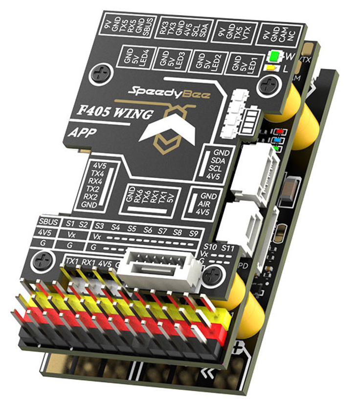

# SpeedyBeeF405WINGV2" Flight Controller

The SpeedyBeeF405WINGV2 is a flight controller produced by [SpeedyBee](http://www.speedybee.com/).

## Features
    Processor
        STM32F405 168Mhz, 1MB 32-bit processor
        AT7456E OSD
    Sensors
        ICM42688P Acc/Gyro
        SPA006 barometer
    Power
        2S - 6S Lipo input voltage with voltage monitoring
        90A Cont., 215A peak current monitor
        9V/12/5V, 1.8A BEC for powering Video Transmitter controlled by GPIO
        4.9V/6V/7.2V, 4.5A BEC for servos
        5V, 2.4A BEC for internal and peripherals
    Interfaces
        12x PWM outputs (Serial LED output is PWM12)
        1x RC input
        6x UARTs/serial for GPS and other peripherals
        I2C port for external compass, airspeed, etc.
        microSDCard for logging, etc.
        USB-C port
  

## Pinout

## Wiring Diagram

## UART Mapping

The UARTs are marked RXn and TXn in the above pinouts. The RXn pin is the
receive pin for UARTn. The TXn pin is the transmit pin for UARTn.

 - SERIAL0 -> USB
 - SERIAL1 -> USART1 (Telem1)
 - SERIAL2 -> USART2 (RX tied to inverted SBUS RC input, but can be used as normal UART if :ref:`BRD_ALT_CONFIG<>` =1) 
 - SERIAL3 -> UART3 (MSP DisplayPort) (TX DMA capable)
 - SERIAL4 -> UART4 (User) (TX DMA capable)
 - SERIAL5 -> UART5 (GPS) (TX DMA capable)
 - SERIAL6 -> UART6 (Serial RC RCIN) 

## RC Input

RC input is configured on the SBUS pin (inverted and sent to UART2_RX). It supports all RC
protocols except serial protocols such as CRSF, ELRS, etc. Those devices can be connected to USART1 TX and RX, instead.
Fport can be connected to USART1 TX also, but will require an external bi-directional inverter and the ref:`SERIAL1_OPTION<SERIAL1_OPTION>' = 4 (HalfDuplex) set.
   
## OSD Support

The SpeedyBeeF405WINGV2 supports using its internal OSD using OSD_TYPE 1 (MAX7456 driver). External OSD support such as DJI or DisplayPort is supported using UART5 or any other free UART5. See :ref:`common-msp-osd-overview-4.2` for more info.

## Analog Airspeed Input

The analog airspeed pin is "15"

## PWM Output

The SpeedyBeeF405WingV2 supports up to 12 PWM outputs (PWM12 is the serial LED output, by default). All outputs support DShot.

The PWM is in 5 groups:

 - PWM 1,2 in group1
 - PWM 2,4 in group2
 - PWM 5-7 in group3
 - PWM 8-10 in group4
 - PWM 11,12 in group5  Note: PWM12 is setup for LED use by default, if PWM11 is used, you must re-assign PMW12 to a normal PWM output or nothing

Channels within the same group need to use the same output rate. If
any channel in a group uses DShot then all channels in that group would need
to use DShot.

## Battery Monitoring

The board has a built-in voltage and current sensor. The current
sensor can read up to 90A continuously, 215 Amps peak. The voltage sensor can handle up to 6S
LiPo batteries.

The correct battery setting parameters are set by default and are:

 - BATT_MONITOR 4
 - BATT_VOLT_PIN 10
 - BATT_CURR_PIN 11
 - BATT_VOLT_MULT 11.5
 - BATT_AMP_PERVLT 50

## Compass

The SpeedyBeeF405WINGV2 does not have a built-in compass, but you can attach an external compass using I2C on the SDA and SCL pads.

## VTX power control

GPIO 81 controls the VTX BEC output to pins marked "9V". Setting this GPIO high removes voltage supply to pins. By default RELAY2 is configured to control this pin and sets the GPIO high.

## Loading Firmware
Firmware for these boards can be found at https://firmware.ardupilot.org in sub-folders labeled “SpeedyBeeF405WINGV2”.

Initial firmware load can be done with DFU by plugging in USB with the
boot button pressed. Then you should load the "SpeedyBeeF405WINGV2_bl.hex"
firmware, using your favourite DFU loading tool.

Subsequently, you can update firmware with Mission Planner.

