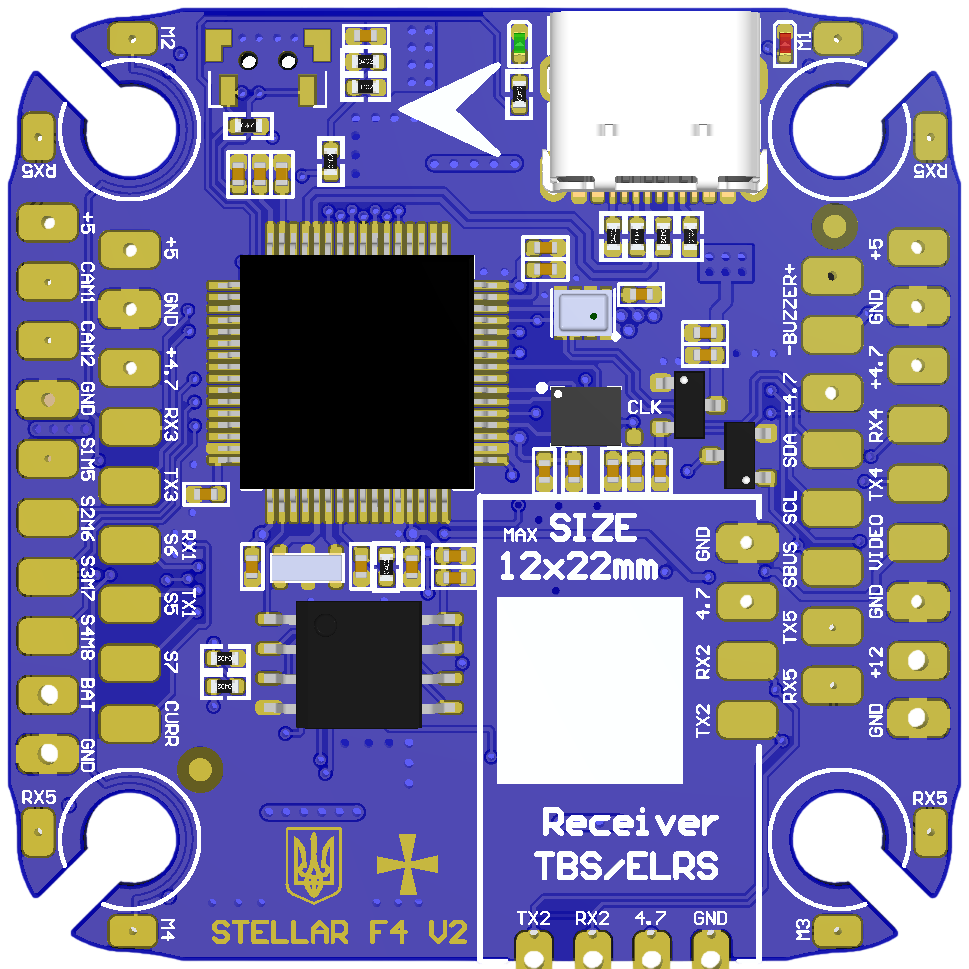
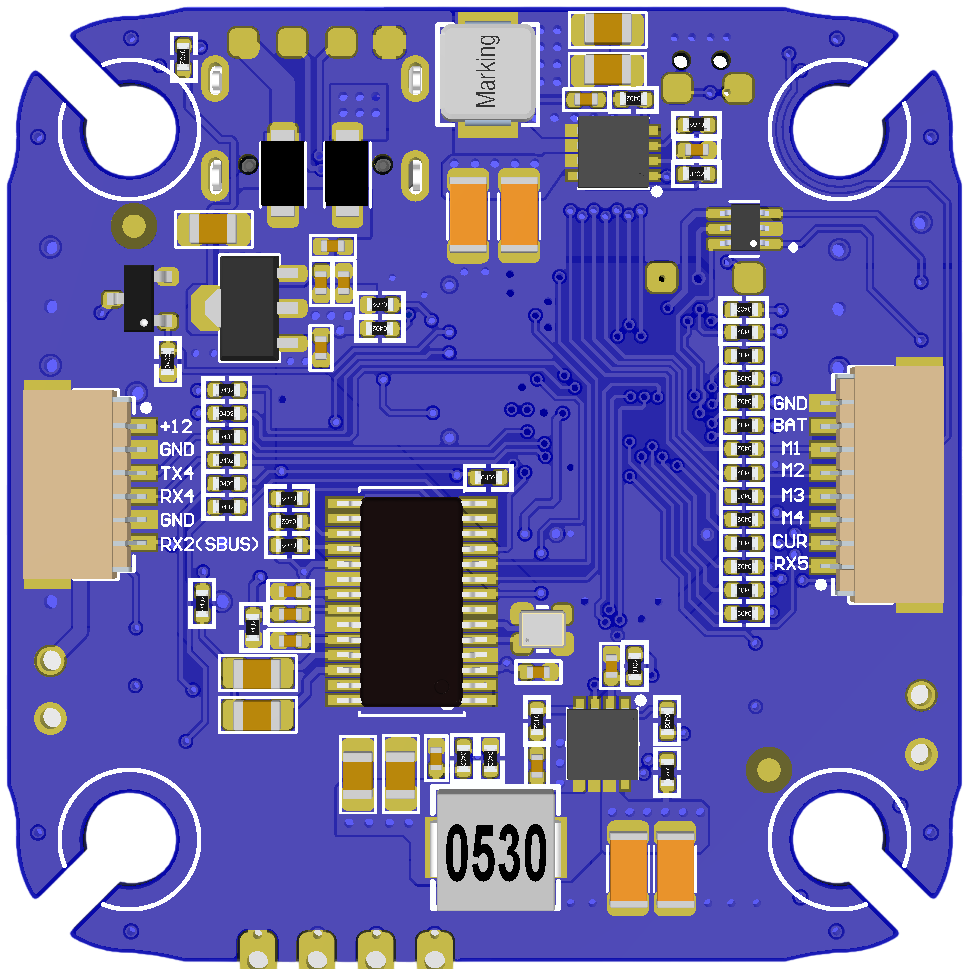

# StellarF4 V2 Flight Controller

https://stingbee.com.ua/flight_controllers/stellarf4v2

## Features
    Processor
        STM32F405
    Sensors
        ICM-42688p Acc/Gyro with external clock feature
        DPS310/BMP280 barometer
        AT7456E OSD
        W25Q128 dataflash
    Power
        2S-8S Lipo input voltage with voltage monitoring
        12V, 3A BEC for powering Video Transmitter
        5V, 2A BEC for internal and peripherals
    Interfaces
        11x PWM outputs DShot capable, PWM1-4 DShot capable
        4x UARTs
        1x I2C
        2x ADC
        SPI flash for logging
        USB-C port
    LED
        Red, 3.3V power indicator
        Green, FC status
    Size
        41 x 41mm PCB with 30.5mm M3 mounting

## Overview

## UART Mapping

The UARTs are marked Rx* and Tx* in the above pinouts. The Rx* pin is the
receive pin for UART*. The Tx* pin is the transmit pin for UART*.

 - SERIAL0 -> USB
 - SERIAL1 -> UART2 (Serial RC input, DMA capable)
 - SERIAL2 -> UART3 (User) (NO DMA)
 - SERIAL3 -> UART4 (DisplayPort) (NO DMA)
 - SERIAL4 -> UART5 (ESC Telemetry) (NO DMA)

## CAN and I2C

StellarF4V2 supports 1x I2C bus
multiple I2C peripherals can be connected to one I2C bus in parallel.

## RC Input

The default RC input is configured on the UART2(SERIAL1) RX2 input and can be used for all ArduPilot supported unidirectional receiver protocols.
* SBUS/DSM/SRXL/PPM connects to the SBUS pad or pin on the HD VTX connector. SBUS pad connected to RX2 via inverter.
* CRSF also requires a TX2 connection, in addition to RX2, and automatically provides telemetry.
* FPort requires connection to TX2 and :ref:`SERIAL1_OPTIONS<SERIAL1_OPTIONS>` set to "7". See :ref:`common-FPort-receivers`.
* SRXL2 requires a connection to TX2 and automatically provides telemetry. Set :ref:`SERIAL1_OPTIONS<SERIAL1_OPTIONS>` to “4”.

## OSD Support

StellarF4V2 supports using its internal OSD using OSD_TYPE 1 (MAX7456 driver).
External OSD support such as DJI or DisplayPort is preconfigured on SERIAL3 but supported on any spare UART. See :ref:`common-msp-osd-overview-4.2` for more info.

## PWM Output

StellarF4V2 supports up to 11 PWM outputs. PWM1-4 outputs support DShot.

Channels 1-4 support bi-directional DShot. Channels 5-8 marked as S1M5-S4M8 on the board. Channels 9-11 marked as S5-S7 on the board. PWM outputs are grouped and every group must use the same output protocol:
* 1, 2, 3, 4  are Group 1;
* 5, 6, 7, 8  are Group 2;
* 9, 10, 11   are Group 3;

## Battery Monitoring

The board has 1 built-in voltage dividers and 1x current ADC. support external 3.3V based current sensor
The voltage input is compatible with 2~8S LiPo batteries.
	
The default battery parameters are:

* :ref:`BATT_MONITOR<BATT_MONITOR>` = 4
* :ref:`BATT_VOLT_PIN<BATT_VOLT_PIN__AP_BattMonitor_Analog>` = 10
* :ref:`BATT_CURR_PIN<BATT_CURR_PIN__AP_BattMonitor_Analog>` = 11 (CURR pin)
* :ref:`BATT_VOLT_MULT<BATT_VOLT_MULT__AP_BattMonitor_Analog>` = 11
* :ref:`BATT_AMP_PERVLT<BATT_AMP_PERVLT__AP_BattMonitor_Analog>` = 10

## Compass

StellarF4V2 does not have a built-in compass, but you can attach an external compass using I2C on the SDA and SCL pads.

## Camera Switch

GPIO 81 controls which camera input (CAM1 or CAM2) is applied to the internal OSD.
The camera switch is controlled by the RELAY1 parameter. The default is to use CAM1.

## Loading Firmware

Firmware for these boards can be found at https://firmware.ardupilot.org in sub-folders labeled StellarF4V2.

Initial firmware load can be done with DFU by plugging in USB with the
boot button pressed. Then you should load the "ardu*_with_bl.hex" firmware, using your favourite DFU loading tool. eg STM32CubeProgrammer

Subsequently, you can update firmware with Mission Planner.
