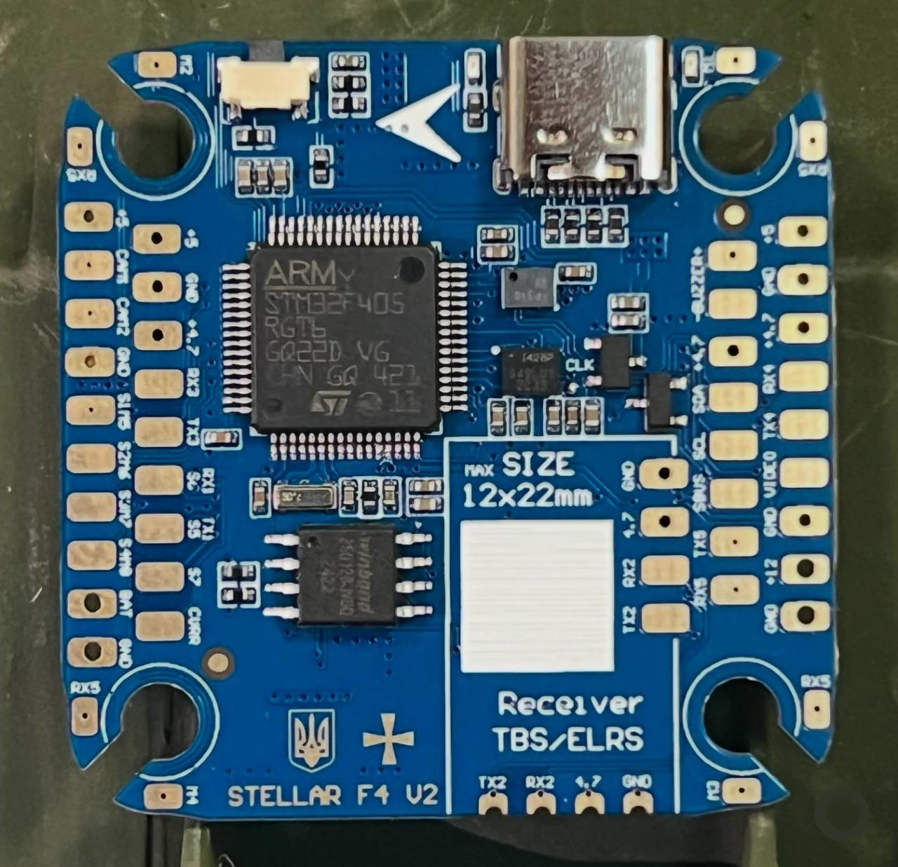

# StellarF4 V2 Flight Controller

https://stingbee.com.ua/flight_controllers/stellarf4v2

## Features
    Processor
        STM32F405
    Sensors
        ICM-42688p Acc/Gyro with external clock feature
        DPS310/BMP280 barometer
        AT7456E OSD
        W25Q128 dataflash
    Power
        8S Lipo input voltage with voltage monitoring
        12V, 3A BEC for powering Video Transmitter
        5V, 2A BEC for internal and peripherals
    Interfaces
        11x PWM outputs DShot capable, PWM1-4 DShot capable
        4x UARTs
        1x I2C
        2x ADC
        SPI flash for logging
        USB-C port
    LED
        Red, 3.3V power indicator
        Green, FC status
    Size
        41 x 41mm PCB with 30.5mm M3 mounting

  
## Overview

## Wiring Diagram

## UART Mapping

The UARTs are marked Rx* and Tx* in the above pinouts. The Rx* pin is the
receive pin for UART*. The Tx* pin is the transmit pin for UART*.

 - SERIAL0 -> USB
 - SERIAL2 -> USART2 (Serial RC input)
 - SERIAL3 -> USART3 (User)
 - SERIAL4 -> USART4 (DJI)
 - SERIAL5 -> USART5 (ESC Telemetry)

## CAN and I2C

StellarF4V2 supports I2C bus
multiple I2C peripherals can be connected to one I2C bus in parallel.

## RC Input

RC input is configured on the UART2(SERIAL2). It supports all serial RC protocols. SERIAL2_PROTOCOL=23 by default.

   
## OSD Support

StellarF4V2 supports using its internal OSD using OSD_TYPE 1 (MAX7456 driver). External OSD support such as DJI or DisplayPort is supported using any spare UART. See :ref:`common-msp-osd-overview-4.2` for more info.

## PWM Output

StellarF4V2 supports up to 11 PWM outputs. PWM1-4 outputs support DShot.

## Battery Monitoring

The board has 1 built-in voltage dividers and 1x current ADC. support external 3.3V based current sensor

## Compass

StellarF4V2 does not have a built-in compass, but you can attach an external compass using I2C on the SDA and SCL pads.

## Loading Firmware
Firmware for these boards can be found at https://firmware.ardupilot.org in sub-folders labeled StellarF4V2.

Initial firmware load can be done with DFU by plugging in USB with the
boot button pressed. Then you should load the "ardu*_with_bl.hex" firmware, using your favourite DFU loading tool. eg STM32CubeProgrammer

Subsequently, you can update firmware with Mission Planner.

