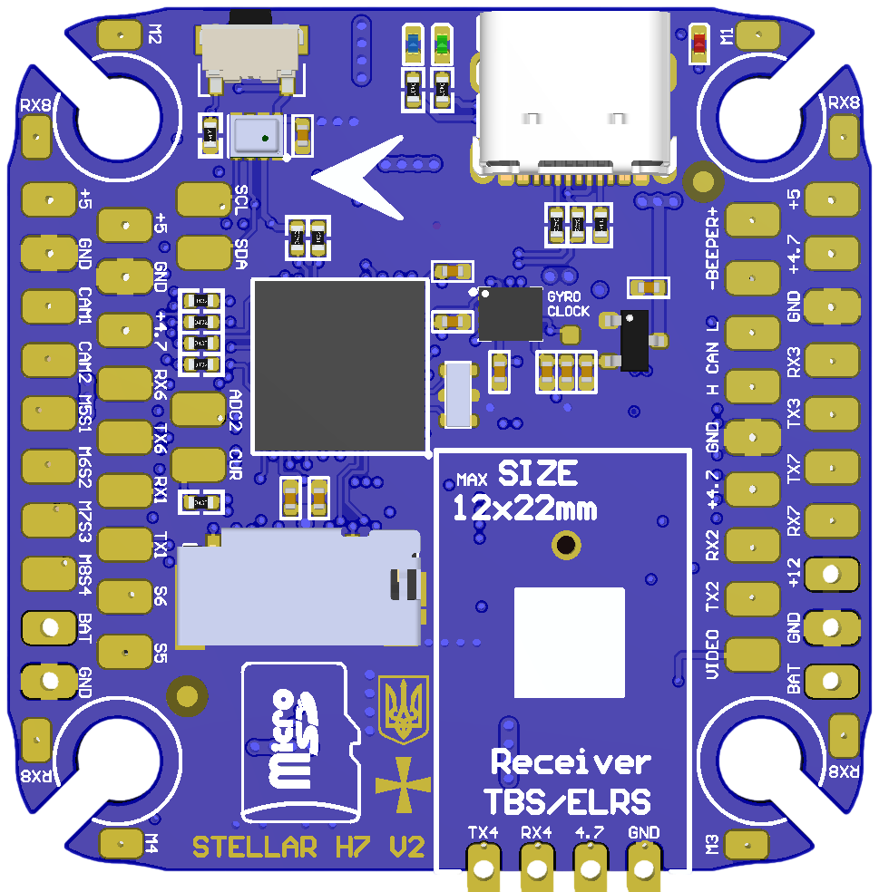
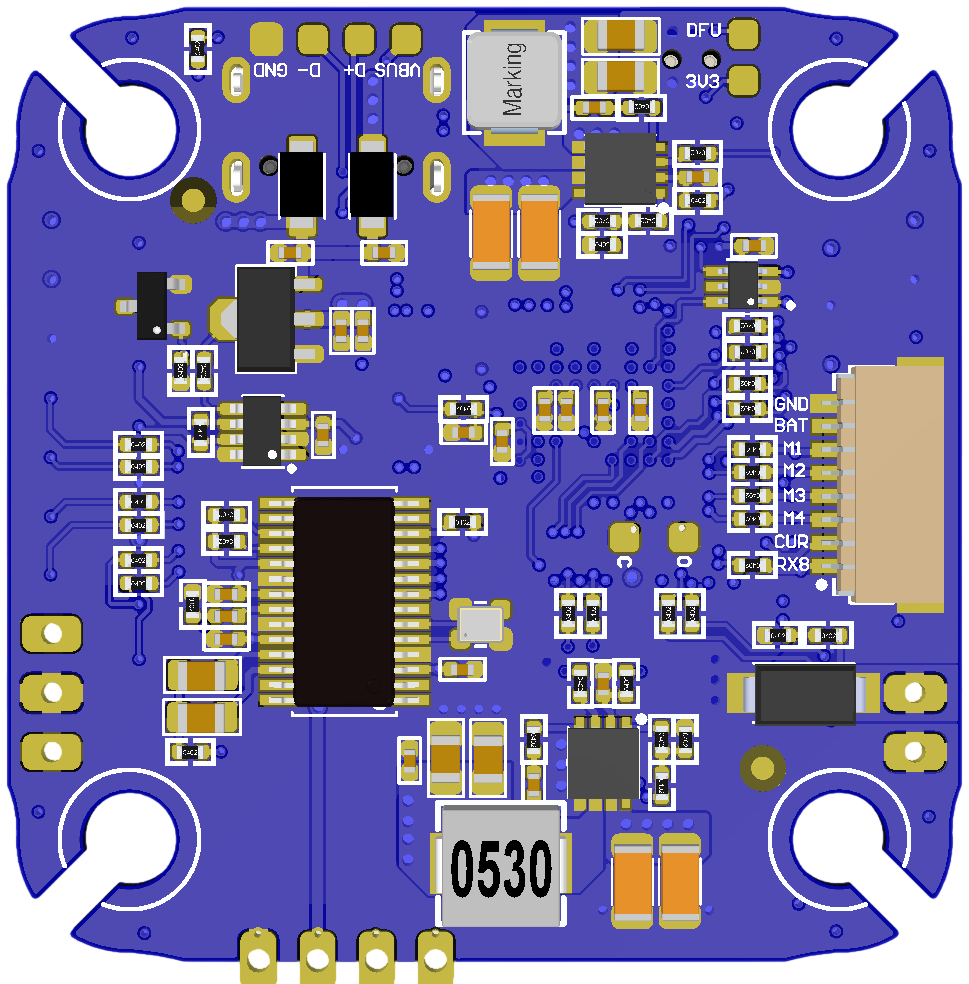

# StellarH7V2 Flight Controller

https://stingbee.com.ua/flight_controllers/stellarh7v2

## Features
    Processor
        STM32H743VIH6 480 MHz, 2MB flash
    Sensors
        ICM-42688p Acc/Gyro with external clock feature
        DPS310/BMP280 barometer
        AT7456E OSD
        SD Card
    Power
        2S-8S Lipo input voltage with voltage monitoring
        12V, 3A BEC for powering Video Transmitter
        5V, 2A BEC for internal and peripherals
    Interfaces
        10x PWM outputs DShot capable, 4 outputs BDShot capable
        7x UARTs
        1x CAN
        1x I2C
        3x ADC
        SD card for logging
        USB-C port
    LED
        Red, 3.3V power indicator
        Blue and Green, FC status
    Size
        41 x 41mm PCB with 30.5mm M3 mounting

  
## Overview

## UART Mapping

The UARTs are marked Rx* and Tx* in the above pinouts. The Rx* pin is the
receive pin for UART*. The Tx* pin is the transmit pin for UART*. All UARTS except UART6 and UART8 are DMA capable.

 - SERIAL0 -> USB
 - SERIAL1 -> UART1 (MAVLink2)
 - SERIAL2 -> UART2 (MAVLink2)
 - SERIAL3 -> UART3 (User)
 - SERIAL4 -> UART4 (Serial RC input)
 - SERIAL5 -> UART6 (GPS)
 - SERIAL6 -> UART7 (DisplayPort)
 - SERIAL7 -> UART8 (ESC Telemetry, RX8 pin only)

## CAN and I2C

StellarH7V2 supports 1x CAN bus and 1x I2C bus

## RC Input

The default RC input is configured on the UART4 RX4 input and can be used for all ArduPilot supported unidirectional receiver protocols. 
* PPM is not supported.
* SBUS/DSM/SRXL connects to the RX4 pin.
* FPort requires connection to TX4 and :ref:`SERIAL4_OPTIONS<SERIAL4_OPTIONS>` set to "7". See :ref:`common-FPort-receivers`.
* CRSF also requires a TX4 connection, in addition to RX4, and automatically provides telemetry.
* SRXL2 requires a connection to TX4 and automatically provides telemetry. Set :ref:`SERIAL4_OPTIONS<SERIAL4_OPTIONS>` to “4”.

## OSD Support

StellarH7V2 supports using its internal OSD using OSD_TYPE 1 (MAX7456 driver). Simultaneous DisplayPort OSD operation  is preconfigured on SERIAL 6 but requires OSD_TYPE2 = 5. See :ref:`common-msp-osd-overview-4.2` for more info.

## PWM Output

StellarH7V2 supports up to 10 PWM outputs. PWM 1-4 outputs support DShot.

All the channels support DShot. Channels 1-6 support bi-directional DShot. Channels 9 and 10 Marked as S5 and S6 on the board. PWM outputs are grouped and every group must use the same output protocol:
* 1, 2        are Group 1;
* 3, 4, 5, 6  are Group 2;
* 7, 8, 9, 10 are Group 3;

## Battery Monitoring

The board has 1 built-in voltage divider and 2x current ADC. Support external 3.3V based current sensor and external voltage divider.

The voltage input is compatible with 2~8S LiPo batteries.
The default battery parameters are:
* :ref:`BATT_MONITOR<BATT_MONITOR>` = 4
* :ref:`BATT_VOLT_PIN<BATT_VOLT_PIN__AP_BattMonitor_Analog>` = 10
* :ref:`BATT_CURR_PIN<BATT_CURR_PIN__AP_BattMonitor_Analog>` = 11 (CURR pin)
* :ref:`BATT_VOLT_MULT<BATT_VOLT_MULT__AP_BattMonitor_Analog>` = 11.0
* :ref:`BATT_AMP_PERVLT<BATT_AMP_PERVLT__AP_BattMonitor_Analog>` = 66.7

Pads for a second analog battery monitor are provided (Voltage only). To use:
* :ref:`BATT2_MONITOR<BATT2_MONITOR>` = 4
* :ref:`BATT2_VOLT_PIN<BATT2_VOLT_PIN__AP_BattMonitor_Analog>` = 18 (ADC1 pin, PA4)
* :ref:`BATT2_VOLT_MULT<BATT2_VOLT_MULT__AP_BattMonitor_Analog>` = 21.0

## Compass

StellarH7V2 does not have a built-in compass, but you can attach an external compass using I2C on the SDA and SCL pads.

## Loading Firmware
Firmware for these boards can be found at https://firmware.ardupilot.org in sub-folders labeled StellarH7V2.

Initial firmware load can be done with DFU by plugging in USB with the
boot button pressed. Then you should load the "ardu*_with_bl.hex" firmware, using your favourite DFU loading tool. eg STM32CubeProgrammer

Subsequently, you can update firmware with Mission Planner.

## Camera Switch
GPIO 81 (CAM_SW) controls which camera input (CAM1 or CAM2) is applied to the internal OSD. A RELAY function can be enabled to control the switching.

