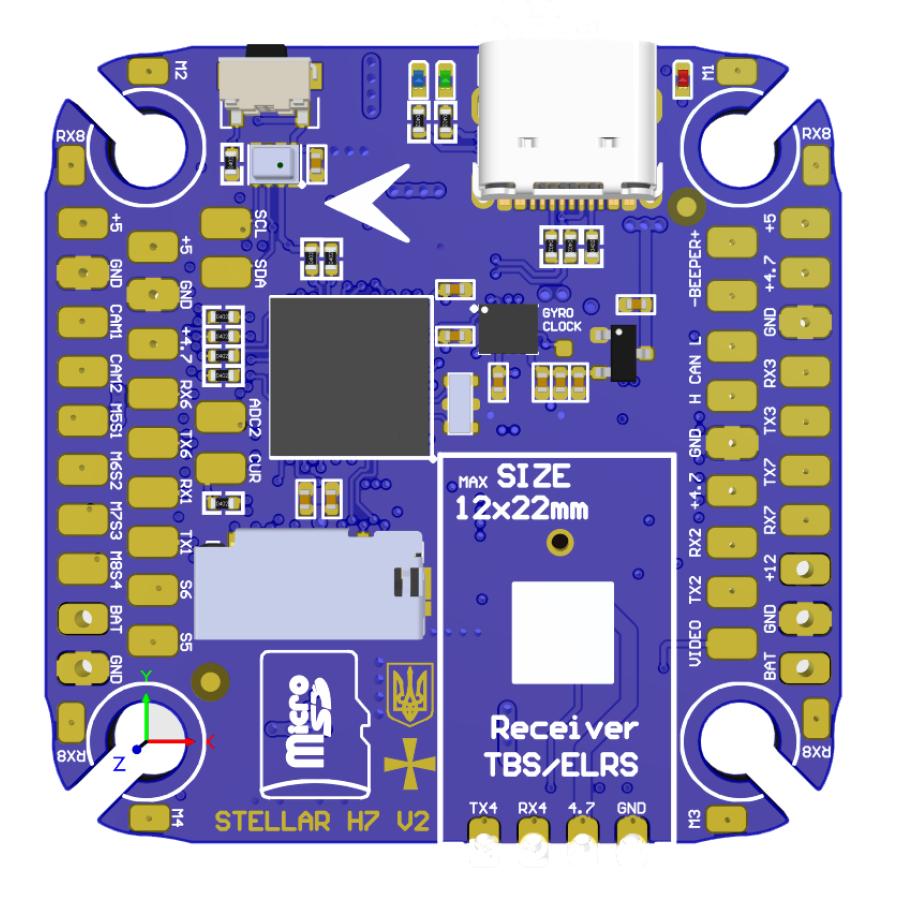
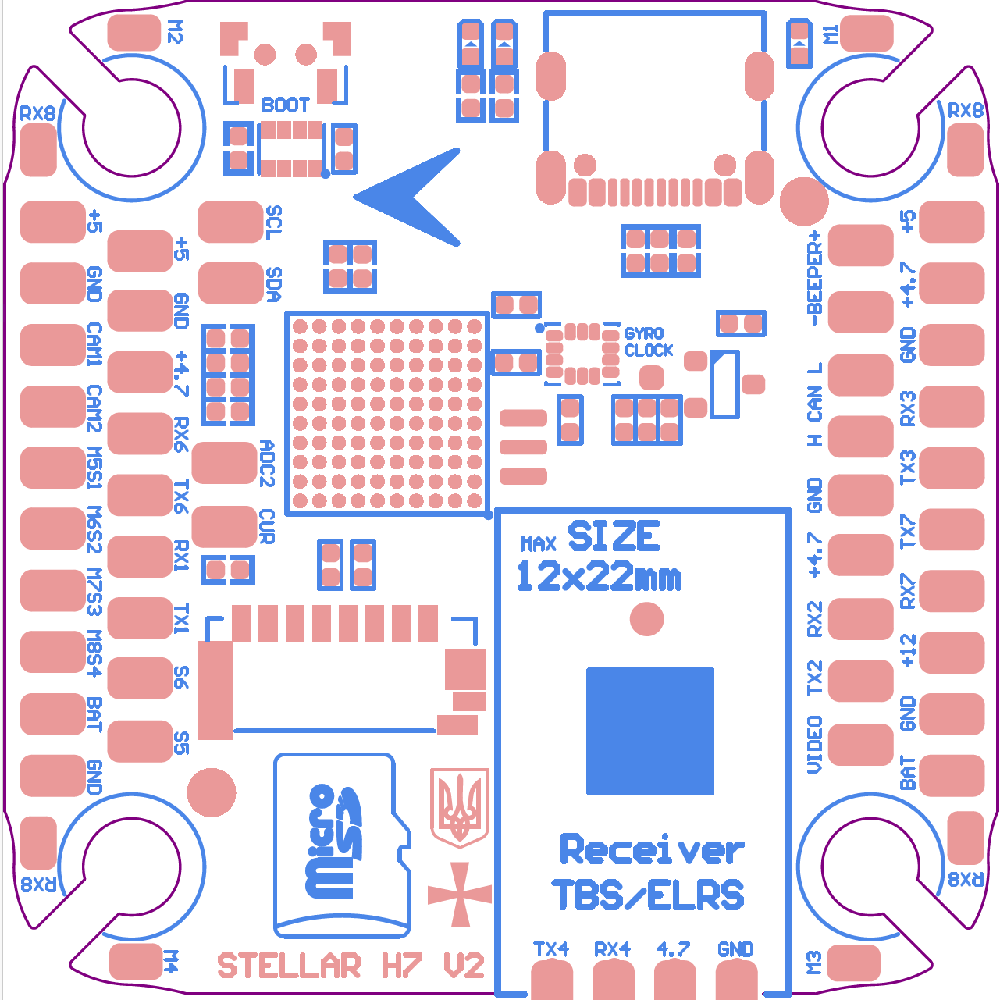

# StellarH7V2 Flight Controller

https://stingbee.com.ua/flight_controllers/stellarh7v2

## Features
    Processor
        STM32H743VIH6 480 MHz, 2MB flash
    Sensors
        ICM-42688p Acc/Gyro with external clock feature
        DPS310/BMP280 barometer
        AT7456E OSD
        SD Card
        W25N02G/1G dataflash
    Power
        8S Lipo input voltage with voltage monitoring
        12V, 3A BEC for powering Video Transmitter
        5V, 2A BEC for internal and peripherals
    Interfaces
        10x PWM outputs DShot capable
        7x UARTs
        1x CAN
        1x I2C
        3x ADC
        SD card and 128/256MB NAND for logging
        USB-C port
    LED
        Red, 3.3V power indicator
        Blue and Green, FC status
    Size
        41 x 41mm PCB with 30.5mm M3 mounting

  
## Overview

## Wiring Diagram

## UART Mapping

The UARTs are marked Rx* and Tx* in the above pinouts. The Rx* pin is the
receive pin for UART*. The Tx* pin is the transmit pin for UART*.

 - SERIAL0 -> USB
 - SERIAL1 -> USART1 (User)
 - SERIAL2 -> USART2 (User)
 - SERIAL3 -> USART3 (User)
 - SERIAL4 -> UART4  (Serial RC input)
 - SERIAL6 -> USART6 (User)
 - SERIAL7 -> USART6 (User)
 - SERIAL8 -> USART6 (User)

## CAN and I2C

StellarH7V2 supports 1x CAN bus and 1x I2C bus
multiple CAN peripherals can be connected to one CAN bus in parallel. similarly for I2C bus.

## RC Input

RC input is configured on the UART4(SERIAL4). It supports all serial RC protocols. SERIAL2_PROTOCOL=23 by default.

   
## OSD Support

StellarH7V2 supports using its internal OSD using OSD_TYPE 1 (MAX7456 driver). External OSD support such as DJI or DisplayPort is supported using any spare UART. See :ref:`common-msp-osd-overview-4.2` for more info.

## PWM Output

StellarH7V2 supports up to 10 PWM outputs. All outputs support DShot.

## Battery Monitoring

The board has 1 built-in voltage dividers and 2x current ADC. support external 3.3V based current sensor

## Compass

StellarH7V2 does not have a built-in compass, but you can attach an external compass using I2C on the SDA and SCL pads.

## Loading Firmware
Firmware for these boards can be found at https://firmware.ardupilot.org in sub-folders labeled StellarH7V2.

Initial firmware load can be done with DFU by plugging in USB with the
boot button pressed. Then you should load the "ardu*_with_bl.hex" firmware, using your favourite DFU loading tool. eg STM32CubeProgrammer

Subsequently, you can update firmware with Mission Planner.

