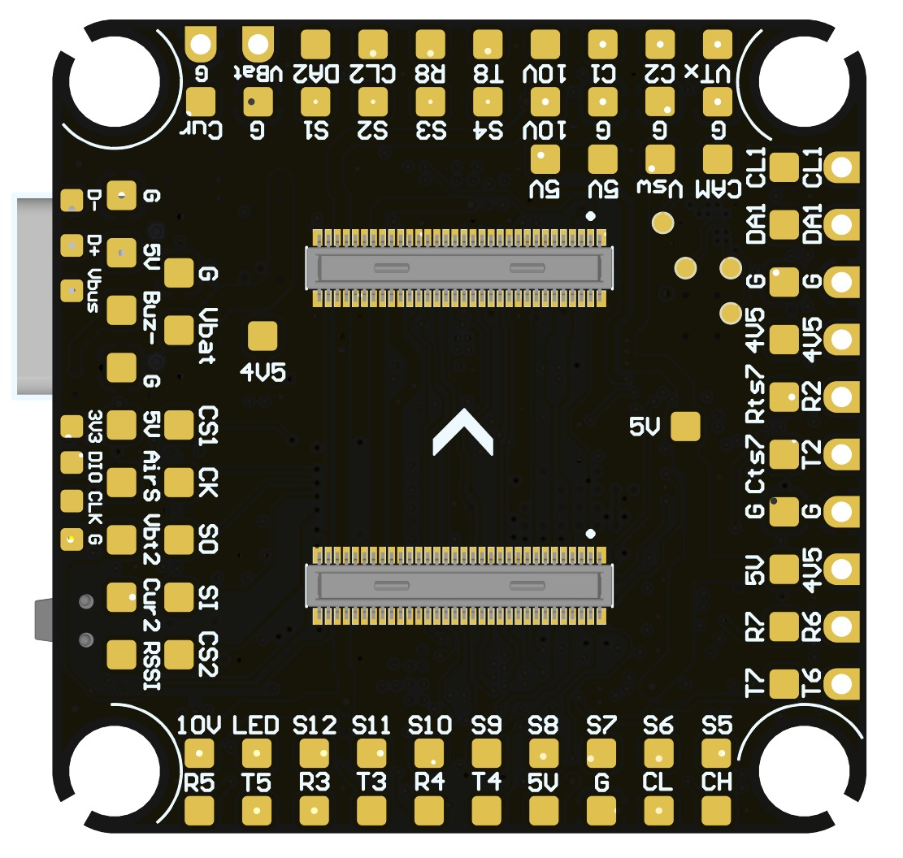
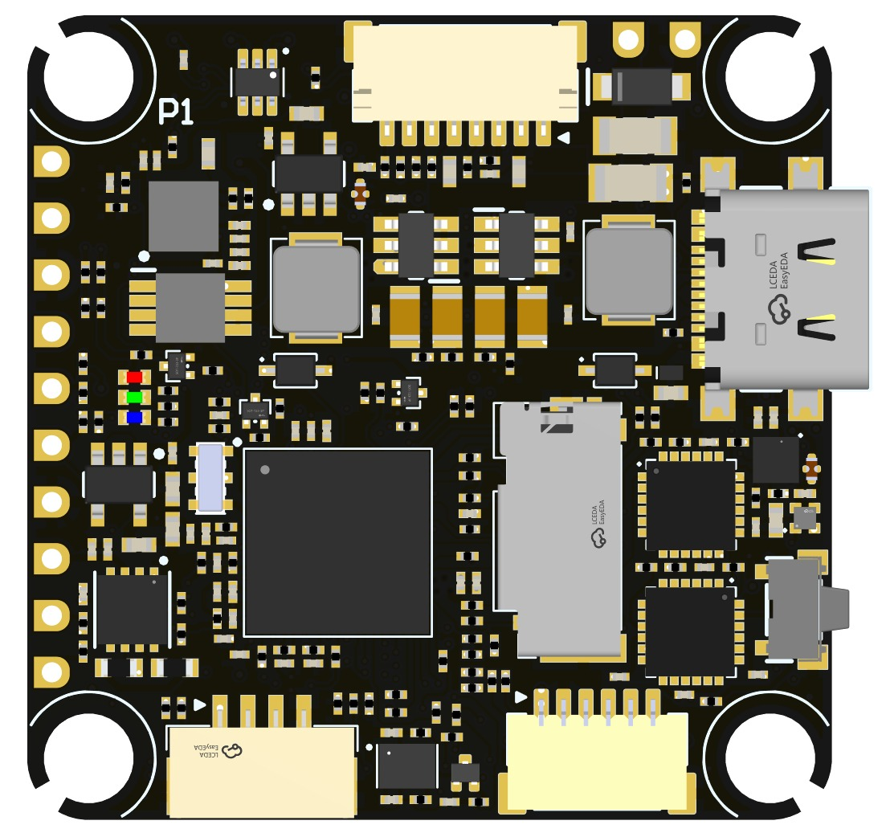

# TBS LUCID H7 OEM Flight Controller

The TBS LUCID H7 OEM is a flight controller produced by [TBS](https://www.team-blacksheep.com/).
It is a board-to-board variant of the TBS LUCID H7 (D2FCAP schematic) intended
for OEM integrators: electrically compatible with the TBS LUCID H7, but with
the on-board MAX7456 analog OSD replaced by a dedicated on-board STM32G431
co-processor that generates the analog video from MSP DisplayPort frames
supplied by the flight MCU over a UART link.

## Features

- MCU - STM32H743 32-bit processor running at 480 MHz
- IMU - Dual MPU6000 (boards may alternatively be populated with dual ICM42688; both are probed at boot)
- Barometer - DPS368 or BMP390 (either/or; both variants are probed at boot)
- OSD - On-board STM32G431 analog OSD driven by MSP DisplayPort over UART5
- microSD card slot
- 8x UARTs (including the internal OSD link)
- CAN support
- 13x PWM Outputs (12 Motor Output, 1 LED)
- Battery input voltage: 2S-8S (VBAT\_SENSE); second analog battery monitor rated for up to 12S
- BEC 3.3V (MCU + sensors)
- BEC 5V
- BEC 9V for video, GPIO controlled, pinned out on HD VTX connector
- Switchable VSW rail, GPIO controlled on/off
- Dual switchable camera inputs
- Connector: 2x DF40C-60DP-0.4V board-to-board (BACK/FRONT)

## Pinout

The images below are the standard TBS LUCID H7 pinout, shown here as a
reference until OEM-specific images are available. The board-to-board
connector pinouts are unchanged from the standard board.

## UART Mapping

The UARTs are marked Rn and Tn in the board documentation. The Rn pin is the
receive pin for UARTn. The Tn pin is the transmit pin for UARTn.

- SERIAL0 -> USB (MAVLink2)
- SERIAL1 -> UART1 (RX1 is SBUS in HD VTX connector)
- SERIAL2 -> UART2 (GPS, DMA-enabled)
- SERIAL3 -> UART3 (DisplayPort to external HD VTX, DMA-enabled)
- SERIAL4 -> UART4 (MAVLink2, Telem1)
- SERIAL5 -> UART5 (DisplayPort to on-board analog OSD co-processor, internal-only, DMA-enabled)
- SERIAL6 -> UART6 (RC Input, DMA-enabled)
- SERIAL7 -> UART7 (MAVLink2, Telem2, DMA and flow-control enabled)
- SERIAL8 -> UART8 (ESC Telemetry, RX8 on ESC connector for telem)

SERIAL5 is hard-wired to the on-board STM32G431 analog-OSD MCU and should not
be reassigned unless the analog OSD is being disabled entirely.

## RC Input

RC input is configured by default via the USART6 RX input. It supports all serial RC protocols except PPM.

Note: If the receiver is FPort the receiver must be tied to the USART6 TX pin, RSSI\_TYPE set to 3,
and SERIAL6\_OPTIONS must be set to 7 (invert TX/RX, half duplex). For full duplex like CRSF/ELRS use both
RX6 and TX6 and set RSSI\_TYPE also to 3.

If SBUS is used on the HD VTX connector (DJI TX), then SERIAL1\_PROTOCOL should be set to "23" and SERIAL6\_PROTOCOL changed to something else.

## FrSky Telemetry

FrSky Telemetry is supported using an unused UART, such as the T1 pin (UART1 transmit).
You need to set the following parameters to enable support for FrSky S.PORT:

- SERIAL1\_PROTOCOL 10
- SERIAL1\_OPTIONS 7

## OSD Support

Unlike the TBS LUCID H7, the OEM variant does **not** have a MAX7456 on SPI2.
Instead, analog video is generated by an on-board STM32G431 co-processor that
receives MSP DisplayPort frames from the flight MCU over UART5. The default
OSD configuration is therefore:

- OSD\_TYPE 5 (MSP DisplayPort) - drives the on-board analog OSD via SERIAL5
- OSD\_TYPE2 5 (MSP DisplayPort) - additionally drives an external HD VTX via SERIAL3

Both outputs render the same OSD layout simultaneously, so a ground analog
receiver and an HD goggle can be used together with no additional setup.

## PWM Output

The TBS LUCID H7 OEM supports up to 13 PWM or DShot outputs. The pads for
motor output M1 to M4 are provided on the motor connector, with M5-M12 and
an LED strip output on separate pads.

The PWM is in 6 groups:

- PWM 1-2   in group1
- PWM 3-4   in group2
- PWM 5-8   in group3
- PWM 9-10  in group4
- PWM 11-12 in group5
- PWM 13    in group6 (Serial LED by default)

Channels within the same group need to use the same output rate. If
any channel in a group uses DShot then all channels in the group need
to use DShot. Channels 1-10 support bi-directional DShot.

## Battery Monitoring

The board has a built-in voltage sensor and external current sensor input. The voltage sensor can handle up to 8S
LiPo batteries on the primary input.

The default battery parameters are:

- BATT\_MONITOR 4
- BATT\_VOLT\_PIN 10
- BATT\_CURR\_PIN 11
- BATT\_VOLT\_MULT 11.0
- BATT\_AMP\_PERVLT 40

Pads for a second analog battery monitor are provided. The second input uses
a 20K:1K divider and can measure up to 12S. To use:

- BATT2\_MONITOR 4
- BATT2\_VOLT\_PIN 18
- BATT2\_CURR\_PIN 7
- BATT2\_VOLT\_MULT 21.0
- BATT2\_AMP\_PERVLT as required

## Analog RSSI and AIRSPEED inputs

Analog RSSI uses RSSI\_PIN 8
Analog Airspeed sensor would use ARSPD\_PIN 4

## CAN

The board has a CAN port for DroneCAN peripherals such as GPS, compass, airspeed, and rangefinder.

## Compass

The TBS LUCID H7 OEM does not have a builtin compass, but you can attach an external compass using I2C on the SDA and SCL pads.

## VTX power control

GPIO 81 controls the VSW pins which can be switched on/off in firmware. Setting this GPIO low removes voltage supply to those pins. RELAY2 is configured by default to control this GPIO and is high by default.

GPIO 83 controls the VTX BEC output to pins marked "9V" and is included on the HD VTX connector. Setting this GPIO low removes voltage supply to this pin/pad. By default RELAY4 is configured to control this pin and sets the GPIO high.

## Camera control

GPIO 82 controls the camera output to the connectors marked "CAM1" and "CAM2". Setting this GPIO low switches the video output from CAM1 to CAM2. By default RELAY3 is configured to control this pin and sets the GPIO high.

## Loading Firmware

Firmware for this board can be found on the ArduPilot firmware server in sub-folders labeled "TBS\_LUCID\_H7\_OEM".

Initial firmware load can be done with DFU by plugging in USB with the
bootloader button pressed. Then you should load the "with\_bl.hex"
firmware, using your favourite DFU loading tool.

Once the initial firmware is loaded you can update the firmware using
any ArduPilot ground station software. Updates should be done with the
\*.apj firmware files.
