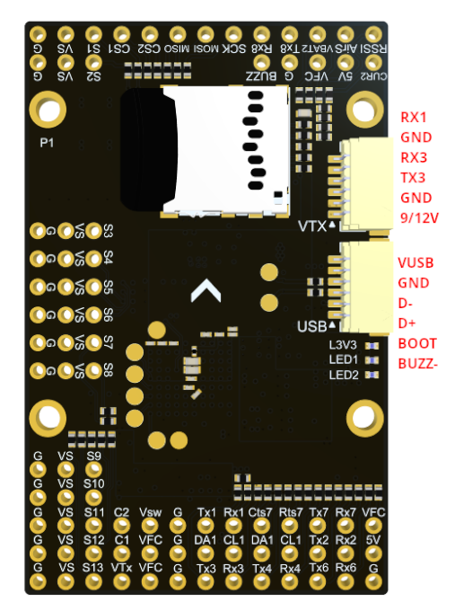
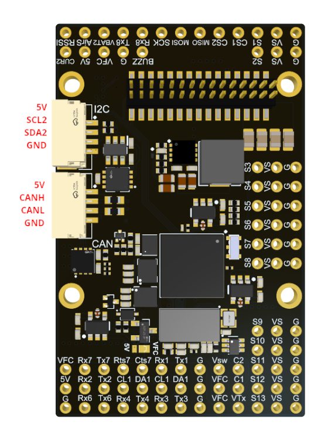
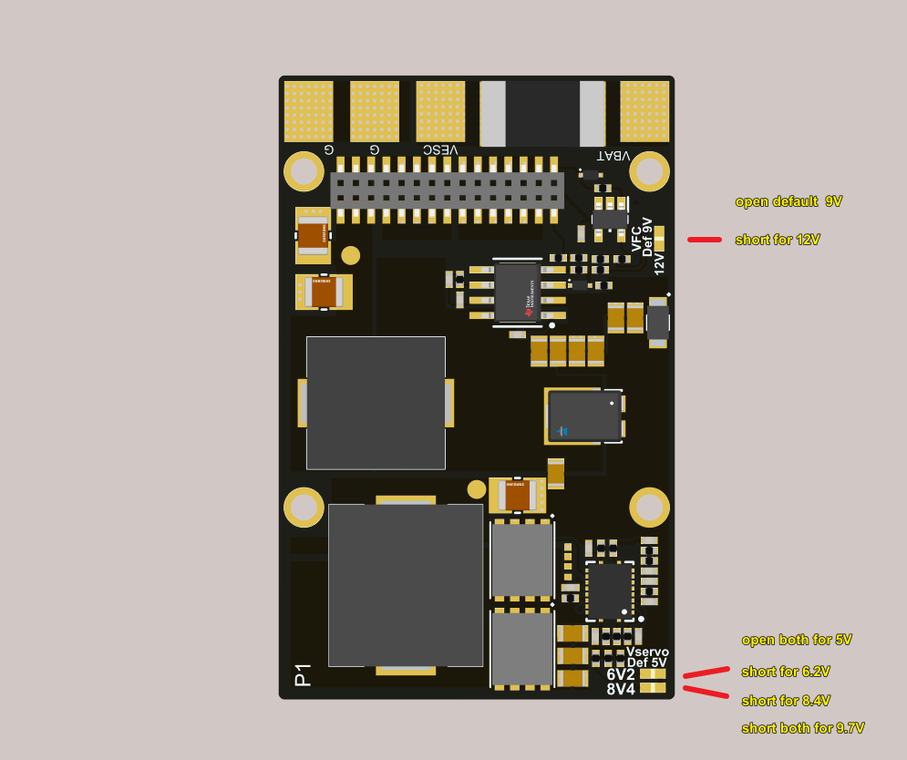

# TBS Lucid H7 Wing Flight Controller

The TBS Lucid H7 Wing is a flight controller produced by [TBS](https://www.team-blacksheep.com/).

## Features

 - MCU: STM32H743VIH6, 480MHz, 2MB Flash
 - Input voltage: 8V-50.4V (3-12S)
 - Output power: 8A cont./10A peak BEC. 5V, 6V, 8.4V (selectable)
 - Channels: 13x PWM (including LED)
 - Gyro: ICM42688 x 2 (SPI1 & SPI4)
 - Baro: DPS310 (I2C2)
 - Peripherals: 7x UART, 2x I2C, 1x CAN
 - Measurements: 6x ADC (Vbat, Current, CB2, CU2, RSSI, AirSpeed)
 - High speed ports: MicroSD BlackBox, SPI3 on pin headers
 - Analog FPV: Switchable dual camera inputs, AT7456E OSD, 5V/9V/12V support at 5A (selectable)
 - Digital FPV: "DJI"-connector with SBUS and OSD communication
 - Current sensor: 165A cont. / 240A peak
 - FC BEC: 5V 3A cont. (for FC & peripherals)
 - FPV VTX BEC: 9V/12V 5A (selectable) and controlled by GPIO
 - Dual  Camera inputs, GPIO selectable
 - Camera supply selectable between 5V and VTX supply
 - Dimensions:  54 x 36 x 13 mm

## Pinout

## UART Mapping

The UARTs are marked Rn and Tn in the above pinouts. The Rn pin is the
receive pin for UARTn. The Tn pin is the transmit pin for UARTn.

 - SERIAL0 -> USB (MAVLink2)
 - SERIAL1 -> UART1 (RX1 is SBUS in HD VTX connector)
 - SERIAL2 -> UART2 (GPS, DMA-enabled)
 - SERIAL3 -> UART3 (DisplayPort, DMA-enabled)
 - SERIAL4 -> UART4 (MAVLink2, Telem1)
 - SERIAL6 -> UART6 (RC Input, DMA-enabled)
 - SERIAL7 -> UART7 (MAVLink2, Telem2, DMA and flow-control enabled)
 - SERIAL8 -> UART8 (ESC Telemetry, RX8 on ESC connector for telem)

## RC Input

RC input is configured by default via the USART6 RX input. It supports all serial RC protocols except PPM.

* For FPort the receiver must be tied to the USART6 TX6 pin , :ref:`RSSI_TYPE<RSSI_TYPE>` set to 3, :ref:`SERIAL6_OPTIONS <SERIAL6_OPTIONS>` = "7" (invert TX/RX, half duplex).
* For full duplex CRSF/ELRS use both TX6 and RX6, and :ref:`RSSI_TYPE<RSSI_TYPE>` set to 3 and provides telemetry.
 
If SBUS is used on HD VTX connector (DJI TX), then :ref:`SERIAL1_PROTOCOl<SERIAL1_PROTOCOl>` should be set to "23" and :ref:`SERIAL6_PROTOCOL<SERIAL6_PROTOCOL>` changed to something else. If UART1 is used for something else, be sure the RX2 pin on the HD VTX connector is left open.

## FrSky Telemetry
 
FrSky Telemetry is supported using an unused UART, such as the T1 pin (UART1 transmit).
You need to set the following parameters to enable support for FrSky S.PORT:
 
 - :ref:`SERIAL1_PROTOCOL<SERIAL1_PROTOCOL>` 10
 - :ref:`SERIAL1_OPTIONS<SERIAL1_OPTIONS>` 7
  
## OSD Support

The TBS Lucid H7 Wing supports analog OSD using its onboard MAX7456 and simultaneously DisplayPort using TX3/RX3 on the HD VTX connector.

## PWM Output

The TBS Lucid H7 Wing supports up to 13 PWM or DShot outputs. The pads for motor output
M1 to M4 are provided on both the motor connectors and on separate pads, plus
M9-13 on a separate pads for LED strip and other PWM outputs.

The PWM is in 4 groups:

 - PWM 1-2   in group1
 - PWM 3-4   in group2
 - PWM 5-6   in group3
 - PWM 7-10  in group4
 - PWM 11-12 in group5
 - PWM 13    in group6

Channels within the same group need to use the same output rate. If
any channel in a group uses DShot then all channels in the group need
to use DShot. Channels 1-10 support bi-directional dshot.

## Battery Monitoring

The board has a built-in voltage sensor and external current sensor input. The current
sensor can read up to 130 Amps. The voltage sensor can handle up to 6S
LiPo batteries.

The correct battery setting parameters are:

 - :ref:BATT_MONITOR<BATT_MONITOR> 4
 - :ref:BATT_VOLT_PIN<BATT_VOLT_PIN__AP_BattMonitor_Analog> 10
 - :ref:BATT_CURR_PIN<BATT_CURR_PIN__AP_BattMonitor_Analog> 11
 - :ref:BATT_VOLT_MULT<BATT_VOLT_MULT__AP_BattMonitor_Analog> 11.0
 - :ref:BATT_AMP_PERVLT<BATT_AMP_PERVLT__AP_BattMonitor_Analog> 40.0

Pads for a second analog battery monitor are provided. To use:

 - :ref:BATT2_MONITOR<BATT2_MONITOR> 4
 - :ref:BATT2_VOLT_PIN<BATT2_VOLT_PIN__AP_BattMonitor_Analog> 18
 - :ref:BATT2_CURR_PIN<BATT2_CURR_PIN__AP_BattMonitor_Analog> 7
 - :ref:BATT2_VOLT_MULT<BATT2_VOLT_MULT__AP_BattMonitor_Analog> 11.0
 - :ref:BATT2_AMP_PERVLT<BATT2_AMP_PERVLT__AP_BattMonitor_Analog> as required

## Analog RSSI and AIRSPEED inputs

Analog RSSI uses RSSI_PIN 8
Analog Airspeed sensor would use ARSPD_PIN 4

## Compass

The TBS Lucid H7 Wing does not have a builtin compass, but you can attach an external compass using I2C on the SDA and SCL pads.

## VTX power control

GPIO 81 controls the Vsw pins which can be set to output either VFC (9/12V) or 5V via a board jumper. Setting this GPIO high removes voltage supply to pins. RELAY2 is configured by default to control this GPIO and is low by default.

GPIO 83 controls the VTX BEC output to pins marked "9V/12V"  included on the HD VTX connector and VFC pads and is included on the HD VTX connector. Setting this GPIO low removes voltage supply to this pin/pad.
By default RELAY4 is configured to control this pin and sets the GPIO high.

## Camera control

GPIO 82 controls the camera output to the connectors marked "C1" and "C2". Setting this GPIO low switches the video input from C1 to C2. By default RELAY3 is configured to control this pin.

## Loading Firmware

The TBS Lucid H7 Wing does not come with ArduPilot firmware pre-installed. Use the instructions here to load ArduPilot the first time :ref:`common-loading-firmware-onto-chibios-only-boards`.
Firmware for the TBS Lucid H7 Wing can be found `here <https://firmware.ardupilot.org>`_ in sub-folders labeled “TBS_LUCID_H7_WING".

Initial firmware load can be done with DFU by plugging in USB with the
bootloader button pressed. Then you should load the "with_bl.hex"
firmware, using your favourite DFU loading tool.

Once the initial firmware is loaded you can update the firmware using
any ArduPilot ground station software. Updates should be done with the
\*.apj firmware files.
