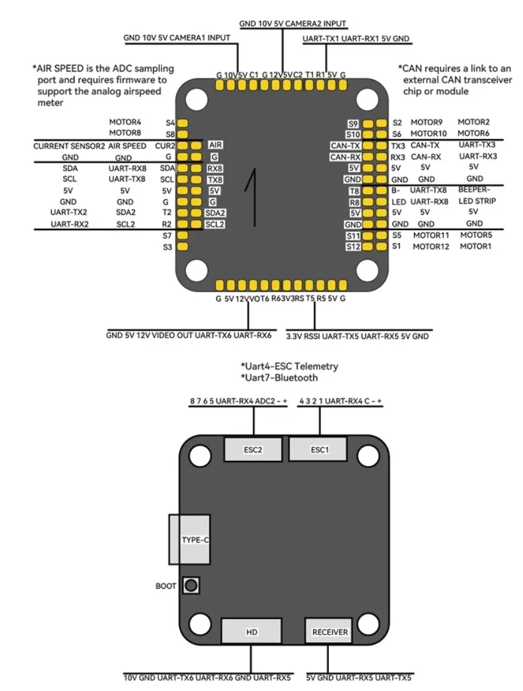

# T-Motor Pacer H743 Flight Controller

The **T-Motor Pacer H743** is a full-size H7 flight controller from T-Motor.

## Key differences vs. H7 Mini

* **12× PWM outputs:** pads **S1–S12** (Mini exposes far fewer).
* **More UARTs exposed (1–8):** with notes **UART4 = ESC telemetry**, **UART7 = Bluetooth**, **UART8** broken out on two headers.
* **CAN pads require an external transceiver** (none on board).
* **Airspeed ADC** input and **second current-sense header (CUR2)**.
* **Two I²C buses** (SDA/SCL and SDA2/SCL2).
* **Analog video path** with **VIDEO OUT** and **CAMERA1/2 10 V & 5 V** rails.
* **RSSI (3.3 V)** pad, **USB-C**, and underside **BOOT** button.

## Features

* MCU – **STM32H743** (480 MHz)
* Up to **12 PWM outputs** (MOTOR1…MOTOR12)
* **UART1–UART8** broken out
* **CAN-TX/CAN-RX** pads (use external transceiver)
* **Two I²C buses**, **Airspeed (ADC)**, **RSSI 3.3 V**
* Peripheral power rails available: **5 V**, **10 V**, **12 V**

## Pinout

## UART Mapping

`Rn` = UARTn RX, `Tn` = UARTn TX.

* **SERIAL0 → USB-C**
* **SERIAL1 → UART1**
* **SERIAL2 → UART2**
* **SERIAL3 → UART3**
* **SERIAL4 → UART4 (ESC telemetry)**
* **SERIAL5 → UART5** (Receiver port)
* **SERIAL6 → UART6** (often HD/DJI)
* **SERIAL7 → UART7 (Bluetooth)**
* **SERIAL8 → UART8** (duplicated headers—use one)

## RC Input

Use the **Receiver** header (UART5). Supports all serial RC protocols.
For FPort/CRSF telemetry, enable half-duplex on **SERIAL5** as required.

## OSD / Video

Analog **VIDEO OUT** is provided along with **10 V/5 V camera power**.
If your variant includes an AT/MAX7456 chip, use **`OSD_TYPE = 1`**; for digital VTX use MSP DisplayPort.

## PWM Output

Up to **12 outputs** (S1–S12). Standard H7 timer grouping applies—channels in the same group must share rate/protocol; Bi-DShot supported where timers allow.

## Battery Monitoring

Board exposes **CUR2** and voltage/current sense. **Calibrate** voltage and current scaling; do **not** reuse Mini’s `BATT_*` values.

## Compass

No onboard compass; attach an external unit via **I²C** (either bus).

## Loading Firmware

Hold **BOOT** and plug **USB-C** to enter DFU, flash the **with\_bl.hex** initially.
After that, update via your ground station using **`.apj`** firmware files.
