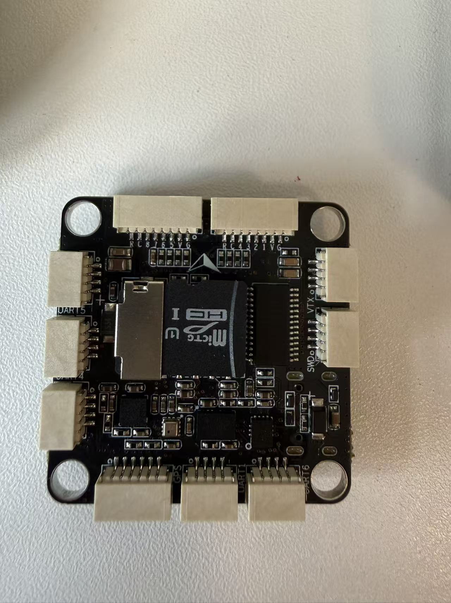
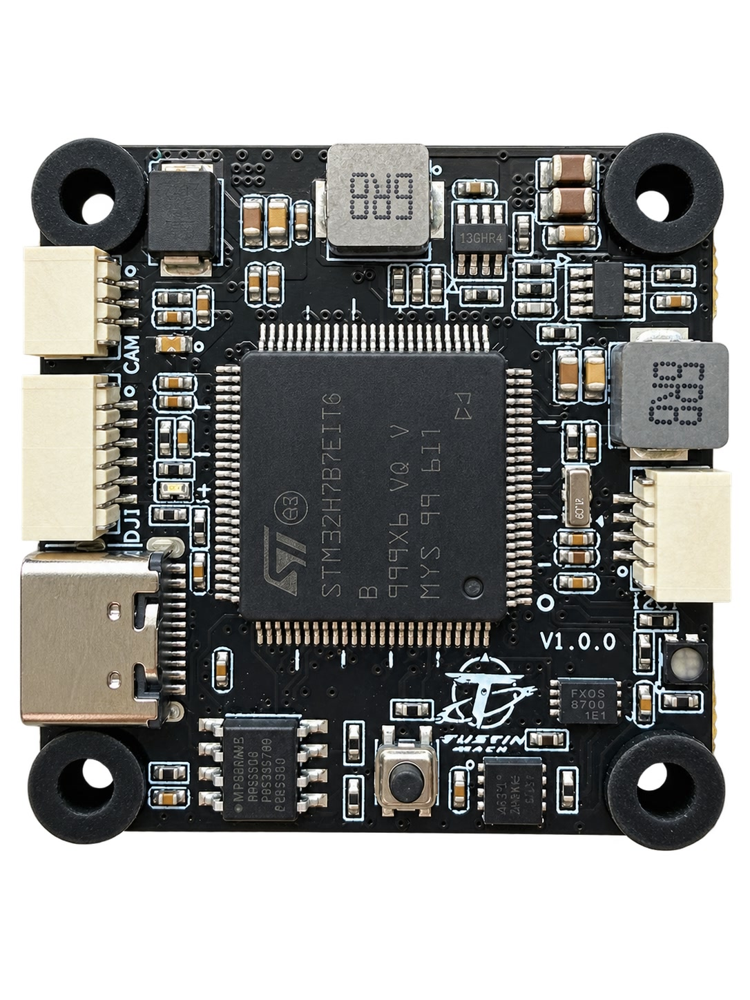

# Tustin MACH Flight Controller

The Tustin MACH is an STM32H743-based flight controller intended for
multirotors.

## Where to Buy

The Tustin MACH is available from
[Tustin Dynamics](https://tustindynamics.com/products/tustin-mach).

## Features

- STM32H743 microcontroller with 2 MiB of flash
- BMI088 and ICM-45686 IMUs
- ICP-20100 barometer
- IST8310 magnetometer
- AT7456E analog OSD
- 32 KiB SPI FRAM
- MicroSD card slot using four-bit SDMMC
- Seven serial ports, including one receive-only ESC telemetry port
- Eight PWM/DShot outputs with bidirectional DShot capability
- One CAN port with an onboard 120 ohm termination resistor
- One external I2C bus
- Common-anode RGB status LED
- USB-C, SWD, and STM32 ROM DFU support
- 12 V and 5 V onboard regulators

## Physical

The white arrow in the front view points toward the front of the vehicle. With
the arrow pointing up as shown, the connectors on the left edge are UART5,
UART4, and CAN from top to bottom. The bottom-edge connectors are GPS, UART1,
and UART6/RC from left to right, while VTX and DEBUG/SWD are on the right edge.
In the back view, CAM, DJI, and USB-C are on the left edge, I2C is on the right
edge, and the BOOT button is the tactile switch at the bottom center.

On the physical board, from left to right in the front view, the ESC M5-M8
connector is labelled `R C 8 7 6 5 V G`, and the ESC M1-M4 connector is
labelled `R C 4 3 2 1 V G`. Use the connector pinout below as the wiring
reference.

## UART Mapping

| ArduPilot port | Hardware | Connector | Default protocol |
|----------------|----------|-----------|------------------|
| SERIAL0 | USB | USB-C | MAVLink2 |
| SERIAL1 | USART1 | TELEM1 | MAVLink2 |
| SERIAL2 | USART2 | DJI and VTX | MSP DisplayPort |
| SERIAL3 | USART3 | GPS | GPS |
| SERIAL4 | UART4 | UART4 (TELEM2) | MAVLink2 |
| SERIAL5 | UART5 | UART5 (TELEM3) | MAVLink2 |
| SERIAL6 | USART6 | RC and DJI | RC input |
| SERIAL7 | UART7 RX | ESC connectors | ESC telemetry |

UART7 is receive-only because its transmit pin is not connected on the PCB.
All connected UART directions are DMA-capable except UART7 RX, which
intentionally does not use DMA.

Several signals are shared between connectors:

- USART2 TX is connected to both the DJI and VTX connectors.
- USART6 RX is connected to both the RC and DJI connectors. Do not connect two
  active transmitters to this signal at the same time.
- The current-sense and UART7 RX signals are each connected to both ESC
  connectors. Do not connect two active current-sense outputs or two
  push-pull ESC telemetry outputs at the same time.
- I2C1 is shared by the GPS and dedicated I2C connectors.

## Connector Pinout

Pin numbers below follow the schematic connector numbering.

| Connector | Pins |
|-----------|------|
| ESC M1-M4 | 1 GND, 2 VBAT, 3 M1, 4 M2, 5 M3, 6 M4, 7 CUR, 8 RX7 |
| ESC M5-M8 | 1 GND, 2 VBAT, 3 M5, 4 M6, 5 M7, 6 M8, 7 CUR, 8 RX7 |
| GPS | 1 5V, 2 TX3, 3 RX3, 4 SCL1, 5 SDA1, 6 GND |
| UART5 (TELEM3) | 1 GND, 2 5V, 3 TX5, 4 RX5 |
| UART4 (TELEM2) | 1 GND, 2 5V, 3 TX4, 4 RX4 |
| TELEM1 | 1 GND, 2 5V, 3 TX1, 4 RX1 |
| RC | 1 GND, 2 5V, 3 TX6, 4 RX6 |
| VTX | 1 12V, 2 GND, 3 OSD OUT, 4 TX2 |
| CAM | 1 12V, 2 GND, 3 OSD IN |
| DJI | 1 12V, 2 GND, 3 TX2, 4 RX2, 5 GND, 6 RX6 |
| I2C | 1 5V, 2 SCL1, 3 SDA1, 4 GND |
| CAN | 1 5V, 2 CAN H, 3 CAN L, 4 GND |
| DEBUG | 1 3.3V, 2 GND, 3 SWDIO, 4 SWCLK |

The DEBUG connector does not expose the reset signal.

## RC Input

The RC connector uses SERIAL6 by default and provides both USART6 TX and RX.
It supports bidirectional serial receivers such as CRSF/ELRS. See
[RC systems](https://ardupilot.org/copter/docs/common-rc-systems.html) for
protocol-specific setup instructions.

With `SERIAL6_PROTOCOL` set to RC input (`23`, the default), ArduPilot
automatically detects SBUS and configures the required baud rate, parity, stop
bits, and RX inversion. A standard inverted SBUS receiver can therefore be
connected directly to USART6 RX; no external inverter or manual
`SERIAL6_OPTIONS` change is required.

USART6 RX is also connected to the DJI connector. Only one active source may
drive this signal.

## OSD Support

The onboard AT7456E provides analog OSD and is enabled by default. Connect the
analog camera to the CAM connector and the analog video transmitter to the VTX
connector.

MSP DisplayPort is enabled on SERIAL2 for digital video systems. The DJI and
VTX connectors share USART2 TX, so DisplayPort and analog VTX control are
mutually exclusive on this port. To use the VTX connector's TX2 pin for
SmartAudio or IRC Tramp, change `SERIAL2_PROTOCOL` from MSP DisplayPort (`42`)
to SmartAudio (`37`) or IRC Tramp (`44`), set `OSD_TYPE2` to `0` (None), and
reboot. Leave `OSD_TYPE` set to `1` to retain the onboard analog OSD. Leaving
`OSD_TYPE2` set to `5` without another DisplayPort UART prevents arming with an
`OSD_TYPE2 not compatible with first OSD` pre-arm error.

The CAM, VTX, and DJI connectors carry 12 V. Check peripheral voltage ratings
before connecting them.

## PWM Output

The board supports eight PWM, DShot, and bidirectional DShot-capable outputs.
DShot and bidirectional telemetry are capabilities and are not enabled by
default.

The outputs are grouped by timer:

- PWM 1, 2, 3, and 4 use TIM1.
- PWM 5 and 6 use TIM3.
- PWM 7 and 8 use TIM4.

Outputs in the same timer group must use a compatible output rate and protocol.
Remove propellers before testing output order or direction.

## Battery Monitoring

Analog battery monitoring is enabled by default:

- `BATT_MONITOR` = 4
- `BATT_VOLT_PIN` = 10
- `BATT_CURR_PIN` = 11
- `BATT_VOLT_MULT` = 21.0
- `BATT_AMP_PERVLT` = 40.0

The 21.0 voltage multiplier follows the onboard 20 kohm/1 kohm divider. The
current-sense voltage comes from the connected ESC, so 40.0 A/V is only a
starting value and must be calibrated for the installed ESC.

## Compass

An IST8310 magnetometer is connected to the internal I2C2 bus. External I2C
compasses can be connected to I2C1 through either the GPS or I2C connector.
Both I2C1 and I2C2 have 1.5 kohm external pull-up resistors to 3.3 V.

The configured BMI088, ICM-45686, and IST8310 rotations have been verified on
hardware. Perform the normal accelerometer and compass calibrations before
flight.

The onboard compass can be affected by nearby power wiring and ESCs. Most
users should disable it and use an external compass mounted away from these
interference sources.

## Storage

ArduPilot parameters are stored in the onboard 32 KiB FM25V02A FRAM. A 24LC64
EEPROM is also fitted on internal I2C2 at address `0x51`, but it is not used by
this board definition.

The microSD socket has no card-detect signal and the board schematic specifies
that the card is not hot-pluggable. Insert or remove the card only while the
board is unpowered.

## CAN

CAN1 is enabled by default. The board has a permanently fitted 120 ohm resistor
between CAN H and CAN L; the termination cannot be disabled in software. Take
this into account when placing the board on a terminated CAN bus.

## Power

The schematic specifies a 12 V to 40 V VBAT input range. The two ESC connectors
carry unregulated VBAT. The CAM, VTX, and DJI connectors are supplied by the
onboard 12 V regulator. GPS, telemetry, RC, I2C, and CAN connectors use the 5 V
rail.

USB VBUS and the onboard 5 V supply are diode-ORed onto the 5 V peripheral rail.
Consequently, plugging in USB can also power connected 5 V peripherals. Keep
the total load within the USB source capability when the board is USB-powered.

The board has no buzzer, safety switch, controllable sensor power rail, or IMU
heater.

## Loading Firmware

The firmware board ID is 1225 and the application starts after a 128 KiB
bootloader region. The application RAM mapping is compatible with the factory
PX4 H7 bootloader.

After this board is merged, firmware will be published on the
[ArduPilot firmware server](https://firmware.ardupilot.org) under the
`TUSTIN_MACH` board folder.

For an initial ArduPilot bootloader installation, hold the BOOT button while
connecting USB to enter the STM32 ROM DFU bootloader, then flash the matching
`arducopter_with_bl.hex` image with STM32CubeProgrammer. This published combined
bootloader and application image uses Intel HEX format, which
STM32CubeProgrammer supports directly. Subsequent updates can be installed
using the `.apj` file from an ArduPilot ground station.

The ArduPilot bootloader also supports an offline update from
`/ardupilot.abin` on the microSD card. Power the board off before inserting or
removing the card.
