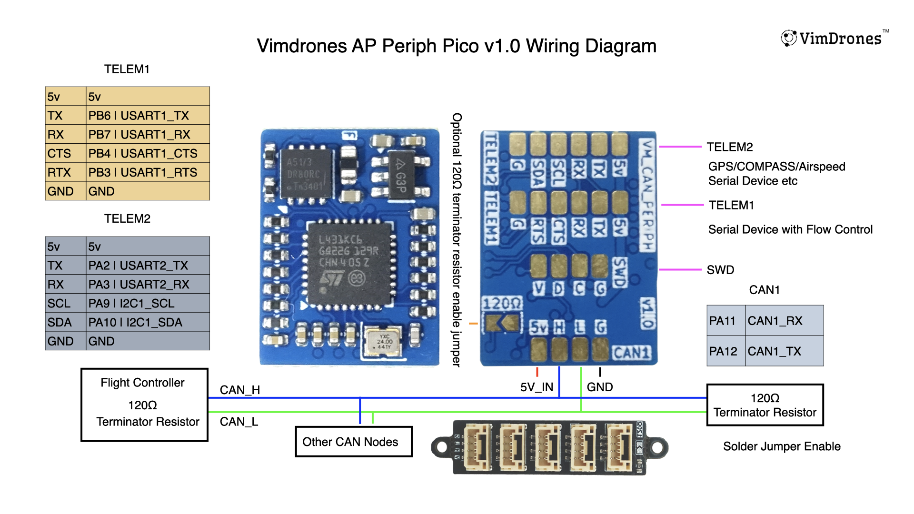

### VM-L431-Periph-Pico

Vimdrones AP_Periph Pico board to convert serial(GPS) and I2C(COMPASS/Air Speed) device in to Dronecan device.

#### Hardware Features

- STM32L431 microcontroller
- CAN bus interface
- 1 Telem with I2C 
- 1 Telem with Flow Control 

#### Wiring Diagram

