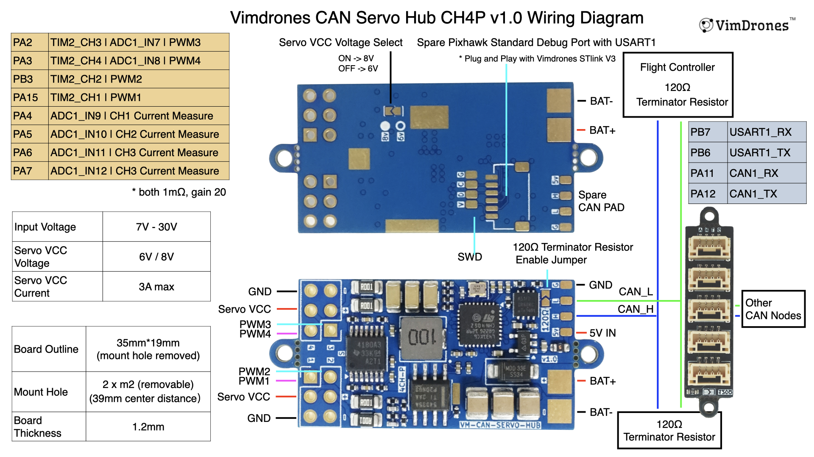

### VM-L431-SRV-Hub-4CHP

Vimdrones CAN Servo Hub peripheral with 4 channels PWM output and 4 channel Servo VCC current measure (4CHP).

#### Hardware Features

- STM32L431 microcontroller
- CAN bus interface
- 4 PWM output channels
- 4 ADC inputs for current sensing

#### Wiring Diagram

