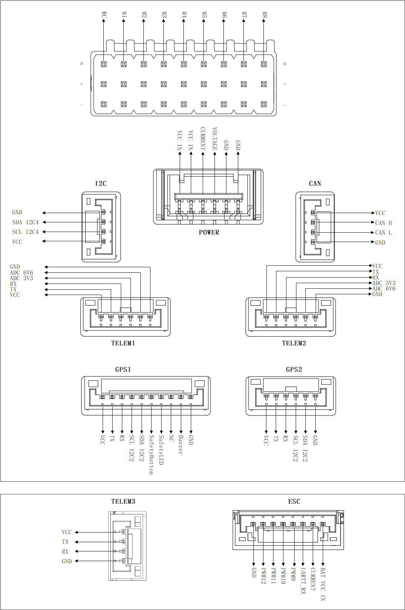

# VUAV-V7Tiny Flight Controller

The VUAV-V7Tiny  flight controller is manufactured and sold by [V-UAV](http://www.v-uav.com/).

## Features

- STM32H743 microcontroller
- Two IMUs: ICM45686,BMI088
- Internal IST8310 magnetometer
- Internal ICP-20100 barometer
- Internal RGB LED
- MicroSD card slot port
- 1 ESC connector power input and current sensor input
- 5 UARTs and 1 USB ports
- 12 PWM output ports
- 1 I2C and 1 CAN ports
- Safety switch port
- Buzzer port
- RC IN port

## Pinout

## UART Mapping

- SERIAL0 -> USB
- SERIAL1 -> UART2 (MAVLink2, Telem1) (DMA enabled)
- SERIAL2 -> UART5 (MAVLink2, Telem2) (DMA enabled)
- SERIAL3 -> UART1 (GPS1) (DMA enabled)
- SERIAL4 -> UART3 (GPS2) (DMA enabled)
- SERIAL5 -> UART7 (User defined, marked Telem3) (DMA enabled)
- SERIAL6 -> USB2 (virtual port on same connector)

The Telem1 port has RTS/CTS pins, the other UARTs do not have RTS/CTS.

## Connectors

### TELEM1 port

| Pin  |  Signal   | Volt  |
| :--: | :-------: | :---: |
|  1   |    VCC    |  +5V  |
|  2   | TX2 (OUT) | +3.3V |
|  3   | RX2 (IN)  | +3.3V |
|  4   |    CTS    | +3.3V |
|  5   |    RTS    | +3.3V |
|  6   |    GND    |  GND  |

### TELEM2/ADC port

| Pin  |  Signal   |    Volt     |
| :--: | :-------: | :---------: |
|  1   |    VCC    |     +5V     |
|  2   | TX5 (OUT) |    +3.3V    |
|  3   | RX5 (IN)  |    +3.3V    |
|  4   |  ADC_3V3  | up to +3.3V |
|  5   |  ADC_6V6  | up to +3.3V |
|  6   |    GND    |     GND     |

### TELEM3/ADC port

NOTE: RX7 is pinned out here and on the ESC connector

| Pin  |  Signal   | Volt  |
| :--: | :-------: | :---: |
|  1   |    VCC    |  +5V  |
|  2   | TX7 (OUT) | +3.3V |
|  3   | RX7 (IN)  | +3.3V |
|  4   |    GND    |  GND  |

### GPS1/I2C2 port

| Pin  |    Signal    |      Volt       |
| :--: | :----------: | :-------------: |
|  1   |     VCC      |       +5V       |
|  2   |  TX1 (OUT)   |      +3.3V      |
|  3   |   RX1 (IN)   |      +3.3V      |
|  4   |   SCL I2C2   | +3.3V (pullups) |
|  5   |   SDA I2C2   | +3.3V (pullups) |
|  6   | SafetyButton |      +3.3V      |
|  7   |  SafetyLED   |      +3.3V      |
|  8   |      -       |        -        |
|  9   |    Buzzer    |      +3.3V      |
|  10  |     GND      |       GND       |

### GPS2/I2C2 port

| Pin  |  Signal   |      Volt       |
| :--: | :-------: | :-------------: |
|  1   |    VCC    |       +5V       |
|  2   | TX3 (OUT) |      +3.3V      |
|  3   | RX3 (IN)  |      +3.3V      |
|  4   | SCL I2C2  | +3.3V (pullups) |
|  5   | SDA I2C2  | +3.3V (pullups) |
|  6   |    GND    |       GND       |

### CAN1 port

| Pin  | Signal | Volt |
| :--: | :----: | :--: |
|  1   |  VCC   | +5V  |
|  2   | CAN_H  | +24V |
|  3   | CAN_L  | +24V |
|  4   |  GND   | GND  |

### I2C port

| Pin  |  Signal  |      Volt      |
| :--: | :------: | :------------: |
|  1   |   VCC    |      +5V       |
|  2   | SCL I2C4 | +3.3 (pullups) |
|  3   | SDA I2C4 | +3.3 (pullups) |
|  4   |   GND    |      GND       |

### POWER

| Pin  | Signal  |    Volt     |
| :--: | :-----: | :---------: |
|  1   | VCC IN  |     +5V     |
|  2   | VCC IN  |    +3.3V    |
|  3   | CURRENT | up to +3.3V |
|  4   | VOLTAGE | up to +3.3V |
|  5   |   GND   |     GND     |
|  6   |   GND   |     GND     |

### ESC

| Pin  |   Signal   |    Volt     |
| :--: | :--------: | :---------: |
|  1   | BAT VCC IN | +6V to 26V  |
|  2   |  CURRENT   | up to +3.3V |
|  3   |  UART7_RX  |    +3.3V    |
|  4   |    PWM9    |    +3.3V    |
|  5   |   PWM10    |    +3.3V    |
|  6   |   PWM11    |    +3.3V    |
|  7   |   PWM12    |    +3.3V    |
|  8   |    GND     |     GND     |

## RC Input

The RC input is configured on the RCIN pin at one end of the servo rail. This pin supports all unidirectional RC protocols. For bidirectional protocols, such as CRSF/ELRS, any SERIAL port can be set to protocol "23" and the receiver can be connected to its RX and TX pins as described in [RC control systems](https://ardupilot.org/rover/docs/common-rc-systems.html).

## PWM Output

The VUAV-V7Tiny supports up to 12 PWM outputs and all PWM protocols. Outputs 1-8 support bidirectional Dshot protocol. All 8 PWM outputs use a three-row design: the top row is GND, the middle rows are connected together, and the bottom row is the signal line. Outputs 9-12 do not support Dshot and are located at the ESC interface.

The 12 PWM outputs are in 4 groups:

- PWM 1, 2, 3 and 4 in group1
- PWM 5, 6, 7 and 8 in group2
- PWM 9, 10 in group3
- PWM 11, 12 in group4

Channels within the same group need to use the same output rate. If any channel in a group uses DShot, then all channels in that group need to use DShot.

## GPIOs

All 12 PWM channels can be used for GPIO functions (relays, buttons, RPM etc).

The pin numbers for these PWM channels in ArduPilot are shown below:

| PWM Channels | Pin  | PWM Channels | Pin  |
| :----------: | :--: | :----------: | :--: |
|     PWM1     |  50  |     PWM7     |  56  |
|     PWM2     |  51  |     PWM8     |  57  |
|     PWM3     |  52  |     PWM9     |  58  |
|     PWM4     |  53  |    PWM10     |  59  |
|     PWM5     |  54  |    PWM11     |  60  |
|     PWM6     |  55  |    PWM12     |  61  |

## Analog inputs

The VUAV-V7Tiny  flight controller has 6 Analog inputs

- ADC Pin18-> Battery Current
- ADC Pin4 -> Battery Voltage
- ADC Pin19 -> ADC 3V3 Sense
- ADC Pin5 -> ADC 6V6 Sense
- ADC Pin10  -> Battery Voltage input on ESC connector
- ADC Pin8  -> Servo Voltage

## Battery Monitor Configuration

The board has voltage and current inputs sensor on the POWER and ESC connector.

The correct battery setting parameters are:

Enable POWER monitor:

- BATT_MONITOR 4
- BATT_VOLT_PIN 4
- BATT_CUR_PIN 8
- BATT_VOLT_MULT 20
- BATT_AMP_PERVLT 24

Enable ESC battery monitor (if used) :

- BATT2_MONITOR 3
- BATT2_VOLT_PIN 10
- BATT2_VOLT_MULT 10.09

## Loading Firmware

The firmware can be found at [ArduPilot Firmware Server](https://firmware.ardupilot.org). Click on the corresponding type, such as Plane or Copter, then select the version folder, and finally select the folder labeled "VUAV-TinyV7".

The board comes pre-installed with an ArduPilot compatible bootloader, allowing the loading of \*.apj firmware files with any ArduPilot compatible ground station.
