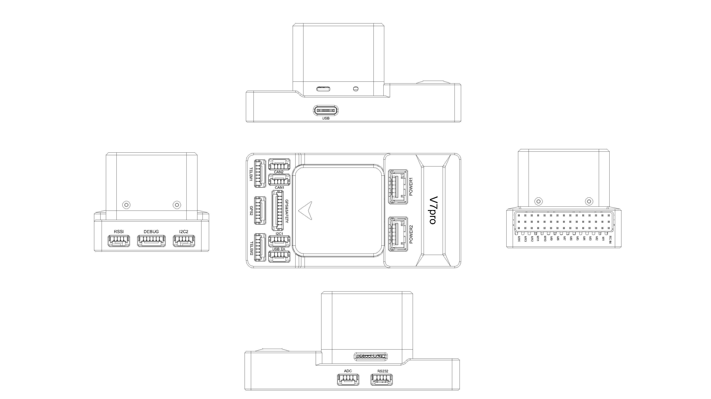
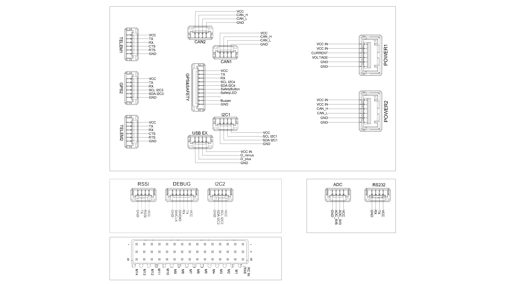

# VUAV-V7pro Flight Controller

The VUAV-V7pro  flight controller is manufactured and sold by [VIEWPRO](http://www.viewprotech.com/).

## Features

 - STM32H743 microcontroller
 - Three IMUs: ADIS16470,ICM42688,ICM42688
 - Internal vibration isolation for IMUs
 - Internal RM3100 SPI magnetometer
 - Internal two MS5611 SPI barometer
 - Internal RGB LED
 - MicroSD card slot port
 - 1 Analog power port
 - 1 CAN power port
 - 5 UARTs and 1 USB ports
 - 1 RS232 port
 - 14 PWM output ports
 - 4 I2C and 2 CAN ports
 - Safety switch port
 - Buzzer port
 - RC IN port

##  Pinout

## UART Mapping
 - SERIAL0 -> USB
 - SERIAL1 -> UART2 (Telem1) (DMA enabled)
 - SERIAL2 -> UART6 (Telem2) (DMA enabled)
 - SERIAL3 -> UART1 (GPS1)
 - SERIAL4 -> UART3 (GPS2)
 - SERIAL5 -> UART8 (USER) TX only on pin, RX is tied to RCIN
 - SERIAL6 -> UART4 (RS232)
 - SERIAL7 -> USB2 (virtual port on same connector)
 - SERIAL8 -> UART7 (DEBUG)

The Telem1,Telem2 port has RTS/CTS pins, the other UARTs do not have RTS/CTS.

##  Connectors

### TELEM1 ,TELEM2 port

   <table border="1" class="docutils">
   <tbody>
   <tr>
   <th>Pin </th>
   <th>Signal </th>
   <th>Volt </th>
   </tr>
   <tr>
   <td>1</td>
   <td>VCC</td>
   <td>+5V</td>
   </tr>
   <tr>
   <td>2</td>
   <td>TX (OUT)</td>
   <td>+3.3V</td>
   </tr>
   <tr>
   <td>3</td>
   <td>RX (IN)</td>
   <td>+3.3V</td>
   </tr>
   <tr>
   <td>4</td>
   <td>CTS</td>
   <td>+3.3V</td>
   </tr>
   <tr>
   <td>5</td>
   <td>RTS</td>
   <td>+3.3V</td>
   </tr>
   <tr>
   <td>6</td>
   <td>GND</td>
   <td>GND</td>
   </tr>
   </tbody>
   </table>

### GPS1/I2C4 port

   <table border="1" class="docutils">
   <tbody>
   <tr>
   <th>Pin</th>
   <th>Signal</th>
   <th>Volt</th>
   </tr>
   <tr>
   <td>1</td>
   <td>VCC</td>
   <td>+5V</td>
   </tr>
   <tr>
   <td>2</td>
   <td>TX (OUT)</td>
   <td>+3.3V</td>
   </tr>
   <tr>
   <td>3</td>
   <td>RX (IN)</td>
   <td>+3.3V</td>
   </tr>
   <tr>
   <td>4</td>
   <td>SCL I2C4</td>
   <td>+3.3V (pullups)</td>
   </tr>
   <tr>
   <td>5</td>
   <td>SDA I2C4</td>
   <td>+3.3V (pullups)</td>
   </tr>
   <tr>
   <td>6</td>
   <td>SafetyButton</td>
   <td>+3.3V</td>
   </tr>
   <tr>
   <td>7</td>
   <td>SafetyLED</td>
   <td>+3.3V</td>
   </tr>
   <tr>
   <td>8</td>
   <td>-</td>
   <td>-</td>
   </tr>
   <tr>
   <td>9</td>
   <td>Buzzer</td>
   <td>+3.3V</td>
   </tr>
   <tr>
   <td>10</td>
   <td>GND</td>
   <td>GND</td>
   </tr>
   </tbody>
   </table>

### GPS2/I2C3 port

   <table border="1" class="docutils">
   <tbody>
   <tr>
   <th>Pin</th>
   <th>Signal</th>
   <th>Volt</th>
   </tr>
   <tr>
   <td>1</td>
   <td>VCC</td>
   <td>+5V</td>
   </tr>
   <tr>
   <td>2</td>
   <td>TX (OUT)</td>
   <td>+3.3V</td>
   </tr>
   <tr>
   <td>3</td>
   <td>RX (IN)</td>
   <td>+3.3V</td>
   </tr>
   <tr>
   <td>4</td>
   <td>SCL I2C3</td>
   <td>+3.3V (pullups)</td>
   </tr>
   <tr>
   <td>5</td>
   <td>SDA I2C3</td>
   <td>+3.3V (pullups)</td>
   </tr>
   <tr>
   <td>6</td>
   <td>GND</td>
   <td>GND</td>
   </tr>
   </tbody>
   </table>

### CAN1,CAN2 port

   <table border="1" class="docutils">
   <tbody>
   <tr>
   <th>Pin</th>
   <th>Signal</th>
   <th>Volt</th>
   </tr>
   <tr>
   <td>1</td>  
   <td>VCC</td>
   <td>+5V</td>
   </tr>
   <tr>
   <td>2</td>
   <td>CAN_H</td>
   <td>+24V</td>
   </tr>
   <tr>
   <td>3</td>
   <td>CAN_L</td>
   <td>+24V</td>
   </tr>
   <tr>
   <td>4</td>
   <td>GND</td>
   <td>GND</td>
   </tr>
   </tbody>
   </table>

### I2C1,I2C2 port

   <table border="1" class="docutils">
   <tbody>
   <tr>
   <th>Pin</th>
   <th>Signal</th>
   <th>Volt</th>
   </tr>
   <tr>
   <td>1</td>
   <td>VCC</td>
   <td>+5V</td>
   </tr>
   <tr>
   <td>2</td>
   <td>SCL</td>
   <td>+3.3 (pullups)</td>
   </tr>
   <tr>
   <td>3</td>
   <td>SDA</td>
   <td>+3.3 (pullups)</td>
   </tr>
   <tr>
   <td>4</td>
   <td>GND</td>
   <td>GND</td>
   </tr>
   </tbody>
   </table>

### USB Ex

   <table border="1" class="docutils">
   <tbody>
   <tr>
   <th>Pin </th>
   <th>Signal </th>
   <th>Volt </th>
   </tr>
   <tr>
   <td>1</td>
   <td>VCC IN</td>
   <td>+5V</td>
   </tr>
   <tr>
   <td>2</td>
   <td>D_minus</td>
   <td>+3.3V</td>
   </tr>
   <tr>
   <td>3</td>
   <td>D_plus</td>
   <td>+3.3V</td>
   </tr>
   <tr>
   <td>4</td>
   <td>GND</td>
   <td>GND</td>
   </tr>
   </tbody>
   </table>

### RSSI

   <table border="1" class="docutils">
   <tbody>
   <tr>
   <th>Pin</th>
   <th>Signal</th>
   <th>Volt</th>
   </tr>
   <tr>
   <td>1</td>
   <td>VCC</td>
   <td>+5V</td>
   </tr>
   <tr>
   <td>2</td>
   <td>RSSI</td>
   <td>up to +3.3V</td>
   </tr>
   <tr>
   <td>3</td>
   <td>UART8_TX (OUT)</td>
   <td>+3.3</td>
   </tr>
   <tr>
   <td>4</td>
   <td>GND</td>
   <td>GND</td>
   </tr>
   </tbody>
   </table>

### RS232

   <table border="1" class="docutils">
   <tbody>
   <tr>
   <th>Pin </th>
   <th>Signal </th>
   <th>Volt </th>
   </tr>
   <tr>
   <td>1</td>
   <td>VCC</td>
   <td>+5V</td>
   </tr>
   <tr>
   <td>2</td>
   <td>TX (OUT)</td>
   <td>+3.3V</td>
   </tr>
   <tr>
   <td>3</td>
   <td>RX (IN)</td>
   <td>+3.3V</td>
   </tr>
   <tr>
   <td>4</td>
   <td>GND</td>
   <td>GND</td>
   </tr>
   </tbody>
   </table>

### DEBUG

   <table border="1" class="docutils">
   <tbody>
   <tr>
   <th>Pin </th>
   <th>Signal </th>
   <th>Volt </th>
   </tr>
   <tr>
   <td>1</td>
   <td>VCC</td>
   <td>+5V</td>
   </tr>
   <tr>
   <td>2</td>
   <td>TX (OUT)</td>
   <td>+3.3V</td>
   </tr>
   <tr>
   <td>3</td>
   <td>RX (IN)</td>
   <td>+3.3V</td>
   </tr>
   <tr>
   <td>4</td>
   <td>SWDIO</td>
   <td>+3.3V</td>
   </tr>
   <tr>
   <td>5</td>
   <td>SWCLK</td>
   <td>+3.3V</td>
   </tr>
   <tr>
   <td>6</td>
   <td>GND</td>
   <td>GND</td>
   </tr>
   </tbody>
   </table>

### ADC

   <table border="1" class="docutils">
   <tbody>
   <tr>
   <th>Pin</th>
   <th>Signal</th>
   <th>Volt</th>
   </tr>
   <tr>
   <td>1</td>
   <td>VCC</td>
   <td>+5V</td>
   </tr>
   <tr>
   <td>2</td>
   <td>ADC_3V3</td>
   <td>up to +3.3V</td>
   </tr>
   <tr>
   <td>3</td>
   <td>ADC_6V6</td>
   <td>up to +6.6V</td>
   </tr>
   <tr>
   <td>4</td>
   <td>GND</td>
   <td>GND</td>
   </tr>
   </tbody>
   </table>

### POWER1

   <table border="1" class="docutils">
   <tbody>
   <tr>
   <th>Pin</th>
   <th>Signal</th>
   <th>Volt</th>
   </tr>
   <tr>
   <td>1</td>
   <td>VCC IN</td>
   <td>+5V</td>
   </tr>
   <tr>
   <td>2</td>
   <td>VCC IN</td>
   <td>+5V</td>
   </tr>
   <tr>
   <td>3</td>
   <td>CURRENT</td>
   <td>up to +3.3V</td>
   </tr>
   <tr>
   <td>4</td>
   <td>VOLTAGE</td>
   <td>up to +3.3V</td>
   </tr>
   <td>5</td>
   <td>GND</td>
   <td>GND</td>
   </tr>
   <td>6</td>
   <td>GND</td>
   <td>GND</td>
   </tr>
   </tbody>
   </table>

### POWER2(CAN1)

   <table border="1" class="docutils">
   <tbody>
   <tr>
   <th>Pin</th>
   <th>Signal</th>
   <th>Volt</th>
   </tr>
   <tr>
   <td>1</td>
   <td>VCC IN</td>
   <td>+5V</td>
   </tr>
   <tr>
   <td>2</td>
   <td>VCC IN</td>
   <td>+5V</td>
   </tr>
   <tr>
   <td>3</td>
   <td>CAN1_H</td>
   <td>+24V</td>
   </tr>
   <tr>
   <td>4</td>
   <td>CAN1_L</td>
   <td>+24V</td>
   </tr>
   <td>5</td>
   <td>GND</td>
   <td>GND</td>
   </tr>
   <td>6</td>
   <td>GND</td>
   <td>GND</td>
   </tr>
   </tbody>
   </table>

## RC Input

RC input is configured on the RCIN pin, at one end of the servo rail. This pin supports all unidirectional RC protocols. For bi-directional protocols, such as CRSF/ELRS, UART8 can be set to protocol "23" and the reciever tied to RCIN (shared with UART8 RX) and UART8 TX. In this case, the RC_PROTOCOLS parameter should be set to the expected protocol type to avoid accidental erroneous detection by the RCIN path.

## PWM Output

The VUAV-V7pro supports up to 14 PWM outputs,support all PWM protocols. Outputs 1-12 support  DShot. Outputs 1-8 support bi-directional Dshot. All 14 PWM outputs have GND on the top row, 5V on the middle row and signal on the bottom row.

The 14 PWM outputs are in 4 groups:

 - PWM 1, 2, 3 and 4 in group1
 - PWM 5, 6, 7 and 8 in group2
 - PWM 9, 10, 11 and 12 in group3
 - PWM 13, 14 in group4

Channels within the same group need to use the same output rate. If any channel in a group uses DShot, then all channels in that group need to use DShot.

## GPIOs

All 14 PWM channels can be used for GPIO functions (relays, buttons, RPM etc).
The pin numbers for these PWM channels in ArduPilot are shown below:

   <table border="1" class="docutils">
   <tbody>
   <tr>
   <th>PWM Channels</th>
   <th>Pin</th>
   <th>PWM Channels</th>
   <th>Pin</th>
   </tr>
   <tr>
   <td>PWM1</td>
   <td>50</td>
   <td>PWM8</td>
   <td>57</td>
   </tr>
   <tr>
   <td>PWM2</td>
   <td>51</td>
   <td>PWM9</td>
   <td>58</td>
   </tr>
   <tr>
   <td>PWM3</td>
   <td>52</td>
   <td>PWM10</td>
   <td>59</td>
   </tr>
   <tr>
   <td>PWM4</td>
   <td>53</td>
   <td>PWM11</td>
   <td>60</td>
   </tr>
   <tr>
   <td>PWM5</td>
   <td>54</td>
   <td>PWM12</td>
   <td>61</td>
   </tr>
   <tr>
   <td>PWM6</td>
   <td>55</td>
   <td>PWM13</td>
   <td>62</td>
   </tr>
   <tr>
   <td>PWM7</td>
   <td>56</td>
   <td>PWM14</td>
   <td>63</td>
   </tr>
   </tbody>
   </table>

## Analog inputs

The VUAV-V7pro flight controller has 5 Analog inputs

 - ADC Pin2-> Battery Current
 - ADC Pin16 -> Battery Voltage 
 - ADC Pin19 -> ADC 3V3 Sense
 - ADC Pin3 -> ADC 6V6 Sense
 - ADC Pin9 -> RSSI voltage monitoring

## Battery Monitor Configuration

The board has voltage and current inputs sensor on the POWER1 ADC and POWER2 CAN connector.

The correct battery setting parameters are:

Enable Battery1 monitor:
 - BATT_MONITOR   4
 - BATT_VOLT_PIN 16
 - BATT_CUR_PIN 2
 - BATT_VOLT_MULT 15.7 (may need adjustment if supplied monitor is not used)
 - BATT_AMP_PERVLT 60.61 (may need adjustment if supplied monitor is not used)

Enable Battery2 monitor (if used):
 - BATT2_MONITOR  8

## Loading Firmware

The VUAV-V7pro flight controller comes pre-installed with an ArduPilot compatible bootloader, allowing the loading of \*.apj firmware files with any ArduPilot compatible ground station.
