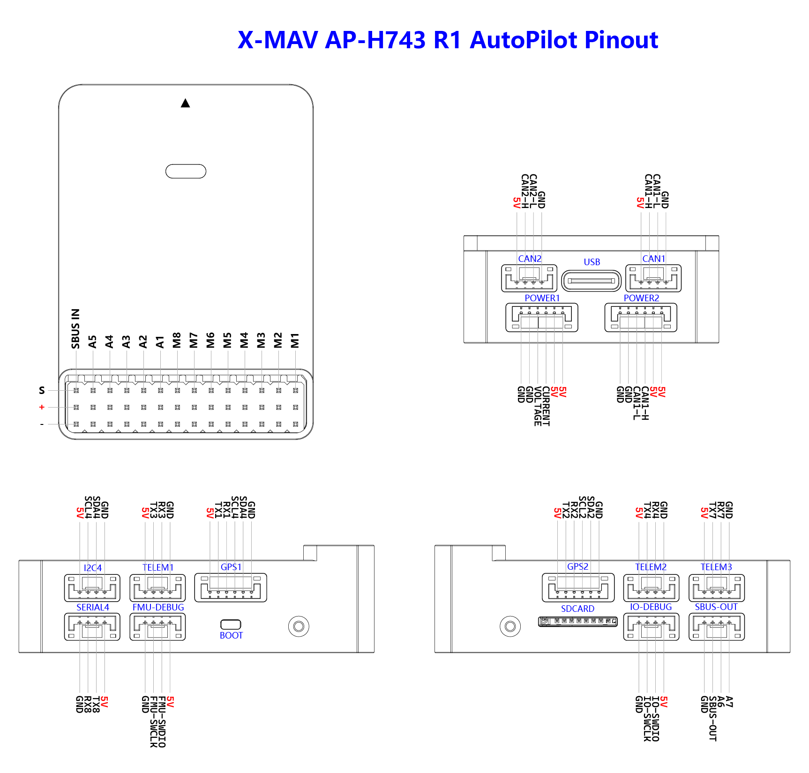
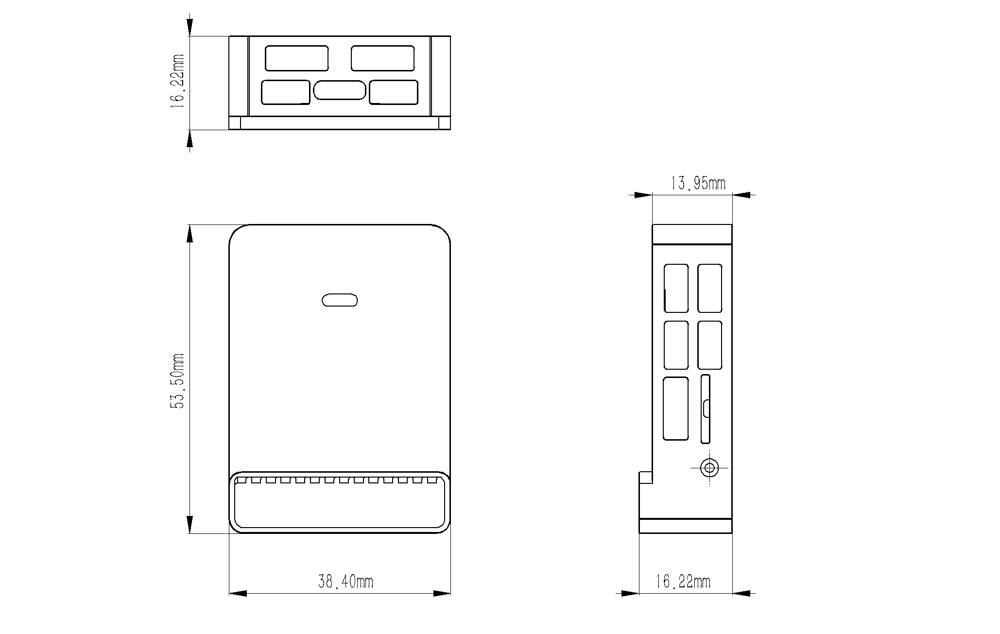

# AP-H743-R1

The AP-H743-R1 is an advanced autopilot manufactured by X-MAV&reg;.

The autopilot is recommended for commercial system integration, but is also suitable for academic research and any other applications.
It brings you ultimate performance, stability, and reliability in every aspect.

### Processors & Sensors

- FMU Processor: STM32H743VIT6
  - 32 Bit Arm® Cortex®-M7, 480MHz, 2MB flash memory, 1MB RAM
- IO Processor: STM32F103
  - 32 Bit Arm® Cortex®-M3, 72MHz, 20KB SRAM
- On-board sensors
  - Accel/Gyro: ICM-42688-P\*2(Version1), BMI270\*2(Version2)
  - Mag: IST8310
  - Barometer: DPS310(Version1),SPL06(Version2)

### Interfaces

- 15x PWM Servo Outputs
- 1x Dedicated S.Bus Input
- 6x UARTs
- 1x USB Port (TYPE-C)
- 3x I2C Bus Ports
- 2x CAN Ports
- microSD card slot
- 2x Dedicated Debug Port
  - FMU Debug
  - IO Debug

## Purchase Channels

Order from [X-MAV](https://www.x-mav.cn/).

## Radio Control
The SBUS-in pin supports all unidirectional RC protocols. For bi-directional RC systems (CRSF/ELRS,etc.) you will need to use a UART/SERIAL port such as SERIAL4:
 - Set SERIAL4_PROTOCOL to "23"
 - PPM is not supported.
 - FPort requires connection to TX4 and RX4 via a bi-directional inverter. See :ref:common-FPort-receivers.
 - CRSF/ELRS also requires a TX4 connection, in addition to RX4, and automatically provides telemetry.
 - SRXL2 requires a connection to TX4 and automatically provides telemetry. Set SERIAL4_OPTIONS to "4".

## UART Mapping
all UARTs have DMA
 - SERIAL0 -> USB 
 - SERIAL1 -> UART1 (GPS)
 - SERIAL2 -> UART2 (GPS2)
 - SERIAL3 -> UART3 (MAVLink2)
 - SERIAL4 -> UART4 (MAVLink2)
 - SERIAL5 -> UART7 (User)
 - SERIAL6 -> UART8 (User)

## PWM Output

The AP-H743-R1 flight controller supports up to 15 PWM outputs.
The first 8 outputs (labelled M1 to M8) are controlled by a dedicated STM32F103 IOMCU controller.
The remaining 7 outputs (labelled A1 to A7) are the "auxiliary" outputs.
These are directly attached to the STM32H743 FMU controller,.

All outputs are  bi-directional DSHOT capable.

The 15 PWM outputs are:

M1 - M8 are connected to the IOMCU.
A1 - A7 are connected to the FMU.

M1 - M8 support DShot and are in 3 groups:

- M1, M2 in group 1
- M3, M4 in group 2
- M5, M6, M7, M8 in group 3

The 7 FMU PWM outputs are in 3 groups:

- A1 - A4 are in one group.
- A5, A6 are in a 2nd group.
- A7 is in a 3nd group.

Channels within the same group need to use the same output rate.
If any channel in a group uses DShot then all channels in the group need to use DShot.

### Electrical data

- Voltage Ratings:
  - Max input voltage: 5.4V
  - USB Power Input: 4.75\~5.25V
  - Servo Rail Input: 0\~9.9V

## Battery Monitoring

The board has connectors for 2 power monitors.

- POWER1 -- ADC
- POWER2 -- DroneCAN

The board is configure by default for a analog power monitor(POWER1).
DroneCAN battery monitoring(POWER2) is disabled by default.

The default battery parameters are:

- BATT_MONITOR 4
- BATT_VOLT_PIN 9
- BATT_CURR_PIN 8
- BATT_VOLT_MULT 18.5
- BATT_AMP_PERVLT 40

## Pinouts

## Mechanical

 - Dimensions: 53.5 x 38.4 x 16.2 mm
 - Weight: 35g
 
## Loading Firmware

Firmware for these boards can be found at https://firmware.ardupilot.org in sub-folders labeled "X-MAV-AP-H743r1".

Initial firmware load can be done with DFU by plugging in USB with the bootloader button pressed. Then you should load the "with_bl.hex" firmware, using your favorite DFU loading tool.

Once the initial firmware is loaded you can update the firmware using any ArduPilot ground station software. Updates should be done with the "\*.apj" firmware files.
