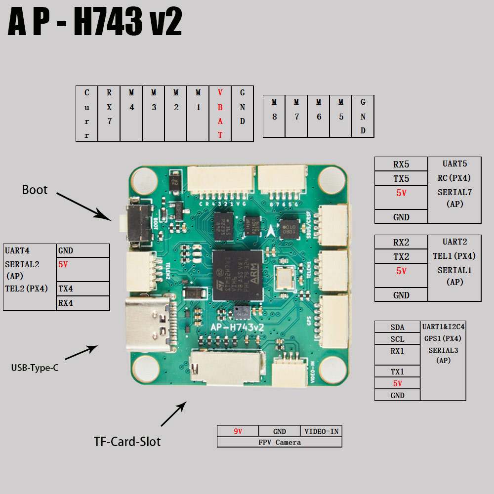
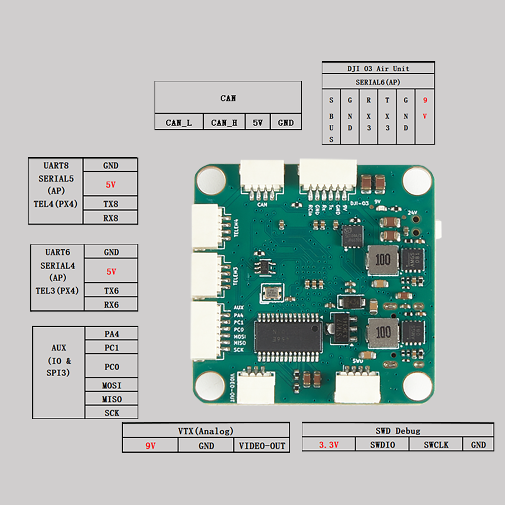

# AP-H743v2 Flight Controller

The AP-H743v2 is a flight controller designed and produced by X-MAV

## Features

 - STM32H743 microcontroller
 - BMI088/ICM42688P dual IMUs
 - DPS310 barometer
 - IST8310 magnetometer
 - AT7456E OSD
 - 9V 3A BEC; 5V 3A BEC
 - MicroSD Card Slot
 - 8 UARTs
 - 8 PWM outputs
 - 1 CAN
 - 1 I2C
 - 1 SWD

## Physical

## UART Mapping

 - SERIAL0 -> USB 
 - SERIAL1 -> UART2 (MAVLink2)
 - SERIAL2 -> UART4 (User)
 - SERIAL3 -> UART1 (GPS)
 - SERIAL4 -> UART6 (User)
 - SERIAL5 -> UART8 (User)
 - SERIAL6 -> UART3 (DisplayPort)
 - SERIAL7 -> UART5 (RCIN)
 - SERIAL8 -> UART7 (RX only, ESC Telemetry)

## RC Input

The default RC input is configured on the UART5 and supports all RC protocols except PPM. The SBUS pin is inverted and connected to RX5. When using RX5 or SBUS, the other input should be unconnected. RC can be attached to any UART port as long as the serial port protocol is set to `SERIALn_PROTOCOL=23` and SERIAL7_Protocol  is changed to something other than '23'.

## OSD Support

The AP-H743v2 supports onboard analog SD OSD using a MAX7456 chip. Simultaneously, DisplayPort HD OSD is available on the DJI connector for HD VTX. Both on board OSD and DisplayPort OSD can be operated simultaneously.

## VTX Support

The SH1.0-6P connector supports a DJI Air Unit / HD VTX connection. Protocol defaults to DisplayPort. Pin 1 of the connector is 9v so be careful not to connect this to a peripheral requiring 5v.

## PWM Output

The AP-H743v2 supports up to 8 PWM outputs.

All the channels support DShot and BiDir DShot.

Outputs are grouped and every output within a group must use the same output protocol:

1, 2, 3, 4 are Group 1;

5, 6 are Group 2;

7, 8 are Group 3;

## Battery Monitoring

The board has a internal voltage sensor and connections on the ESC connector for an external current sensor input.
The voltage sensor can handle up to 6S LiPo batteries.

The default battery parameters are:

 - BATT_MONITOR 4
 - BATT_VOLT_PIN 4
 - BATT_CURR_PIN 8
 - BATT_VOLT_MULT 10.2
 - BATT_CURR_SCALE 20.4

## Compass

The AP-H743v2 has a built-in compass sensor (IST8310), and you can also attach an external compass using I2C on the SDA and SCL connector.

## Mechanical

 - Mounting: 30.5 x 30.5mm, Φ4mm
 - Dimensions: 36 x 36 x 8 mm
 - Weight: 9g

## Loading Firmware

Initial firmware load can be done with DFU by plugging in USB with the bootloader button pressed. Then you should load the "with_bl.hex" firmware, using your favorite DFU loading tool.

Once the initial firmware is loaded you can update the firmware using any ArduPilot ground station software. Updates should be done with the "\*.apj" firmware files.

