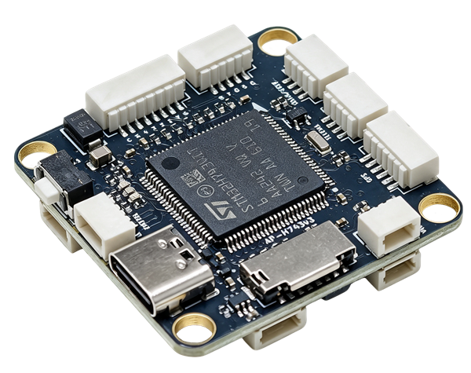
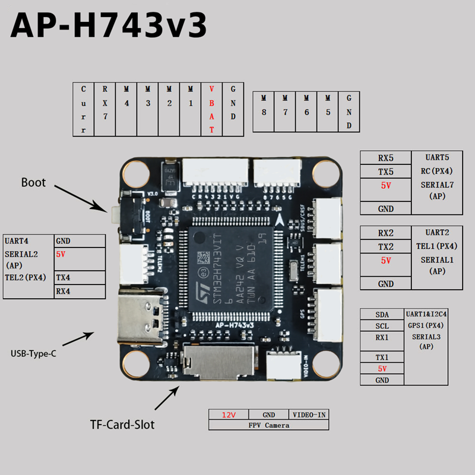
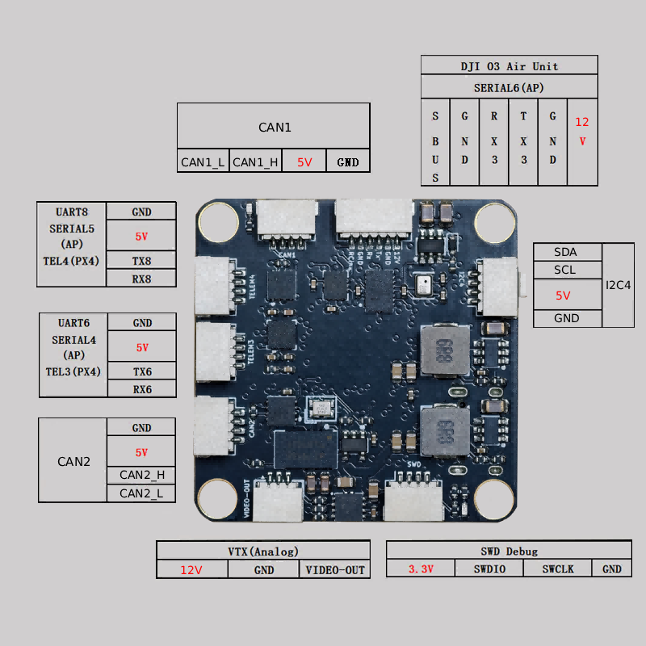
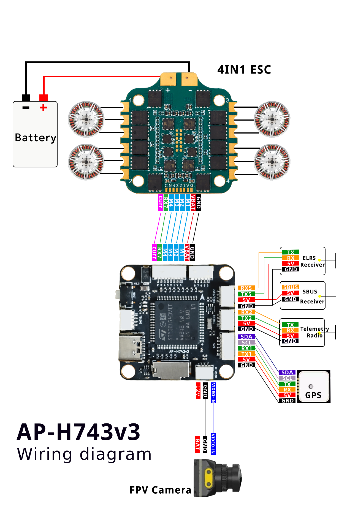
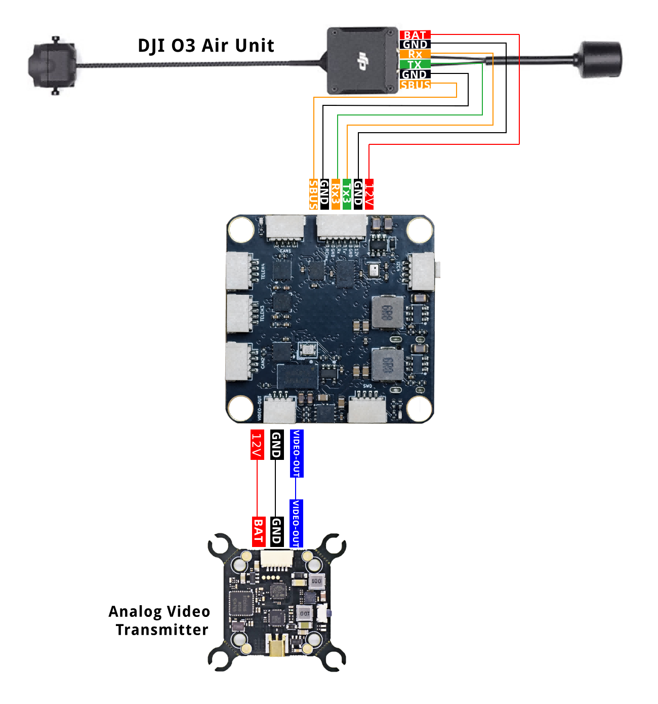

# AP-H743v3 Flight Controller

The AP-H743v3 is a flight controller designed and produced by [X-MAV](http://www.x-mav.cn/).

**Purchase link**: [X-MAV Taobao Store](https://shop108812501.taobao.com/) (available in September 2026)

## Features

- STM32H743 microcontroller
- BMI088/ICM45686 dual IMUs
- SPA06 barometer
- QMC5883P magnetometer
- AT7456E OSD
- Support 2-8S(6-35V) Input
- 12V 2A BEC; 5V 2A BEC
- MicroSD Card Slot
- 8 UARTs
- 8 PWM outputs
- 2 CAN
- 1 I2C
- 1 SWD

## Physical

## Sample Wiring Diagram

## UART Mapping

| Serial# | Protocol        | Port    | Notes                        |
|---------|-----------------|---------|-------------------------------|
| SERIAL0 | MAVLink2        | USB     |                               |
| SERIAL1 | MAVLink2        | USART2  | DMA enabled                   |
| SERIAL2 | MAVLink2        | UART4   | DMA enabled                   |
| SERIAL3 | GPS             | USART1  | DMA enabled                   |
| SERIAL4 | None (User)     | USART6  | DMA enabled                   |
| SERIAL5 | None (User)     | UART8   | DMA enabled                   |
| SERIAL6 | MSP DisplayPort | USART3  | DMA enabled                   |
| SERIAL7 | RCIN            | UART5   | DMA enabled                   |
| SERIAL8 | ESC Telemetry   | UART7   | RX7 only, on ESC connector    |

## RC Input

The default RC input is configured on the UART5 and supports all RC protocols except PPM. The SBUS pin is inverted and connected to RX5. When using RX5 or SBUS, the other input should be unconnected. RC can be attached to any UART port as long as the serial port protocol is set to `SERIALn_PROTOCOL=23` and SERIAL7_Protocol  is changed to something other than '23'.

## OSD Support

The AP-H743v3 supports onboard analog SD OSD using a MAX7456 chip. Simultaneously, DisplayPort HD OSD is available on the DJI connector for HD VTX. Both on board OSD and DisplayPort OSD can be operated simultaneously.

In addition, the board provides dedicated connectors for:

- **FPV Camera** (12V, GND, VIDEO-IN) – for analog camera input to the onboard OSD.
- **VTX (Analog)** (12V, GND, VIDEO-OUT) – for analog video output to an external VTX.

Both connectors are fixed on the 12V rail and are not controlled by a GPIO relay.

## VTX Support

The SH1.0-6P connector supports a DJI Air Unit / HD VTX connection. Protocol defaults to DisplayPort.

The pinout of this connector, in physical order from left to right (when viewing the component side of the board), is:  
**SBUS, GND, RX3, TX3, GND, 12V**  
The 12V power is on the rightmost pin (the last in this order). Be careful not to connect this to a 5V peripheral.

## PWM Output

The AP-H743v3 supports up to 8 PWM outputs.

All the channels support DShot and BiDir DShot.

Outputs are grouped and every output within a group must use the same output protocol:

1, 2, 3, 4 are Group 1;

5, 6 are Group 2;

7, 8 are Group 3;

## Battery Monitoring

The board has an internal voltage sensor and connections on the ESC connector for an external current sensor input.
The voltage sensor can handle up to 8S LiPo batteries.

The default battery parameters are:

- BATT_MONITOR 4
- BATT_VOLT_PIN 4
- BATT_CURR_PIN 8
- BATT_VOLT_MULT 12.11
- BATT_AMP_PERVLT 20.4

**Note**: These default multipliers are starting values. Since the current sensor is external (located on the ESC connector), you must adjust `BATT_VOLT_MULT` and `BATT_AMP_PERVLT` according to your specific current sensor's characteristics.

## Compass

The AP-H743v3 has a built‑in compass sensor (QMC5883P). Due to possible interference, it is often used together with an external I2C compass (usually as part of a GPS/compass module) connected via the SDA and SCL pads.

## Mechanical

- Mounting: 30.5 x 30.5mm, Φ4mm
- Dimensions: 36 x 36 x 8 mm
- Weight: 9g

## Loading Firmware

Initial firmware load must be done via DFU: hold the boot button while connecting USB, then use **STM32CubeProgrammer** or any other DFU tool to flash the **`X-MAV-AP-H743v3_bl.bin`** file (do **not** use `.hex` files, as `dfu-util` cannot parse them).  

The firmware can be obtained from the [ArduPilot Firmware Server](https://firmware.ardupilot.org) under the `X-MAV-AP-H743v3` target.  

After the initial bootloader/firmware is flashed, you can update the firmware using any ArduPilot ground station software with the `*.apj` firmware files.
