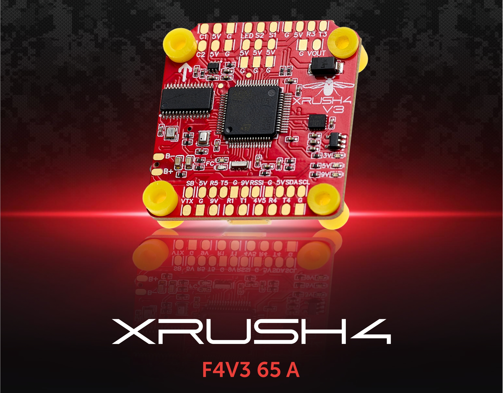

===
XRush4 F4 V3
===
The XRush4 F4 V3 autopilot is manufactured by `XRush4 <https://xrush4.tech/xrush4-f4-v3/>`__

Where to Buy
============

`XRush4 <https://xrush4.tech/xrush4-f4-v3/>`__

Specifications
==============
- Processor

  - STM32F405 32-bit processor, 168MHz
  - 1MB Flash
  - 192KB RAM
  - AT7456E OSD
  
- Sensors

  - Invensense ICM42688 3-axis gyroscope and a 3-axis accelerometer
  - BMP280 or DPS368 (in versions from 09.2025) Barometer

- Interfaces

  - 1 USB-C
  - 4 PWM for 4 motors
  - 2 PWM for servo
  - 1 LED
  - 1 Buzzer 
  - 5 UARTS
  - 2 Cameras with switchable camera inputs
  - ESC Connector with current sense and telemetry inputs

- Power

  - Integrated voltage/current power monitor 65 A (peak 85 A) (3S - 6S) input
  - GPIO controlled VTX power switch
  - 4.5V for Radio

- Dimensions

  - Size: 37 × 39 × 8 mm
  - Weight: 9g

Pinout
======

<!--In addition pin tables and/or connector images can be inserted here..see UART table below for format all user accessible connection points should be clear --> 

UART Mapping
============
The UARTs are marked Rn and Tn in the above pinouts. The Rn pin is the receive pin for UARTn. The Tn pin is the transmit pin for UARTn

|Port  | UART    |Protocol        |TX DMA |RX DMA |
|------|---------|----------------|-------|-------|
|0     |  USB    |  MAVLink2      |  -    |   -   |
|1     |  USART1 |  Tramp         |  -    |   -   |
|2     |  USART2 |  ESCTelemetry  |  -    |   -   |
|3     |  USART3 |  GPS           |  -    |   -   |
|4     |  UART4  |  RCIN          |  -    |   -   |
|5     |  UART5  |  None          |  ✘    |   ✘   |

RC input
========
<!--This is the most difficult section and varies widely.-->

The SBUS pin, can be used for all ArduPilot supported receiver protocols, except CRSF/ELRS and SRXL2 which require a true UART connection. However, FPort, if connected to the SBUS pin, will only provide RC without telemetry since FPort includes SBUS signaling multiplexed with telemetry which will not be decoded (see below). 

To allow CRSF/ELRS and embedded telemetry available in Fport, CRSF, and SRXL2 receivers, a full UART, such as SERIAL4 (UART4) would need to be used for receiver connections. Below are setups using SERIAL4.

- :ref:`SERIAL4_PROTOCOL<SERIAL4_PROTOCOL>` should be set to "23".
- FPort would require :ref:`SERIAL4_OPTIONS<SERIAL4_OPTIONS>` be set to "15".
- CRSF/ELRS would require :ref:`SERIAL4_OPTIONS<SERIAL4_OPTIONS>` be set to "0".
- SRXL2 would require :ref:`SERIAL4_OPTIONS<SERIAL4PTIONS>` be set to "4" and connects only the TX pin.
Any UART can be used for RC system connections in ArduPilot also, and is compatible with all protocols except PPM. See :ref:`common-rc-systems` for details.

PWM Outputs
===========
The XRush4 F4 V3 controller supports up to 4 PWM outputs for motors, 2 PWM outputs for servos, 2 for LED and 1 for buzzer.

OSD Support
===========
Onboard OSD using AT7456E driver is supported by default.

VTX power control
=================
GPIO 81 controls the VTX BEC output to pins marked "9V". Setting this GPIO "as high" attach voltage supply to this pin/pad. By default RELAY2 is configured to control this pin and sets the GPIO "as low" at boot.

Camera Switch
=============
GPIO 82 controls which camera input, CAM1 or CAM2 is used. By default RELAY3 is configured to control this.

Compass
=======
Does not include compass but can plug-in external controller to USART3 and SDA and SCL pins.

Analog Airspeed
===============
Does not include an analog airspeed meter.

GPIOs
=====
|Pin           |GPIO Number |
|--------------|------------|
|PWM(1)        | 50         |
|PWM(2)        | 51         |
|PWM(3)        | 52         |
|PWM(4)        | 53         |
|PWM(5) SERVO  | 54         |
|PWM(6) SERVO  | 55         |
|LED           | 90         |
|LED           | 91         |
|BUZZER        | 80         |
|VTX PWR       | 81         |
|CAM SW        | 82         |

Battery Monitor
===============
The board has a internal voltage sensor and connections on the ESC connector for an external current sensor input.
The voltage sensor can handle up to 6S LiPo batteries.

The default battery parameters are:

 - :ref:`BATT_MONITOR<BATT_MONITOR>` = 4
 - :ref:`BATT_VOLT_PIN<BATT_VOLT_PIN__AP_BattMonitor_Analog>` = 11
 - :ref:`BATT_CURR_PIN<BATT_CURR_PIN__AP_BattMonitor_Analog>` = 13 (CURR pin)

Firmware
========
Firmware for the XRush4 F4 V3 is available from [ArduPilot Firmware Server](https://firmware.ardupilot.org) under the `XRush4 F4 V3` target.

Loading Firmware
================
To flash firmware initially, connect USB while holding the bootloader button and use DFU to load the `with_bl.hex` file. Subsequent updates can be applied using `\.apj` files through a ground station.

Additional
==========
uk_UA: [україномовна документація та прошивки в репозиторії](https://github.com/CO-CF-TECHNO4/XRush4-ArduPilot)

[Xrush4_F4V3_Manual_Rev.2.0](https://xrush4.tech/wp-content/uploads/2025/05/Xrush4_F4V3_Manual_Rev.2.0.pdf)