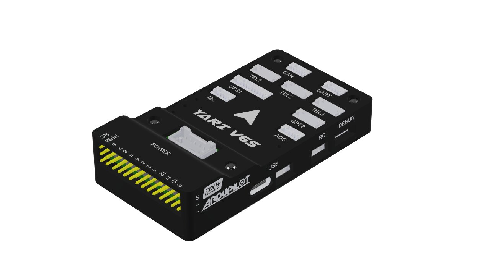
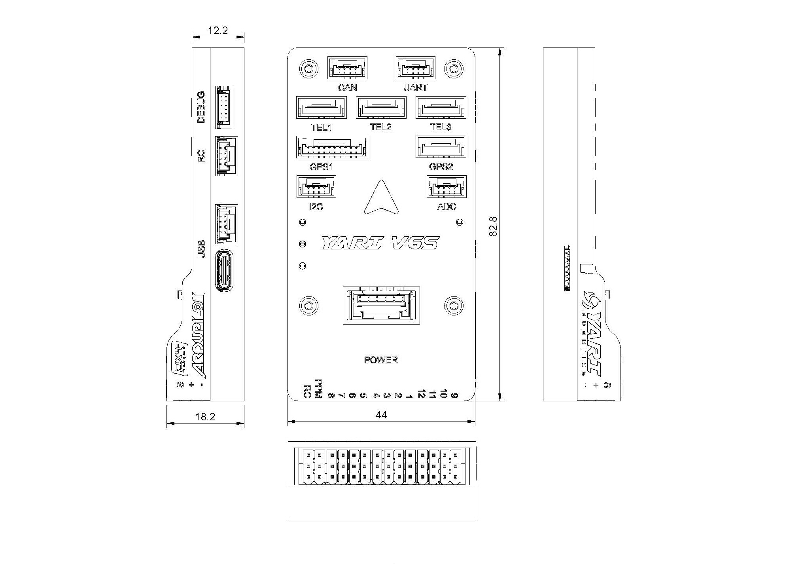
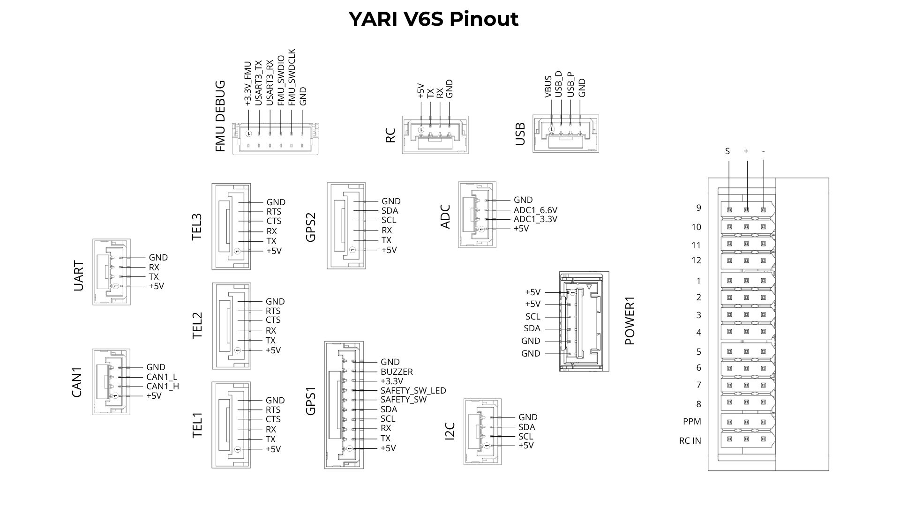

# YARI V6S Flight Controller

The [YARI V6S](https://yarirobotics.com/product/yariv6s-fc/) is an affordable flight controller based on the Pixhawk FMUv6 architecture. It is intended for students, academic teams, and researchers who need a modern STM32H743-based platform with ArduPilot firmware.

It is a practical replacement for older Pixhawk 2.4.8-era FMUv3 controllers in projects that require current-generation hardware. YARI V6S is deliberately a single-sensor design: it does not include redundant sensors, sensor heating, or vibration isolation. Choose YARI V6X instead when your vehicle requires those redundancy and robustness features.

The S in YARI V6S stands for Simple, Single, Standard, or Small. It describes the product's focused approach, a practical lower-cost entry point to current FMUv6 hardware for builders who do not need the redundant architecture of YARI V6X.

Product documentation, connector pinouts, setup instructions, and downloads are available from the [YARI V6S documentation](https://docs.yarirobotics.com/products/flight-controllers/yari-v6s/).

## Features

- STM32H743 processor, with 2 MB flash and 1 MB RAM
- ICM-45686 IMU
- BMP581 barometer
- IST8310 magnetometer
- FRAM parameter storage and microSD logging
- Three TELEM ports, two GPS ports, UART, RC input, CAN, I2C, ADC, USB-C, and USB JST-GH
- Twelve PWM outputs; bidirectional DShot and ESC RPM telemetry are supported on outputs 1-8

## Serial Ports

| ArduPilot serial port | Interface | Peripheral port |
| --- | --- | --- |
| SERIAL0 | OTG1 | USB |
| SERIAL1 | UART7 | TELEM1 |
| SERIAL2 | UART5 | TELEM2 |
| SERIAL3 | USART1 | GPS1 |
| SERIAL4 | UART8 | GPS2 |
| SERIAL5 | USART2 | TELEM3 |
| SERIAL6 | UART4 | UART |
| SERIAL7 | USART3 | FMU DEBUG |
| SERIAL8 | USART6 | RC |
| SERIAL9 | OTG2 | USB |

TELEM1, TELEM2, and TELEM3 include RTS/CTS hardware flow-control signals. SERIAL8_PROTOCOL defaults to 23 for the RC receiver connection.

## PWM Outputs

The YARI V6S provides twelve PWM outputs in three timer groups:

- Outputs 1-4: TIM5
- Outputs 5-8: TIM8
- Outputs 9-12: TIM4

PWM outputs 1-8 are capable of PWM and DShot, including bidirectional DShot and ESC RPM telemetry when compatible ESCs are used. PWM outputs 9-12 are PWM-only because their TIM4 group has no DMA. Outputs within the same timer group must use the same protocol and rate.

PWM outputs 1-12 can be used as GPIOs after setting the corresponding SERVOx_FUNCTION to -1. Their GPIO numbers are 50-61 respectively.

## RC Input

The dedicated PPM input is mapped to the TIM12 timer capture and can be used with PPM and all other ArduPilot-supported unidirectional receiver protocols. FPort connected to this input provides RC control without telemetry.

The 3-pin servo-rail RC input uses USART6 RX and supports serial RC input such as SBUS. The JST-GH RC port exposes both USART6 TX and RX for bidirectional or half-duplex receiver protocols including CRSF, ELRS, FPort, and SRXL2. These receiver inputs share USART6 RX; use only one at a time.

USART6 is SERIAL8 and defaults to SERIAL8_PROTOCOL = 23 (RCIN). For receiver telemetry and the protocol-specific connection mode, configure SERIAL8_OPTIONS as follows:

- FPort: 15
- CRSF or ELRS: 0
- SRXL2: 4; connect only the TX pin

Any available UART can be configured for serial RC protocols. PPM requires the dedicated timer-capture input. See [Radio Control Systems](https://ardupilot.org/copter/docs/common-rc-systems.html) for receiver-specific wiring and configuration details.

## Battery Monitor

The default battery monitor configuration supports an INA2xx digital power module on I2C bus 1:

- BATT_MONITOR = 21
- BATT_I2C_BUS = 1
- BATT_I2C_ADDR = 0

Refer to the [YARI V6S documentation](https://docs.yarirobotics.com/products/flight-controllers/yari-v6s/) for POWER-port wiring and supported power modules.

## Sensors and I2C

The internal BMP581 barometer and IST8310 compass are connected to the internal I2C bus. GPS1, GPS2, and the external I2C connector provide additional I2C buses for compatible GNSS, compass, and sensor modules. The YARI V6S autopilot has a built-in compass. Due to potential interference, the autopilot is usually used with an external I2C compass as part of a GPS/Compass combination.

## Analog Inputs

The ADC connector exposes one 6.6 V-tolerant input and one 3.3 V input.

## CAN

The board provides one CAN interface. The CAN driver is enabled by default with CAN_P1_DRIVER = 1 for DroneCAN peripherals.

## Loading Firmware

The board ships with an ArduPilot-compatible bootloader and accepts .apj firmware files through compatible ground stations such as Mission Planner and QGroundControl. Use firmware built for YARIV6S only.

The bootloader may also be updated from ArduPilot through a compatible ground station or MAVProxy flashbootloader command. Use a YARIV6S-specific bootloader binary only. Pre-built bootloader binaries are available from the [ArduPilot firmware server](https://firmware.ardupilot.org/Tools/Bootloaders/).

## Dimensions

## Pinout

For product-specific firmware, recovery, and wiring guidance, see the [YARI V6S documentation](https://docs.yarirobotics.com/products/flight-controllers/yari-v6s/).
