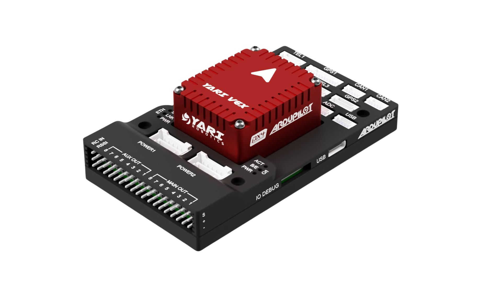
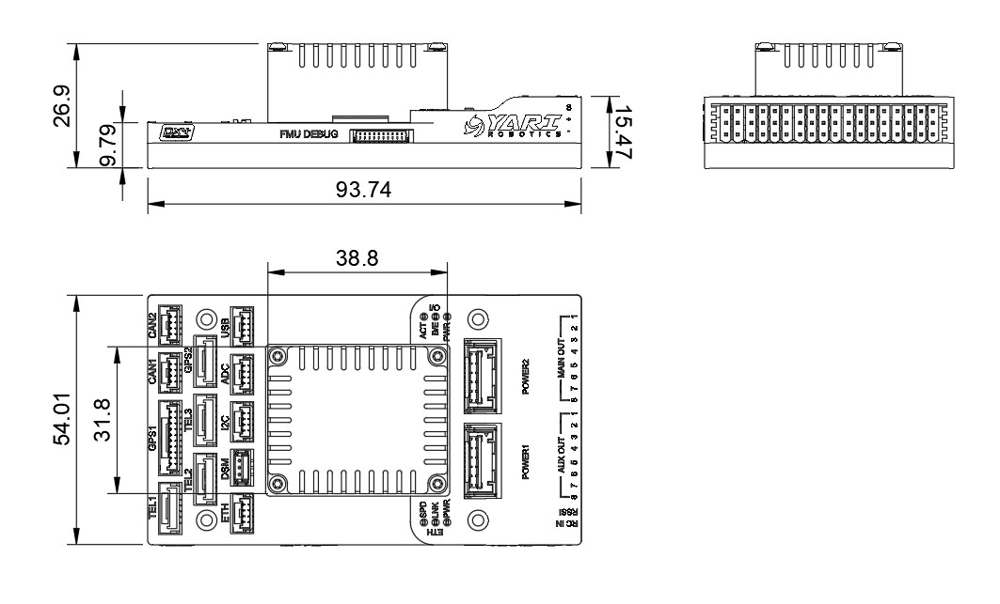
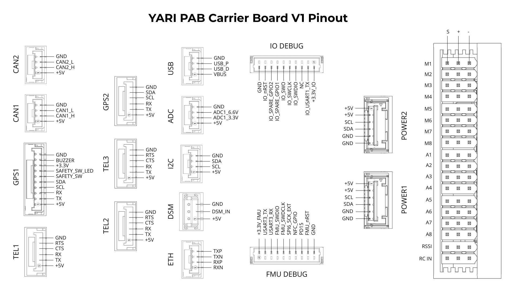

# YARI V6X

### Introduction
The YARI V6X autopilot is based on the [FMUV6X and Pixhawk Autopilot Bus open source specifications](https://github.com/pixhawk/Pixhawk-Standards). The Pixhawk Autopilot Bus (PAB) form factor enables the YARI V6X to be used on any PAB carrier board.

### Where to Buy
YARI V6X autopilots are produced and sold by [YARI Robotics](https://yarirobotics.com).

### Features
- Modular architecture: Discrete IMU, FMU, and base boards linked by the Pixhawk Autopilot Bus (PAB) for clean routing, serviceability, and future upgrades.
- High-performance MCU: STM32H743 running up to 480 MHz for fast control loops and advanced onboard applications.
- True redundancy: Fully isolated sensor domains with dedicated buses and independent power control for fault containment.
- Triple IMU array: Three synchronized, high-range ICM-45686 sensors (±32 g accelerometers, ±4000 dps gyros) with BalancedGyro™ technology for low drift and high resilience.
- Thermally stabilized IMUs: Actively temperature controlled IMU board maintains the IMU sensors at their optimal operating temperature for consistent accuracy.
- Vibration isolation: Durable custom formulated foam material to offer optimal vibration damping characteristics for better IMU stability and accuracy.
- Rugged enclosure: Precision CNC-machined aluminum housing for durability, thermal performance, and EMI shielding.

### Specifications

Autopilot Module
- Sensors
    - 3x Invensense ICM-45686 IMUs
    - 2x Invensense ICP-20100 Barometer
    - Bosch BMM350 Magnetometer
- Processor: STM32H743IIK6 - 480MHz, 2MB Flash, 1MB RAM
- FRAM (256KB)
- MicroSD Slot (Includes 64GB MicroSD card)
- USB C connector
- Heater - 1W for warming sensors in extreme cold
- Heat dissipating aluminum enclosure

Carrier Board
- Processor: STM32F103 - 72MHz, 64KB SRAM
- Connectors
    - PAB Board to Board Interface - 100 Pin Hirose DF40 and 50 Pin Hirose DF40
    - 2x Digital Power Module Inputs - 6 Pin Molex CLIK-Mate, 5V Input, I2C Power Monitor
    - Ethernet - 4 Pin JST-GH, 10Mbps with Built in Magnetics
    - Full GPS Plus Safety Switch Port - 10 Pin JST-GH
    - Basic GPS Port - 6 Pin JST-GH
    - 2x USB Port - USB C and 4 Pin JST-GH
    - 2x CAN Ports - 4 Pin JST-GH
    - 3x Telemetry Ports - 6 Pin JST-GH
    - 16 PWM Outputs - 16 Pin
    - I2C Port - 4 Pin JST-GH
    - RC Port - 3 Pin JST-GH
    - DSM Port - 3 Pin JST-ZH
    - ADC Port - 4 Pin JST-GH
    - 2x Debug Port - 10 Pin JST-SH
- LED Indicators

### Pinout

### UART Mapping

| Serial# | Port            | UART              |
|---------|-----------------|-------------------|
| SERIAL0 | OTG1            | USB               |
| SERIAL1 | Telem1          | UART7 (RTC/CTS)   |
| SERIAL2 | Telem2          | UART5 (RTS/CTS)   |
| SERIAL3 | GPS1            | USART1            |
| SERIAL4 | GPS2            | UART8             |
| SERIAL5 | Telem3          | USART2 (RTS/CTS)  |
| SERIAL6 | UART4, I2C      | UART4             |
| SERIAL7 | Debug Console   | USART3            |
| SERIAL8 | IO/RC           | USART6            |

All UARTs have DMA capability

### PWM Output
The YARI V6X supports up to 16 PWM outputs (M1-8 and A1-8). All 16 outputs support all normal PWM output formats. All outputs support DShot and BiDir DShot, except A7 and A8 which only support PWM.

The 8 FMU PWM outputs (A1-8) are in 4 groups:
- Outputs 1, 2, 3 and 4 in group1
- Outputs 5 and 6 in group2
- Outputs 7 and 8 in group3

FMU outputs within the same group need to use the same output rate and protocol. If any output in a group uses DShot then all channels in that group need to use DShot.

### RC Input
The PPM pin, which by default is mapped to a timer input, can be used for all ArduPilot supported unidirectional receiver protocols,. Half-Duplex and bi-directional protocols, such as CRSF/ELRS, Fport, and SRXL2) require a true UART connection (see below). FPort when connected to PPM will only provide RC without telemetry.

To allow CRSF and embedded telemetry available in Fport, CRSF, and SRXL2 receivers, a full UART, such as SERIAL6 (UART4) would need to be used for receiver connections. Below are setups using SERIAL6.

- :ref:`SERIAL6_PROTOCOL<SERIAL6_PROTOCOL>` should be set to “23”.
- FPort would require :ref:`SERIAL6_OPTIONS<SERIAL6_OPTIONS>` be set to “15”.
- CRSF/ELRS would require :ref:`SERIAL6_OPTIONS<SERIAL6_OPTIONS>` be set to “0”.
- SRXL2 would require :ref:`SERIAL6_OPTIONS<SERIAL6_OPTIONS>` be set to “4” and connects only the TX pin.

Any UART can be used for RC system connections in ArduPilot also, and is compatible with all protocols except PPM. See [Radio Control Systems](https://ardupilot.org/copter/docs/common-rc-systems.html#common-rc-systems) for details.

### Battery Monitor
The default battery parameters for use with a digital power module (with INA2xx) connected to Power1 port:
- :ref:`BATT_I2C_BUS<BATT_I2C_BUS>` = 1
- :ref:`BATT_I2C_ADDR<BATT_I2C_ADDR>` = 0
- :ref:`BATT_MONITOR<BATT_MONITOR>` = 21

For use with Power2 port update :ref:`BATT_I2C_BUS<BATT_I2C_BUS>` = 2

### Compass
The YARI V6X autopilot has a built-in compass. Due to potential interference, the autopilot is usually used with an external I2C compass as part of a GPS/Compass combination.

### GPIOs
The 8 FMU outputs can be used as GPIOs (relays, buttons, RPM etc). To use them you need to set the output’s `SERVOx_FUNCTION` to -1. See [GPIOs](https://ardupilot.org/copter/docs/common-gpios.html#common-gpios) page for more information.

The numbering of the GPIOs for PIN variables in ArduPilot is:
- A1 50
- A2 51
- A3 52
- A4 53
- A5 54
- A6 55
- A7 56
- A8 57

Additional GPIOs:
- FMU_CAP1 58
- NFC_GPIO 59

### Analog Input
The YARI V6X has 2 analog inputs, one 6V tolerant and one 3.3V tolerant
- ADC Pin12 -> ADC 6.6V Sense
- ADC Pin13 -> ADC 3.3V Sense
- Analog 3.3V RSSI input pin = 103 . To use analog RSSI, set :ref:`RSSI_TYPE<RSSI_TYPE>` = 1 and :ref:`RSSI_ANA_PIN<RSSI_ANA_PIN>` = 103.

### Loading Firmware
The board comes pre-installed with an ArduPilot compatible bootloader, allowing the loading of xxxxxx.apj firmware files with any ArduPilot compatible ground station.

Firmware for YARI V6X can be found [here](https://firmware.ardupilot.org) in sub-folders labeled “YARIV6X”.

Subsequently, you can update firmware with Mission Planner or QGroundcontrol.

### More Information
[YARI Robotics Docs](https://yari-robotics.gitbook.io)