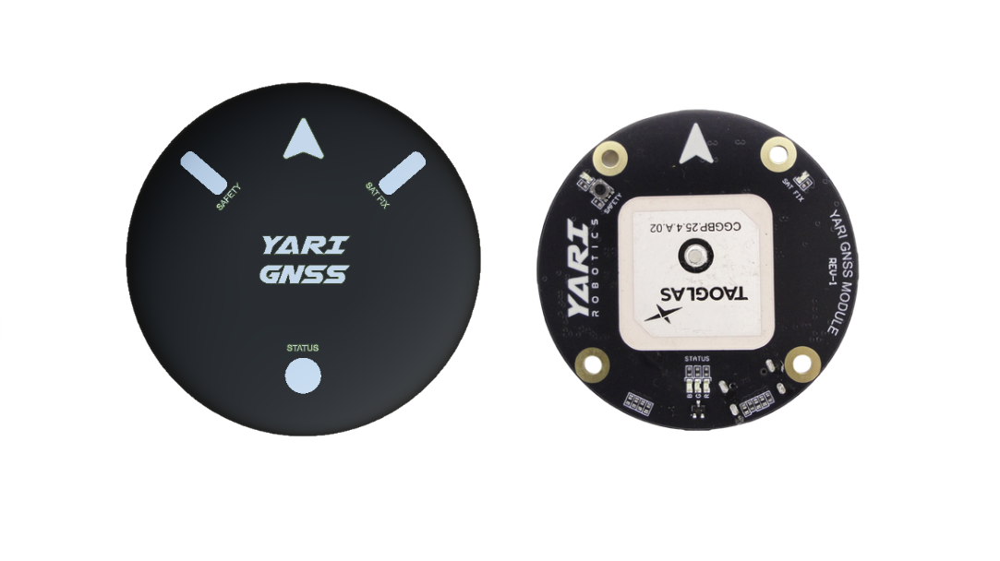
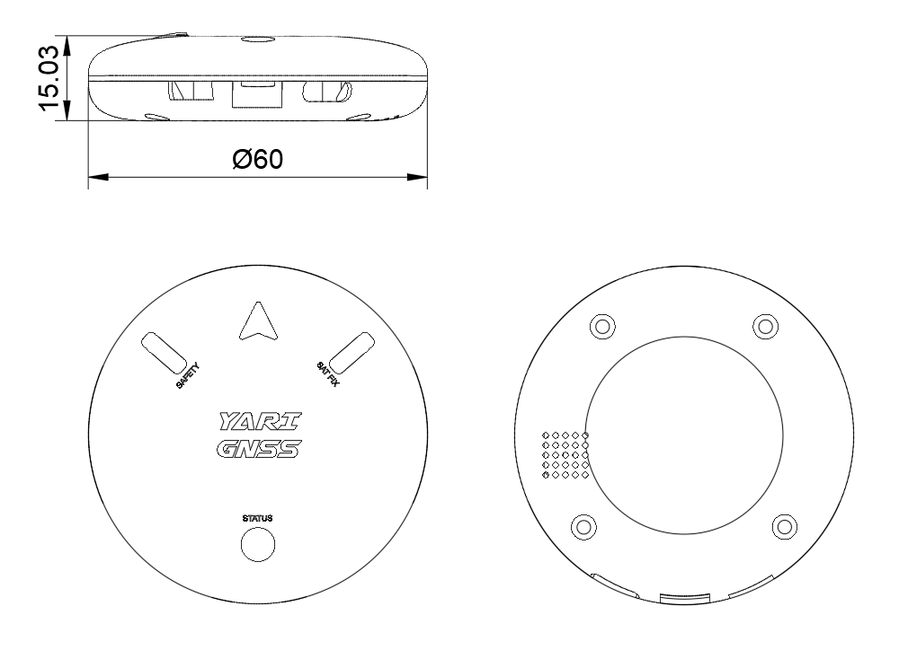
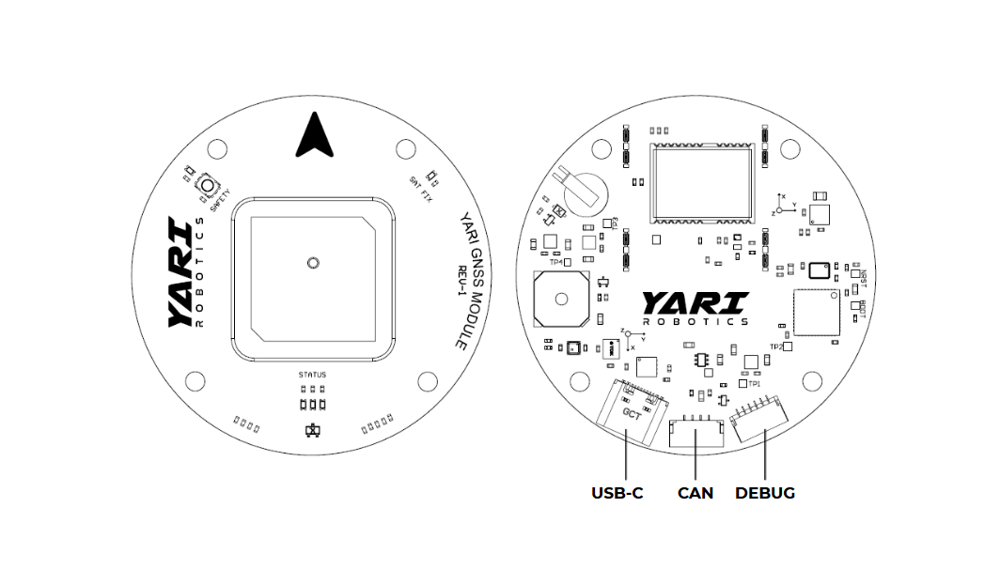

# YARI GNSS

### Introduction
YARI GNSS module is a Dronecan module developed by [YARI Robotics](https://yarirobotics.com). It comes with a standard precision GNSS receiver, magnetometer, barometer, IMU, buzzer, and safety switch. The module is available in two variants: [YARI GNSS (NEO-M9N)](https://yarirobotics.com/products/yari-gnss-module-m9n) with single-band (L1) support, and [YARI GNSS (NEO-F10N)](https://yarirobotics.com/products/yari-gnss-module-f10n) with dual-band (L1/L5) support.

### Features

- GNSS receiver: u-blox NEO-M9N or Neo-F10N,  meter-level positioning (up to 0.7 m), concurrent constellations, plus anti-jamming/spoofing and RF interference mitigation.
- Antenna: Taoglas ceramic patch antenna in a compact 25 × 25 mm form factor.
- Integrated sensors: iSentek IST8310 magnetometer, InvenSense ICP-20100 barometer, InvenSense ICM-42688-P 6-axis IMU.
- Safety and feedback: tactile safety switch, buzzer, and LEDs for safety, satellite fix, and system status.
- USB-C port: Access u-center for quick configuration and data access.
- Standard connectors: Pixhawk Standard CAN (4-pin JST-GH), Pixhawk Standard Debug (6-pin JST-SH), and USB-C.

### Dimensions and Interface 

### Config

See instructions on enabling the [CANBUS](https://ardupilot.org/copter/docs/common-canbus-setup-advanced.html#common-canbus-setup-advanced) and [DroneCAN](https://ardupilot.org/copter/docs/common-uavcan-setup-advanced.html#common-uavcan-setup-advanced).

The following parameters should be set on the autopilot (and then reboot the autopilot):

- CAN_P1_DRIVER = 1 (to enable the 1st CAN port)
- GPS1_TYPE = 9 (DroneCAN)

### Firmware Update

The board comes pre-installed with an ArduPilot compatible bootloader and the Ardupilot peripheral firmware. Firmware for YARI_GNSS can be found [here](https://firmware.ardupilot.org) in sub-folders labeled “YARI_GNSS". Subsequently, you can update firmware with Mission Planner or [DroneCAN GUI](https://github.com/dronecan/gui_tool).

### More Information
[YARI Robotics Docs](https://yari-robotics.gitbook.io)
