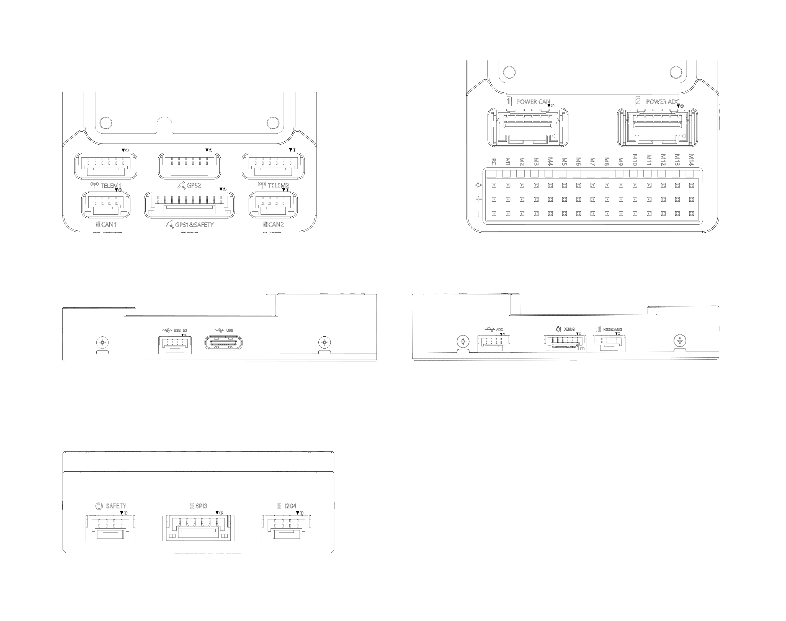

# A6 Flight Controller

The A6 flight controller is manufactured and sold by [YJUAV](http://www.yjuav.net).

The full schematics of the board are available here:

https://github.com/yunjiuav/Hardware/tree/main/A6

## Features

 - STM32H743 microcontroller
 - Three IMUs: ICM42688, ICM42688 and IIM42652
 - Internal RM3100 SPI magnetometer
 - Internal DPS310 SPI barometer
 - Internal vibration isolation for IMUs
 - Internal RGB LED
 - microSD card slot port
 - 2 power ports(CAN and Analog)
 - 6 UARTs and USB ports
 - 3 I2C and 3 CAN ports
 - 14 PWM output ports
 - Safety switch port
 - External SPI port
 - Buzzer port
 - RC IN port

## Pinout

## Connectors

**ADC**

| Pin  | Signal  | Volt  |
| :--: | :-----: | :---: |
|  1   |   VCC   |  +5V  |
|  2   | ADC_3V3 | +3.3V |
|  3   | ADC_6V6 | +6.6V |
|  4   |   GND   |  GND  |

**DEBUG**

| Pin  | Signal | Volt  |
| :--: | :----: | :---: |
|  1   |  VCC   |  +5V  |
|  2   |   TX   | +3.3V |
|  3   |   RX   | +3.3V |
|  4   | SWDIO  | +3.3V |
|  5   | SWCLK  | +3.3V |
|  6   |  GND   |  GND  |

**RSSI&SBUS**

| Pin  |  Signal  | Volt  |
| :--: | :------: | :---: |
|  1   |   VCC    |  +5V  |
|  2   |   RSSI   | +3.3V |
|  3   | SBUS_OUT | +3.3V |
|  4   |   GND    |  GND  |

**SAFETY**

| Pin  |    Signal     | Volt  |
| :--: | :-----------: | :---: |
|  1   |    3V3_OUT    | +3.3V |
|  2   |   SAFETY_SW   | +3.3V |
|  3   | SAFETY_SW_LED | +3.3V |
|  4   |      GND      |  GND  |

**SPI3**

| Pin  |  Signal  | Volt  |
| :--: | :------: | :---: |
|  1   |   VCC    |  +5V  |
|  2   | SPI_SCK  | +3.3V |
|  3   | SPI_MISO | +3.3V |
|  4   | SPI_MOSI | +3.3V |
|  5   |  SPI_CS  | +3.3V |
|  6   |   GND    |  GND  |

**I2C4**

| Pin  | Signal  | Volt  |
| :--: | :-----: | :---: |
|  1   |   VCC   |  +5V  |
|  2   | I2C_SCL | +3.3V |
|  3   | I2C_SDA | +3.3V |
|  4   |   GND   |  GND  |

**USB EX**

| Pin  | Signal | Volt  |
| :--: | :----: | :---: |
|  1   | VCC_IN |  +5V  |
|  2   |   DM   | +3.3V |
|  3   |   DP   | +3.3V |
|  4   |  GND   |  GND  |

**CAN1&CAN2**

| Pin  | Signal | Volt  |
| :--: | :----: | :---: |
|  1   |  VCC   |  +5V  |
|  2   | CAN_P  | +3.3V |
|  3   | CAN_N  | +3.3V |
|  4   |  GND   |  GND  |

**GPS1&SAFETY**

| Pin  |    Signal     | Volt  |
| :--: | :-----------: | :---: |
|  1   |      VCC      |  +5V  |
|  2   |    UART_TX    | +3.3V |
|  3   |    UART_RX    | +3.3V |
|  4   |    I2C_SCL    | +3.3V |
|  5   |    I2C_SDA    | +3.3V |
|  6   |   SAFETY_SW   | +3.3V |
|  7   | SAFETY_SW_LED | +3.3V |
|  8   |    3V3_OUT    | +3.3V |
|  9   |    BUZZER     | +3.3V |
|  10  |      GND      |  GND  |

**TELEM1&TELEM2**

| Pin  | Signal  | Volt  |
| :--: | :-----: | :---: |
|  1   |   VCC   |  +5V  |
|  2   | UART_TX | +3.3V |
|  3   | UART_RX | +3.3V |
|  4   |   NC    |   -   |
|  5   |   NC    |   -   |
|  6   |   GND   |  GND  |

**GPS2**

| Pin  | Signal  | Volt  |
| :--: | :-----: | :---: |
|  1   |   VCC   |  +5V  |
|  2   | UART_TX | +3.3V |
|  3   | UART_RX | +3.3V |
|  4   | I2C_SCL | +3.3V |
|  5   | I2C_SDA | +3.3V |
|  6   |   GND   |  GND  |

**POWER A**

| Pin  |     Signal      | Volt  |
| :--: | :-------------: | :---: |
|  1   |     VCC_IN      |  +5V  |
|  2   |     VCC_IN      |  +5V  |
|  3   | BAT_CRRENT_ADC  | +3.3V |
|  4   | BAT_VOLTAGE_ADC | +3.3V |
|  5   |       GND       |  GND  |
|  6   |       GND       |  GND  |

**POWER C**

| Pin  | Signal | Volt  |
| :--: | :----: | :---: |
|  1   | VCC_IN |  +5V  |
|  2   | VCC_IN |  +5V  |
|  3   | CAN_P  | +3.3V |
|  4   | CAN_N  | +3.3V |
|  5   |  GND   |  GND  |
|  6   |  GND   |  GND  |

## UART Mapping

 - SERIAL0 -> USB(OTG1)
 - SERIAL1 -> USART1(Telem1)
 - SERIAL2 -> USART2 (Telem2)
 - SERIAL3 -> USART3 (GPS1), NODMA
 - SERIAL4 -> UART5 (GPS2), NODMA
 - SERIAL5 -> UART6 (SBUS)
 - SERIAL6 -> UART7 (Debug), NODMA
 - SERIAL7 -> USB2(OTG2)

## RC Input

The remote control signal should be connected to the “RC IN” pin, at one side of the servo channels.

This signal pin supports two types of remote control signal inputs, SBUS and PPM signals.

## PWM Output

The A6 supports up to 14 PWM outputs,support all PWM protocols as well as DShot. All 14 PWM outputs have GND on the bottom row, 5V on the middle row and signal on the top row.

The 14 PWM outputs are in 4 groups:

 - PWM 1, 2, 3 and 4 in group1
 - PWM 5, 6, 7 and 8 in group2
 - PWM 9, 10, 11 and 12 in group3
 - PWM 13 and 14 group4

Channels 1-8 support bi-directional Dshot, channels 9-12 support Dshot, channels 13-14 support regular PWM.
Channels within the same group need to use the same output rate. If any channel in a group uses DShot, then all channels in that group need to use DShot.

## Battery Monitoring

The A6 flight controller has two six-pin power connectors, supporting CAN interface power supply and analog interface power supply.

## Compass

The A6 flight controller built-in industrial-grade electronic compass chip RM3100.

## GPIOs

All 14 PWM channels can be used for GPIO functions (relays, buttons, RPM etc).

The pin numbers for these PWM channels in ArduPilot are shown below:

| PWM Channels | Pin  | PWM Channels | Pin  |
| ------------ | ---- | ------------ | ---- |
| PWM1         | 50   | PWM8         | 57   |
| PWM2         | 51   | PWM9         | 58   |
| PWM3         | 52   | PWM10        | 59   |
| PWM4         | 53   | PWM11        | 60   |
| PWM5         | 54   | PWM12        | 61   |
| PWM6         | 55   | PWM13        | 62   |
| PWM7         | 56   | PWM14        | 63   |

## Analog inputs

The A6 flight controller has 5 analog inputs

 - ADC Pin10 -> Battery Current 
 - ADC Pin11 -> Battery Voltage 
 - ADC Pin4   -> ADC 3V3 Sense
 - ADC Pin8   -> ADC 5V Sense
 - ADC Pin18 -> RSSI voltage monitoring

## Build the FC

./waf configure --board=YJUAV_A6
./waf copter

The compiled firmware is located in folder **"build/YJUAV_A6/bin/arducopter.apj"**.

## Loading Firmware

The A6 flight controller comes pre-installed with an ArduPilot compatible bootloader, allowing the loading of *.apj firmware files with any ArduPilot compatible ground station.

