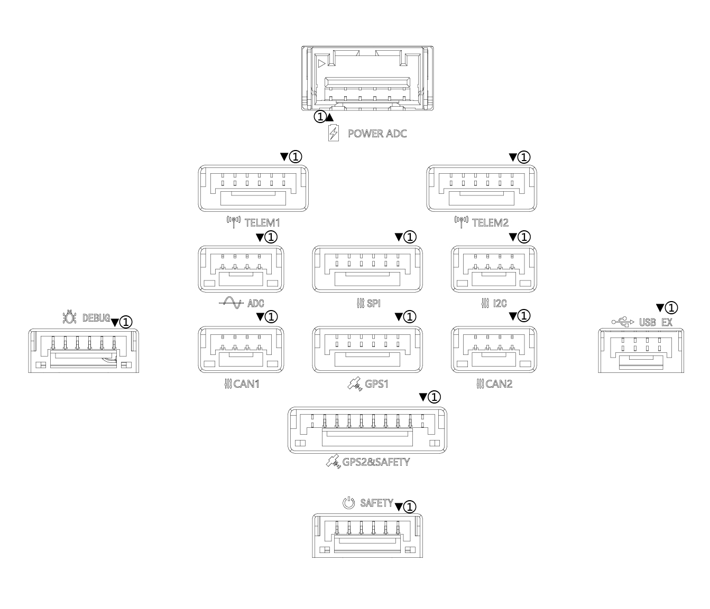

# A6SE Flight Controller

The A6SE flight controller is manufactured and sold by [YJUAV](http://www.yjuav.net).

## Features

 - STM32H750 microcontroller
 - Onboard Flash: 128Mbits/16Mbytes
 - Two IMUs: ICM42688, ICM42688
 - Internal ITS8310 I2C magnetometer
 - Internal DPS310 SPI barometer
 - Internal RGB LED
 - microSD card slot port
 - 1 analog power ports
 - 5 UARTs and 1 USB ports
 - 3 I2C and 2 CAN ports
 - 11 PWM output ports
 - Safety switch port
 - External SPI port
 - Buzzer port
 - RC IN port

## Pinout

## Connectors

**POWER ADC**

| Pin  |     Signal      | Volt  |
| :--: | :-------------: | :---: |
|  1   |     VCC_IN      |  +5V  |
|  2   |     VCC_IN      |  +5V  |
|  3   | BAT_CRRENT_ADC  | +3.3V |
|  4   | BAT_VOLTAGE_ADC | +3.3V |
|  5   |       GND       |  GND  |
|  6   |       GND       |  GND  |

**TELEM1&TELEM2**

| Pin  | Signal  | Volt  |
| :--: | :-----: | :---: |
|  1   |   VCC   |  +5V  |
|  2   | UART_TX | +3.3V |
|  3   | UART_RX | +3.3V |
|  4   |   CTS   | +3.3V |
|  5   |   RTS   | +3.3V |
|  6   |   GND   |  GND  |

**ADC**

| Pin  | Signal  | Volt  |
| :--: | :-----: | :---: |
|  1   |   VCC   |  +5V  |
|  2   | ADC_3V3 | +3.3V |
|  3   | ADC_6V6 | +6.6V |
|  4   |   GND   |  GND  |

**SPI**

| Pin  |  Signal  | Volt  |
| :--: | :------: | :---: |
|  1   |   VCC    |  +5V  |
|  2   | SPI_SCK  | +3.3V |
|  3   | SPI_MISO | +3.3V |
|  4   | SPI_MOSI | +3.3V |
|  5   |  SPI_CS  | +3.3V |
|  6   |   GND    |  GND  |

**I2C**

| Pin  | Signal  | Volt  |
| :--: | :-----: | :---: |
|  1   |   VCC   |  +5V  |
|  2   | I2C_SCL | +3.3V |
|  3   | I2C_SDA | +3.3V |
|  4   |   GND   |  GND  |

**CAN1&CAN2**

| Pin  | Signal | Volt  |
| :--: | :----: | :---: |
|  1   |  VCC   |  +5V  |
|  2   | CAN_P  | +3.3V |
|  3   | CAN_N  | +3.3V |
|  4   |  GND   |  GND  |

**GPS1**

| Pin  | Signal  | Volt  |
| :--: | :-----: | :---: |
|  1   |   VCC   |  +5V  |
|  2   | UART_TX | +3.3V |
|  3   | UART_RX | +3.3V |
|  4   | I2C_SCL | +3.3V |
|  5   | I2C_SDA | +3.3V |
|  6   |   GND   |  GND  |

**GPS2&SAFETY**

| Pin  |    Signal     | Volt  |
| :--: | :-----------: | :---: |
|  1   |      VCC      |  +5V  |
|  2   |    UART_TX    | +3.3V |
|  3   |    UART_RX    | +3.3V |
|  4   |    I2C_SCL    | +3.3V |
|  5   |    I2C_SDA    | +3.3V |
|  6   |   SAFETY_SW   | +3.3V |
|  7   | SAFETY_SW_LED | +3.3V |
|  8   |    3V3_OUT    | +3.3V |
|  9   |    BUZZER     | +3.3V |
|  10  |      GND      |  GND  |

**DEBUG**

| Pin  | Signal | Volt  |
| :--: | :----: | :---: |
|  1   |  VCC   |  +5V  |
|  2   |   TX   | +3.3V |
|  3   |   RX   | +3.3V |
|  4   | SWDIO  | +3.3V |
|  5   | SWCLK  | +3.3V |
|  6   |  GND   |  GND  |

**SAFETY**

| Pin  |    Signal     | Volt  |
| :--: | :-----------: | :---: |
|  1   |    3V3_OUT    | +3.3V |
|  2   |   SAFETY_SW   | +3.3V |
|  3   | SAFETY_SW_LED | +3.3V |
|  4   |   SBUS_OUT    | +3.3V |
|  5   |     RSSI      | +3.3V |
|  6   |      GND      |  GND  |

**USB EX**

| Pin  | Signal | Volt  |
| :--: | :----: | :---: |
|  1   | VCC_IN |  +5V  |
|  2   |   DM   | +3.3V |
|  3   |   DP   | +3.3V |
|  4   |  GND   |  GND  |

## UART Mapping

 - SERIAL0 -> USB (OTG1)
 - SERIAL1 -> USART1 (Telem1)
 - SERIAL2 -> USART6 (Telem2)
 - SERIAL3 -> USART3 (GPS1), NODMA
 - SERIAL4 -> USART2 (GPS2), NODMA
 - SERIAL5 -> UART8 (SBUS)
 - SERIAL6 -> UART7 (Debug), NODMA
 - SERIAL7 -> USB2 (OTG2)

## RC Input

The remote control signal should be connected to the “RC IN” pin, at one side of the servo channels.

This signal pin supports two types of remote control signal inputs, SBUS and PPM signals.

## PWM Output

The A6SE supports up to 11 PWM outputs,support all PWM protocols as well as DShot. All 11 PWM outputs have GND on the bottom row, 5V on the middle row and signal on the top row.

The 11 PWM outputs are in 4 groups:

 - PWM 1, 2, 3 and 4 in group1
 - PWM 5, 6, 7 and 8 in group2
 - PWM 9, 10, 11 in group3

Channels 1-8 support bi-directional Dshot.
Channels within the same group need to use the same output rate. If any channel in a group uses DShot, then all channels in that group need to use DShot.

## GPIOs

All 11 PWM channels can be used for GPIO functions (relays, buttons, RPM etc).

The pin numbers for these PWM channels in ArduPilot are shown below:

| PWM Channels | Pin  | PWM Channels | Pin  |
| ------------ | ---- | ------------ | ---- |
| PWM1         | 50   | PWM8         | 57   |
| PWM2         | 51   | PWM9         | 58   |
| PWM3         | 52   | PWM10        | 59   |
| PWM4         | 53   | PWM11        | 60   |
| PWM5         | 54   |              |      |
| PWM6         | 55   |              |      |
| PWM7         | 56   |              |      |

## Analog inputs

The A6SE flight controller has 5 analog inputs

 - ADC Pin4   -> Battery Current 
 - ADC Pin2 -> Battery Voltage 
 - ADC Pin8   -> ADC 3V3 Sense
 - ADC Pin10 -> ADC 6V6 Sense
 - ADC Pin11 -> RSSI voltage monitoring

## Build the FC

./waf configure --board=YJUAV_A6SE
./waf copter

The compiled firmware is located in folder **"build/YJUAV_A6SE/bin/arducopter.apj"**.

## Loading Firmware

The A6SE flight controller comes pre-installed with an ArduPilot compatible bootloader, allowing the loading of *.apj firmware files with any ArduPilot compatible ground station.

