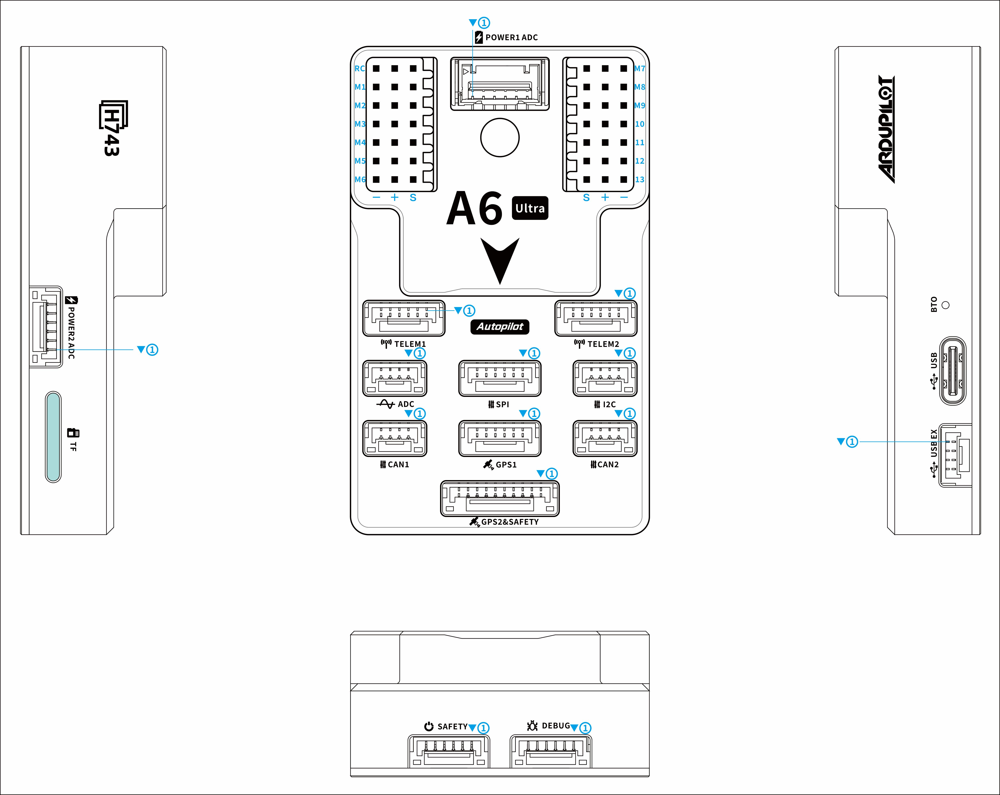

# A6Ultra Flight Controller

The A6Ultra flight controller is manufactured and sold by [YJUAV](http://www.yjuav.net).

## Features

 - STM32H743 microcontroller
 - Onboard Flash: 2048Mbits
 - Three IMUs: ICM42688,ICM42688,IIM42652
 - Internal ITS8310 I2C magnetometer
 - Internal two DPS310 SPI barometer
 - Internal RGB LED
 - MicroSD card slot port
 - 2 Analog power ports
 - 5 UARTs and 1 USB ports
 - 3 I2C and 2 CAN ports
 - 13 PWM output ports
 - Safety switch port
 - External SPI port
 - Buzzer port
 - RC IN port

## Pinout

## Connectors

**POWER1 ADC**

| Pin  |     Signal      | Volt  |
| :--: | :-------------: | :---: |
|  1   |     VCC_IN      |  +5V  |
|  2   |     VCC_IN      |  +5V  |
|  3   | BAT_CURRENT_ADC | +3.3V |
|  4   | BAT_VOLTAGE_ADC | +3.3V |
|  5   |       GND       |  GND  |
|  6   |       GND       |  GND  |

**POWER2 ADC**

| Pin  |     Signal      | Volt  |
| :--: | :-------------: | :---: |
|  1   |     VCC_IN      |  +5V  |
|  2   |     VCC_IN      |  +5V  |
|  3   | BAT2_CURRENT_ADC | +3.3V |
|  4   | BAT2_VOLTAGE_ADC | +3.3V |
|  5   |       GND       |  GND  |
|  6   |       GND       |  GND  |

**TELEM1**

| Pin  | Signal  | Volt  |
| :--: | :-----: | :---: |
|  1   |   VCC   |  +5V  |
|  2   | USART2_TX | +3.3V |
|  3   | USART2_RX | +3.3V |
|  4   |   CTS   | +3.3V |
|  5   |   RTS   | +3.3V |
|  6   |   GND   |  GND  |

**TELEM2**

| Pin  | Signal  | Volt  |
| :--: | :-----: | :---: |
|  1   |   VCC   |  +5V  |
|  2   | USART6_TX | +3.3V |
|  3   | USART6_RX | +3.3V |
|  4   |   CTS   | +3.3V |
|  5   |   RTS   | +3.3V |
|  6   |   GND   |  GND  |

**ADC**

| Pin  | Signal  | Volt  |
| :--: | :-----: | :---: |
|  1   |   VCC   |  +5V  |
|  2   | ADC_3V3 | +3.3V |
|  3   | ADC_6V6 | +6.6V |
|  4   |   GND   |  GND  |

**SPI**

| Pin  |  Signal  | Volt  |
| :--: | :------: | :---: |
|  1   |   VCC    |  +5V  |
|  2   | SPI_SCK  | +3.3V |
|  3   | SPI_MISO | +3.3V |
|  4   | SPI_MOSI | +3.3V |
|  5   |  SPI_CS  | +3.3V |
|  6   |   GND    |  GND  |

**I2C**

| Pin  | Signal  | Volt  |
| :--: | :-----: | :---: |
|  1   |   VCC   |  +5V  |
|  2   | I2C4_SCL | +3.3V |
|  3   | I2C4_SDA | +3.3V |
|  4   |   GND   |  GND  |

**CAN1**

| Pin  | Signal | Volt  |
| :--: | :----: | :---: |
|  1   |  VCC   |  +5V  |
|  2   | CAN1_P  | +3.3V |
|  3   | CAN1_N  | +3.3V |
|  4   |  GND   |  GND  |

**CAN2**

| Pin  | Signal | Volt  |
| :--: | :----: | :---: |
|  1   |  VCC   |  +5V  |
|  2   | CAN2_P  | +3.3V |
|  3   | CAN2_N  | +3.3V |
|  4   |  GND   |  GND  |

**GPS1**

| Pin  | Signal  | Volt  |
| :--: | :-----: | :---: |
|  1   |   VCC   |  +5V  |
|  2   | USART3_TX | +3.3V |
|  3   | USART3_RX | +3.3V |
|  4   | I2C2_SCL | +3.3V |
|  5   | I2C2_SDA | +3.3V |
|  6   |   GND   |  GND  |

**GPS2&SAFETY**

| Pin  |    Signal     | Volt  |
| :--: | :-----------: | :---: |
|  1   |      VCC      |  +5V  |
|  2   |    USART1_TX  | +3.3V |
|  3   |    USART1_RX  | +3.3V |
|  4   |    I2C3_SCL   | +3.3V |
|  5   |    I2C3_SDA   | +3.3V |
|  6   |   SAFETY_SW   | +3.3V |
|  7   | SAFETY_SW_LED | +3.3V |
|  8   |    3V3_OUT    | +3.3V |
|  9   |    BUZZER     | +3.3V |
|  10  |      GND      |  GND  |

**DEBUG**

| Pin  | Signal | Volt  |
| :--: | :----: | :---: |
|  1   |  VCC   |  +5V  |
|  2   |  UART7_TX   | +3.3V |
|  3   |  UART7_RX   | +3.3V |
|  4   | SWDIO  | +3.3V |
|  5   | SWCLK  | +3.3V |
|  6   |  GND   |  GND  |

**SAFETY**

| Pin  |    Signal     | Volt  |
| :--: | :-----------: | :---: |
|  1   |    3V3_OUT    | +3.3V |
|  2   |   SAFETY_SW   | +3.3V |
|  3   | SAFETY_SW_LED | +3.3V |
|  4   |   UART8_TX(SBUS_OUT)    | +3.3V |
|  5   |     RSSI      | +3.3V |
|  6   |      GND      |  GND  |

**USB EX**

| Pin  | Signal | Volt  |
| :--: | :----: | :---: |
|  1   | VCC_IN |  +5V  |
|  2   |   DM   | +3.3V |
|  3   |   DP   | +3.3V |
|  4   |  GND   |  GND  |

## UART Mapping

 - SERIAL0 -> USB (OTG1)
 - SERIAL1 -> USART2 (Telem1)
 - SERIAL2 -> USART6 (Telem2)
 - SERIAL3 -> USART3 (GPS1)
 - SERIAL4 -> USART1 (GPS2)
 - SERIAL5 -> UART8 (USER) TX only, normally used for SBUS_OUT with protocol change
 - SERIAL6 -> UART7 (USER/Debug), NODMA
 - SERIAL7 -> USB2 (OTG2)

## RC Input

The RCIN pin is mapped to a timer input instead of the UART, and can be used for all ArduPilot supported receiver protocols, except CRSF/ELRS and SRXL2 which require a true UART connection. However, FPort, when connected in this manner, can provide RC without telemetry.

To allow CRSF and embedded telemetry available in Fport, CRSF, and SRXL2 receivers, a full UART must be used. For example, UART1 can have its protocol changed from the default GPS protocol for GPS2 to RX input protocol:

With this option, SERIAL4_PROTOCOL must be set to “23”, and:

PPM is not supported.

SBUS/DSM/SRXL connects to the RX1 pin.

FPort requires connection to TX1 and RX1. See FPort Receivers.

CRSF also requires a TX1 connection, in addition to RX1, and automatically provides telemetry.

SRXL2 requires a connection to TX1 and automatically provides telemetry. Set SERIAL4_OPTIONS to “4”.

Any UART can be used for RC system connections in ArduPilot also, and is compatible with all protocols except PPM. See Radio Control Systems for details.

## PWM Output

The A6Ultra supports up to 13 PWM outputs,support all PWM protocols as well as DShot. All 13 PWM outputs have GND on the bottom row, 5V on the middle row and Signal on the top row.

The 13 PWM outputs are in 4 groups:

 - PWM 1, 2, 3 and 4 in group1
 - PWM 5, 6, 7 and 8 in group2
 - PWM 9, 10, 11 in group3
 - PWM 12, 13 in group4

Channels 1-8 support bi-directional Dshot.
Channels within the same group need to use the same output rate. If any channel in a group uses DShot, then all channels in that group need to use DShot.

## GPIOs

All 13 PWM channels can be used for GPIO functions (relays, buttons, RPM etc).

The pin numbers for these PWM channels in ArduPilot are shown below:

| PWM Channels | Pin  | PWM Channels | Pin  |
| ------------ | ---- | ------------ | ---- |
| PWM1         | 50   | PWM8         | 57   |
| PWM2         | 51   | PWM9         | 58   |
| PWM3         | 52   | PWM10        | 59   |
| PWM4         | 53   | PWM11        | 60   |
| PWM5         | 54   | PWM12        | 61   |
| PWM6         | 55   | PWM13        | 62   |
| PWM7         | 56   |              |      |

## Analog inputs

The A6Ultra flight controller has 7 Analog inputs

 - ADC Pin4   -> Battery Current 
 - ADC Pin2 -> Battery Voltage 
 - ADC Pin16   -> Battery2 Current 
 - ADC Pin12 -> Battery2 Voltage 
 - ADC Pin8   -> ADC 3V3 Sense
 - ADC Pin10 -> ADC 6V6 Sense
 - ADC Pin11 -> RSSI voltage monitoring

 ## Battery Monitor Configuration

The board has voltage and current sensor inputs on the POWER1_ADC and POWER2_ADC connector.

The correct battery setting parameters are:

Enable Battery1 monitor:

BATT_MONITOR    4

BATT_VOLT_PIN   2

BATT_CURR_PIN   4

BATT_VOLT_MULT 21.0 (may need adjustment if supplied monitor is not used)

BATT_AMP_PERVLT 34.6 (may need adjustment if supplied monitor is not used)

Enable Battery2 monitor:
BATT2_MONITOR   4

BATT2_VOLT_PIN  12

BATT2_CURR_PIN  16

BATT2_VOLT_MULT 21.0 (may need adjustment if supplied monitor is not used)

BATT2_AMP_PERVLT 34.6 (may need adjustment if supplied monitor is not used)

## Build the FC

./waf configure --board YJUAV_A6Ultra
./waf copter

The compiled firmware is located in folder **"build/YJUAV_A6Ultra/bin/arducopter.apj"**.

## Loading Firmware

The A6Ultra flight controller comes pre-installed with an ArduPilot compatible bootloader, allowing the loading of *.apj firmware files with any ArduPilot compatible ground station.