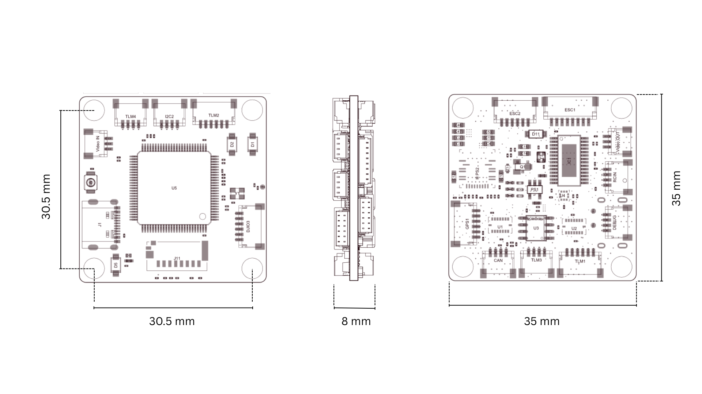
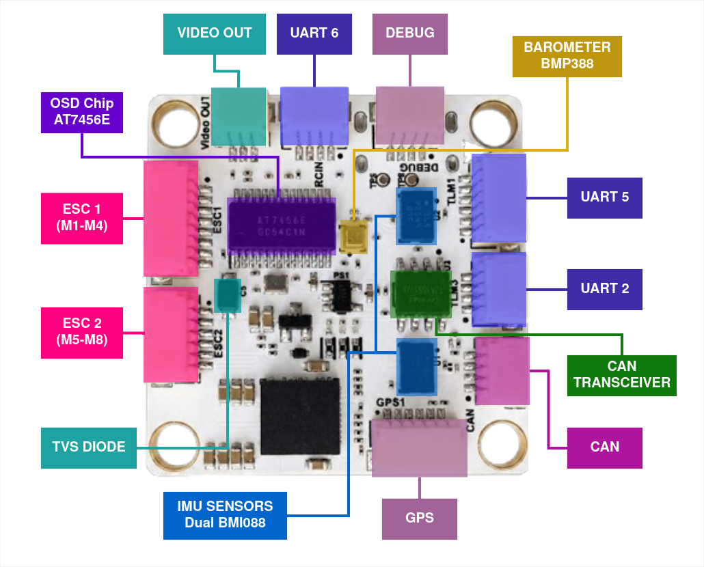
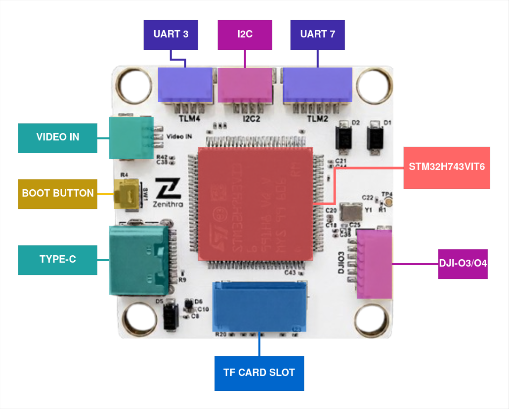
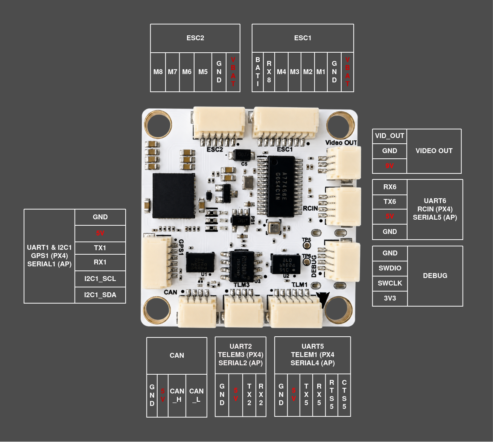
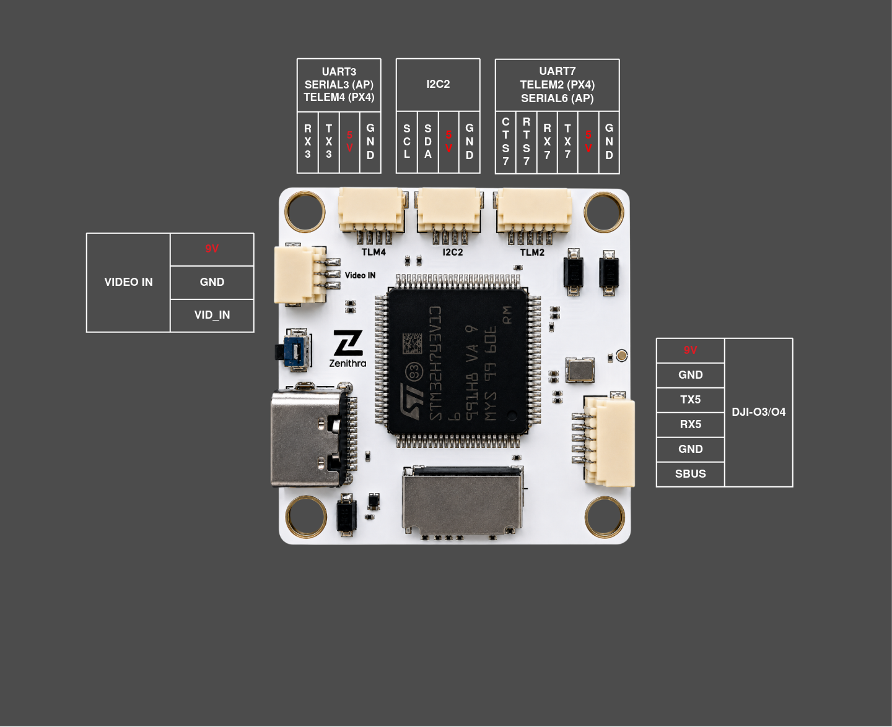

# ZenFC H743 Flight Controller

The _ZenFC H743_ is a flight controller designed by [Zenithra Tech](https://www.zenithratech.com/contact).
It is built around the STM32H743 processor with dual Bosch BMI088 IMUs for sensor redundancy, an onboard barometer, and an integrated OSD.

## Features

- **MCU:**
  - STM32H743VIT6 (32-bit Arm® Cortex®-M7, 480 MHz)
- **IMU:**
  - 2x Bosch BMI088 (accel + gyro, independent SPI buses for redundancy)
- **Barometer:**
  - Bosch BMP388
- **OSD:**
  - Onboard AT7456E OSD chip
- **Interfaces:**
  - 7x UARTs
  - 1x CAN
  - 2x external I2C (I2C1 with GPS connector for compass and dedicated I2C2 connector)
  - 8x PWM outputs (Dshot supported)
  - microSD card slot
  - 1x USB Type-C
  - 1x SWD (Debug)
- **Power:**
  - 2x ADC (V_BAT & current sense)
  - Battery Input range - 2S-6S
  - BEC Outputs
    - 9V 3A cont.
    - 5V 3A cont.

## Dimensions

- **Mounting:** 30.5 mm x 30.5 mm /Φ4mm hole
- **Dimensions:** 35mm x 35mm x 8mm
- **Weight:** 9g

## Where to Buy

Order from [Zenithra Tech](https://www.zenithratech.com/solutions/components).

## Layout

## UART Mapping

The UARTs are marked RXn and TXn in the below pinouts. The RXn pin is the receive pin for UARTn. The TXn pin is the transmit pin for UARTn.

|Port    |UART   |Connector    |Protocol         |Notes                          |
|--------|-------|-------------|-----------------|-------------------------------|
|SERIAL0 |USB    |USB-C        |MAVLink2         |                               |
|SERIAL1 |USART1 |GPS1         |GPS              |I2C1 on same connector         |
|SERIAL2 |USART2 |TLM3         |MAVLink2         |                               |
|SERIAL3 |USART3 |TLM4         |MAVLink2         |                               |
|SERIAL4 |UART5  |TLM1, DJIO3  |MSP DisplayPort  |RTS5/CTS5 on TLM1 only         |
|SERIAL5 |USART6 |RCIN         |RCIN             |                               |
|SERIAL6 |UART7  |TLM2         |MAVLink2         |RTS7/CTS7                      |
|SERIAL7 |UART8  |ESC1         |ESC Telemetry    |RX8 only on the ESC1 connector |

All UARTs are DMA capable in both directions.

> **Notes:**
>
> - The **SBUS** pin on the DJI-O3 connector is internally routed to the **RX6 (RCIN)** pin.
> - **Important:** The **TLM1** and **DJIO3** connectors share the same physical **SERIAL4 (UART5)** port. You can only use one of these connectors at a time; connecting devices to both simultaneously will cause signal conflicts.
> - The **TLM1/DJIO3** port (SERIAL4) is configured for **MSP-DisplayPort** by default. If you require this port for MAVLink or other telemetry, you must manually adjust the `SERIAL4_PROTOCOL` parameter.

## Connectors & Pinout

Board uses JST SH connectors for all interfaces.

## RC Input

RC input is on the RCIN connector (UART6, SERIAL5). PPM is not supported on this board, as there is no dedicated timer-based RC input pin.

> **Note**: The SBUS pin on the DJIO3 connector is internally routed to RX6 and can be used as an alternative RC input for SBUS receivers.

- SBUS/DSM/SRXL connect to the RX6 pin.
- CRSF/ELRS require both RX6 and TX6, and automatically provide telemetry.
- FPort requires connection to TX6, with `SERIAL5_OPTIONS` set to "7".
- SRXL2 requires connection to TX6 only, with `SERIAL5_OPTIONS` set to "4", and automatically provides telemetry.

See [RC Systems](https://ardupilot.org/plane/docs/common-rc-systems.html) for details on all supported receiver protocols.

## OSD Support

The ZenFC H743 has an onboard AT7456E analog OSD, enabled by default (`OSD_TYPE` = 1). Analog camera input is on the VIDEO IN connector and analog video output to a VTX is on the VIDEO OUT connector. Both carry a 9V supply pin, so be careful not to connect a camera or VTX requiring 5V to them.

Simultaneous DisplayPort OSD operation is also pre-configured on SERIAL4 (`OSD_TYPE2` = 5).

> **Note**: if `SERIAL4_PROTOCOL` is ever changed from MSP DisplayPort, `OSD_TYPE2` must be set to `0`, or a pre-arm failure will result.

## HD VTX Support

The DJIO3 connector supports a DJI O3/O4 Air Unit or other HD VTX. Protocol defaults to MSP DisplayPort on SERIAL4. Pin 1 of this connector is 9V, so be careful not to connect this to a peripheral requiring 5V.

## PWM Output

The ZenFC H743 supports up to 8 PWM outputs, all on the FMU (there is no IO co-processor). Outputs 1-4 are on the ESC1 connector, labeled M1-M4. Outputs 5-8 are on the ESC2 connector, labeled M5-M8.

The motor order follows the standard ArduPilot/PX4 convention:

- M1: Front Right
- M2: Back Left
- M3: Front Left
- M4: Back Right

All 8 outputs support DShot and bi-directional DShot.

The outputs are in 3 groups:

- Outputs 1, 2, 3 and 4 (M1-M4) in group 1
- Outputs 5 and 6 (M5, M6) in group 2
- Outputs 7 and 8 (M7, M8) in group 3

Channels within the same group need to use the same output rate. If any channel in a group uses DShot then all channels in the group need to use DShot.

## Battery Monitoring

The voltage sensor can handle up to 6S LiPo batteries.

The default battery parameters are:

- BATT_MONITOR 4
- BATT_VOLT_PIN 8
- BATT_CURR_PIN 4
- BATT_VOLT_MULT 10.09
- BATT_AMP_PERVLT 40

> **Note**: These default multipliers are starting values. Since the current sensor is external (located on the ESC connector), you must adjust `BATT_VOLT_MULT` and `BATT_AMP_PERVLT` according to your specific current sensor's characteristics.

## Compass

The ZenFC H743 does not have a builtin compass, but you can attach an external compass using I2C. The I2C1 SCL and SDA pins are on the GPS1 connector for use with a GPS/Compass combination unit, and a second I2C bus is available on the I2C2 connector.

## GPIOs

All 8 PWM outputs can be used as GPIOs (relays, buttons, RPM etc). To use them you need to set the output's `SERVOx_FUNCTION` to -1.

|PWM Output |GPIO Number |
|-----------|------------|
|PWM1 (M1)  | 50         |
|PWM2 (M2)  | 51         |
|PWM3 (M3)  | 52         |
|PWM4 (M4)  | 53         |
|PWM5 (M5)  | 54         |
|PWM6 (M6)  | 55         |
|PWM7 (M7)  | 56         |
|PWM8 (M8)  | 57         |

## Firmware

ArduPilot firmware for the ZenFC H743 can be found at the [ArduPilot Firmware Server](https://firmware.ardupilot.org) under the **ZenFC743** target.

### Loading Firmware

The method used to load ArduPilot depends on the firmware currently installed on the board:

- **Boards shipped with ArduPilot:** These units come with the ArduPilot bootloader (AP_Bootloader) pre-installed. You can flash `*.apj` firmware files directly from any ArduPilot-compatible ground station (Mission Planner, QGroundControl, etc.). No separate first-time installation step is required.
- **Boards shipped with other firmware:** If your board was supplied with PX4 or another firmware, the ArduPilot bootloader is not yet present. You must follow the **First-time Installation (DFU)** procedure below once to "migrate" the board to ArduPilot.

### First-time Installation / Recovery (DFU)

DFU mode is required to install ArduPilot for the first time on boards shipped with non-ArduPilot firmware, or to recover a board if the bootloader becomes corrupted.

1. Locate the **BOOT** button next to the USB-C connector (see `zenfc_h743_layout_back.png` in the **Layout** section).
2. Connect the flight controller to your computer via USB while holding the **BOOT** button down.
3. Use [STM32CubeProgrammer](https://www.st.com/en/development-tools/stm32cubeprog.html) to flash the firmware. See [Loading Firmware onto ChibiOS boards](https://ardupilot.org/copter/docs/common-loading-firmware-onto-chibios-only-boards.html#upload-the-firmware-to-autopilot) for a detailed walkthrough.
4. **Important:** Select the firmware file ending in **`_with_bl.hex`**. This file contains both the ArduPilot bootloader and the firmware itself.

Once this process is complete, the board will have the ArduPilot bootloader installed, and all future updates can be done normally via your Ground Control Station using `*.apj` files.
