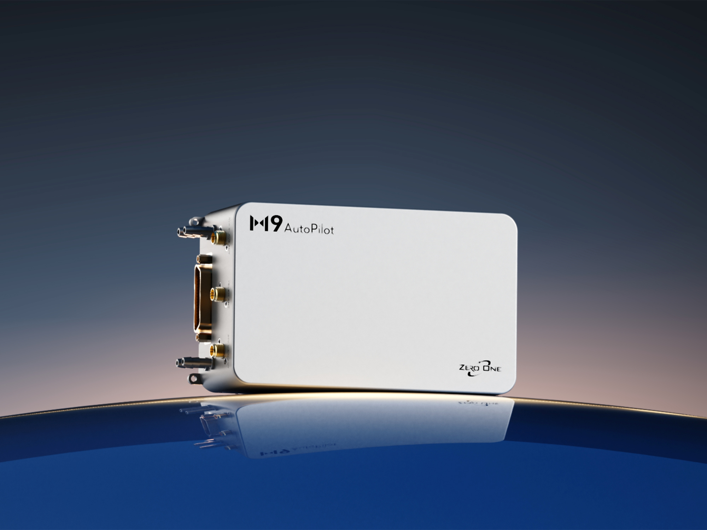
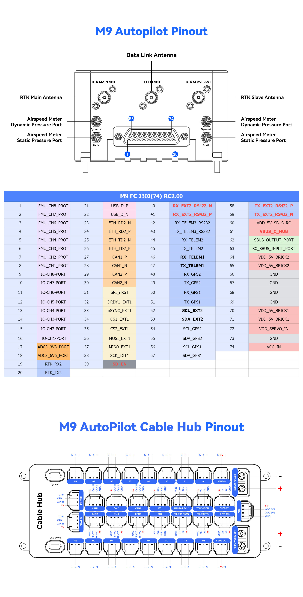

# ZeroOneM9 Flight Controller

The ZeroOne M9 is a series of flight controllers designed and manufactured by ZeroOne.
Integrated with dual-redundant high-precision differential airspeed sensors, anti-interference RTK positioning module, and adopts 900MHz band data transmission link with a maximum communication range of 60km.

## Features

- Separate flight control core design.
- MCU

   STM32H753IIK6 32-bit processor running at 480MHz
   2MB Flash
   1MB RAM

- IO MCU

   STM32F103

- Sensors
  - IMU:

       Internal Vibration Isolation for IMUs
       IMU constant temperature heating(2W heating power).
       With Triple Synced IMUs, BalancedGyro technology, low noise and more shock-resistant:

       IMU1-SCH16T-K10(With vibration isolation and external FIFO)
       IMU2-ADIS16507(With vibration isolation)
       IMU3-IIM42653(No vibration isolation)

  - Baro:

       Three barometers(Version 1):  2 x ICP20100 + AUAV L30D
       Three barometers(Version 2):  BMP581+SPL07 + AUAV L30D

  - Magnetometer:

       Builtin RM3100 magnetometer
       External RM3100 magnetometer

  - Airspeed

      Two Airspeed Sensors: AUAV-L30D(I2C2) + AUAV-L30D(CAN1)

  - RTK

      Anti-interference RTK positioning module(CAN1)

  - Data Link

      900MHz band data transmission link with a maximum communication range of 60km(Telem1)

## Pinout

## UART Mapping

The Cable Hub labels serial connectors by function. TX and RX are relative to the flight controller.
| Name    | Function | MCU PINS |   DMA   | TYPE    |
| :-----: | :------: | :------: | :------:| :------:|
| SERIAL0 | OTG1     | USB      |
| SERIAL1 | Telem1   | UART7    |DMA Enabled | TTL      |
| SERIAL2 | Telem2   | UART5    |DMA Enabled | TTL      |
| SERIAL3 | GPS1     | USART1   |DMA Enabled | TTL      |
| SERIAL4 | GPS2     | UART8    |DMA Enabled | TTL      |
| SERIAL5 | Telem3   | USART2   |DMA Enabled | RS232    |
| SERIAL6 | UART4    | UART4    |DMA Enabled | RS422    |
| SERIAL7 |FMU DEBUG | USART3   |DMA Enabled | TTL      |
| SERIAL8 | OTG-SLCAN| USB      |

## RC Input

The SBUS pin, can be used for all ArduPilot supported receiver protocols, except CRSF/ELRS and SRXL2 which require a true UART connection. However, FPort, when connected in this manner, will only provide RC without telemetry.
For CRSF/ELRS, FPort telemetry, or SRXL2, use a full TTL UART such as TELEM1, TELEM2, GPS1, or GPS2. TELEM3 is RS232 and UART4 is RS422, so neither is electrically compatible with a TTL receiver.

Any UART can be used for RC system connections in ArduPilot also, and is compatible with all protocols except PPM. See [RC systems](https://ardupilot.org/copter/docs/common-rc-systems.html) for details.

## PWM Output

The M9 flight controller supports up to 16 PWM outputs.
First 8 outputs (labelled 1 to 8) are controlled by a dedicated STM32F103 IO controller.
The remaining 8 outputs (labelled 9 to 16) are the "auxiliary" outputs. These are directly attached to the STM32H753 FMU controller .
All 16 outputs support normal PWM output formats. All 16 outputs support DShot, except 15 and 16.

The 8 IO PWM outputs are in 3 groups:

- Outputs 1 and 2 in group1
- Outputs 3 and 4 in group2
- Outputs 5, 6, 7 and 8 in group3

The 8 FMU PWM outputs are in 3 groups:

- A1, A2, A3 and A4 in group1 (TIM5)
- A5 and A6 in group2 (TIM4)
- A7 and A8 in group3 (TIM12)

Channels within the same group need to use the same output rate. If any channel in a group uses DShot then all channels in the group need to use DShot.

## GPIOs

All PWM outputs can be used as GPIOs (relays, camera, RPM etc). To use them you need to set the output’s SERVOx_FUNCTION to -1. The numbering of the GPIOs for PIN variables in ArduPilot is:

| IO Pins |       |          | FMU Pins |       |         |
| ---     | ---   | ---      | ---      | ---   | ---     |
| Name    | Value | Option   | Name     | Value | Option  |
| M1      | 101   | MainOut1 | A1       | 50    | AuxOut1 |
| M2      | 102   | MainOut2 | A2       | 51    | AuxOut2 |
| M3      | 103   | MainOut3 | A3       | 52    | AuxOut3 |
| M4      | 104   | MainOut4 | A4       | 53    | AuxOut4 |
| M5      | 105   | MainOut5 | A5       | 54    | AuxOut5 |
| M6      | 106   | MainOut6 | A6       | 55    | AuxOut6 |
| M7      | 107   | MainOut7 | A7       | 56    | AuxOut7 |
| M8      | 108   | MainOut8 | A8       | 57    | AuxOut8 |

## 5V PWM Voltage

The M9 flight controller supports switching between 5V and 3.3V PWM levels. Switch PWM output pulse level by configuring parameter BRD_PWM_VOL_SEL. 0 for 3.3V and 1 for 5V output.

## Compass

The M9 has two RM3100 compasses. An external compass can also be connected to the I2C connector.

## Ethernet

The Cable Hub provides an Ethernet connector connected to the LAN8742A RMII interface. Ethernet power is enabled when the board starts.

## SBUS Output

The SBUS-OUT connector is attached to the IO processor. Set BRD_SBUS_OUT to enable servo-channel output over SBUS.

## Analog Inputs

The M9 flight controller has 2 analog inputs.

- ADC Pin12 -> ADC 6.6V Sense
- ADC Pin13 -> ADC 3.3V Sense

## Battery Monitoring

The M9 flight controller has two four-pin global power connectors, supporting CAN interface power supply.
The BATT_MONITOR default is 8, so a DroneCAN-capable power module is required.

The M9 flight controller has a XT60 FC power connector, supporting analog voltage detection.
This is monitored by the internal CAN peripheral "ZeroOneM9_Periph".

The integrated DroneCAN RTK receiver is the primary GPS by default (GPS1_TYPE is 9). Change GPS1_TYPE before using a serial GPS as the primary receiver on GPS1-TTL.

## Power Input

| Name    | Function | Voltage range |
| :-----: | :------: | :------: |
| Power1 | Global Power(Apart from Datalink) | 5.0-5.3V |
| Power2 | Global Power(Apart from Datalink) | 5.0-5.3V |
| FC Power | FC Power | 16-36V |
| Servo Power | Servo Power| 0-9.9V |

## Log Download

The M9 flight controller has a built-in independent log card reader, which can be connected via the USB Drive interface and recognized as a storage disk (do not connect other power interfaces when connecting the USB Drive interface).

## Dimensions and Weight

- Flight controller: 128mm x 78mm x 46mm, 585g
- Cable Hub: 133mm x 53.5mm x 22mm, 238g
- Combined weight: 823g
- External interfaces: 6 UARTs, dual CAN, Ethernet, I2C, ADC, USB Type-C, USB Drive, SBUS input/output, and 16 PWM outputs

## Loading Firmware

The board comes pre-installed with an ArduPilot compatible bootloader,
allowing the loading of xxxxxx.apj firmware files with any ArduPilot
compatible ground station.
Firmware for these boards can be found [here](https://firmware.ardupilot.org) in  sub-folders labeled "ZeroOneM9".

## Where to Buy

[ZeroOne M9 product page](https://01aero.com/product/m9/)
