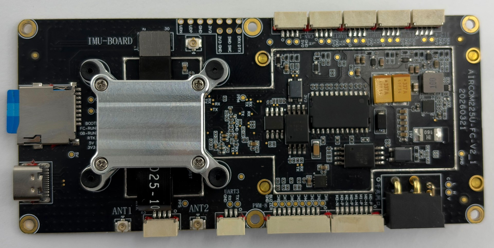
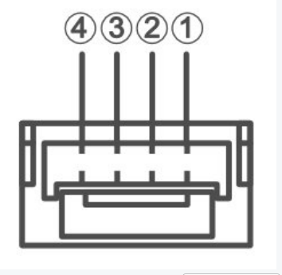

# AMOV Flycore Flight Controller

The AMOV Flycore is an STM32H743-based flight controller manufactured by
[AMOV](https://amovlab.com/). It includes an onboard UM982 GNSS receiver,
dual IMUs, an onboard barometer, 10 PWM outputs, dual CAN, three telemetry
ports, and a standard SD card slot.

## Where to Buy

For purchasing information, contact
[shudajun@amovauto.com](mailto:shudajun@amovauto.com).

## Specifications

- Processor
  - STM32H743, Arm Cortex-M7 at 480 MHz
  - 2 MB flash and 1 MB RAM
  - No I/O coprocessor
- Sensors
  - Bosch BMI088 IMU
  - InvenSense ICM-42688P IMU
  - MS5611 barometer
  - UM982 GNSS receiver connected internally to GPS1
  - No onboard compass
- Interfaces
  - 10 FMU PWM outputs
  - Three telemetry ports
  - One external GPS port
  - Two CAN buses
  - Two external I2C buses
  - USB
  - RC input
  - Standard SD card slot
  - Buzzer and SWD pads
- Power
  - XT30 input, 15 V to 28 V
  - 3S to 6S LiPo voltage sensing hardware
  - 1 A to 60 A current sensing hardware
- Mechanical
  - 120 mm x 55 mm x 26.3 mm
  - 60 g
  - 50 mm x 115 mm mounting pattern with 2.5 mm holes

## Pinout

The external peripheral signal connectors use JST-GH connectors with
1.25 mm pitch unless otherwise noted. The POWER connector is
XT30PW(2+2)-M. USB, the SD card slot, RTK antenna connectors, and the
exposed buzzer, SWD, and debug pads use the interfaces shown in the
pinout image.

Pin 1 starts at the right side of each connector when viewed as shown below.

The VCC pins on signal connectors provide 5 V unless noted otherwise.

### CAN1

| Pin | Signal |
| --- | ------ |
| 1 | CAN_L |
| 2 | CAN_H |
| 3 | GND |
| 4 | VCC |

### I2C1

| Pin | Signal |
| --- | ------ |
| 1 | SDA |
| 2 | SCL |
| 3 | GND |
| 4 | VCC |

### I2C4

| Pin | Signal |
| --- | ------ |
| 1 | SDA |
| 2 | SCL |
| 3 | GND |
| 4 | VCC |

### TELEM2

| Pin | Signal |
| --- | ------ |
| 1 | GND |
| 2 | RX |
| 3 | TX |

### RTK COM2

| Pin | Signal |
| --- | ------ |
| 1 | RX |
| 2 | TX |
| 3 | GND |
| 4 | PPS |

### TELEM1

| Pin | Signal |
| --- | ------ |
| 1 | RX |
| 2 | TX |
| 3 | GND |
| 4 | VCC |

### SBUS

| Pin | Signal |
| --- | ------ |
| 1 | RX |
| 2 | TX |
| 3 | GND |
| 4 | VCC |

The SBUS connector is connected to USART6. It supports serial RC protocols
such as SBUS, DSM/DSMX, CRSF, and GHST. Bi-directional protocols require
both the RX and TX signals. See
[RC Systems](https://ardupilot.org/copter/docs/common-rc-systems.html) for
more details on setup. PPM is not brought out to an external connector.

### GPS2

| Pin | Signal |
| --- | ------ |
| 1 | RX |
| 2 | TX |
| 3 | GND |
| 4 | VCC |

### TELEM3

| Pin | Signal |
| --- | ------ |
| 1 | RX |
| 2 | TX |
| 3 | GND |
| 4 | VCC |

### PWM

| Pin | Signal |
| --- | ------ |
| 1 | GND |
| 2 | BUZZER |
| 3 | FMU_CH8 |
| 4 | FMU_CH7 |
| 5 | FMU_CH6 |
| 6 | FMU_CH5 |
| 7 | FMU_CH4 |
| 8 | FMU_CH3 |
| 9 | FMU_CH2 |
| 10 | FMU_CH1 |

The board also has exposed pads labelled M0-P/M0-N through M3-P/M3-N.
These pads are not used by ArduPilot on the Flycore.

### POWER

| Pin | Signal |
| --- | ------ |
| 1 | GND |
| 2 | VCC |
| 3 | CAN_L |
| 4 | CAN_H |

The POWER connector is XT30PW(2+2)-M. VCC is the main power input and
supports 15 V to 28 V.

### FAN Power

| Pin | Signal |
| --- | ------ |
| 1 | GND |
| 2 | VCC |

The fan power connector provides 5 V.

### Debug and SWD pads

| Pad | Signal |
| --- | ------ |
| 3V3 | 3.3 V |
| GND | GND |
| SWD | SWDIO |
| SWC | SWCLK |
| DRX | UART8 RX |
| DTX | UART8 TX |

SWD and SWC are used for bootloader flashing and debugging. DRX and DTX
are the UART8 debug serial pins.

## UART Mapping

| Serial | UART | Port | Default protocol |
| ------ | ---- | ---- | ---------------- |
| SERIAL0 | OTG1 | USB | MAVLink2 |
| SERIAL1 | USART2 | TELEM1 | MAVLink2 |
| SERIAL2 | USART3 | TELEM2 | MAVLink2 |
| SERIAL3 | UART4 | GPS1, onboard UM982 | GPS |
| SERIAL4 | UART5 | TELEM3 | MAVLink2 |
| SERIAL5 | USART6 | SBUS | RC input |
| SERIAL6 | UART7 | GPS2 | GPS |
| SERIAL7 | UART8 | Debug pads | Disabled |
| SERIAL8 | OTG2 | Not pinned out | Disabled |

GPS1 is connected internally to the onboard UM982 and is not an external
connector. GPS2 is the external GPS connector.

## PWM Outputs

The Flycore supports 10 FMU PWM outputs in three timer groups:

- Outputs 1 to 4 use TIM1.
- Outputs 5 to 7 use TIM3.
- Outputs 8 to 10 use TIM4.

Outputs in the same timer group must use the same output rate and protocol.
Outputs 1 to 8 are on the PWM connector. Outputs 9 and 10 are configured in
the hardware definition but are not exposed on the main PWM connector.
The PWM rail is externally powered; the flight controller only supplies the
PWM signals. Standard PWM, unidirectional DShot, and bidirectional DShot are
supported.

## Compass

The Flycore has no onboard compass. An external compass can be connected to
the I2C1 or I2C4 connector.

## Firmware

Firmware for the Flycore is available from the
[ArduPilot firmware server](https://firmware.ardupilot.org/) under the
`flycore` target.

## Loading Firmware

The board uses ArduPilot board ID 1218 and ships with the ArduPilot bootloader.
Firmware can be updated with an `.apj` file using an ArduPilot-compatible
ground station.
