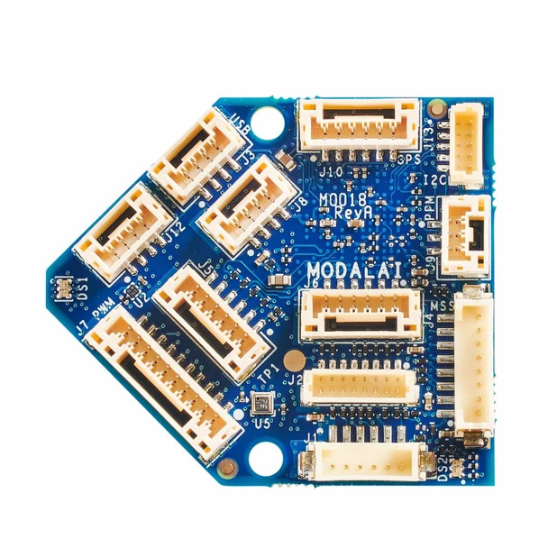
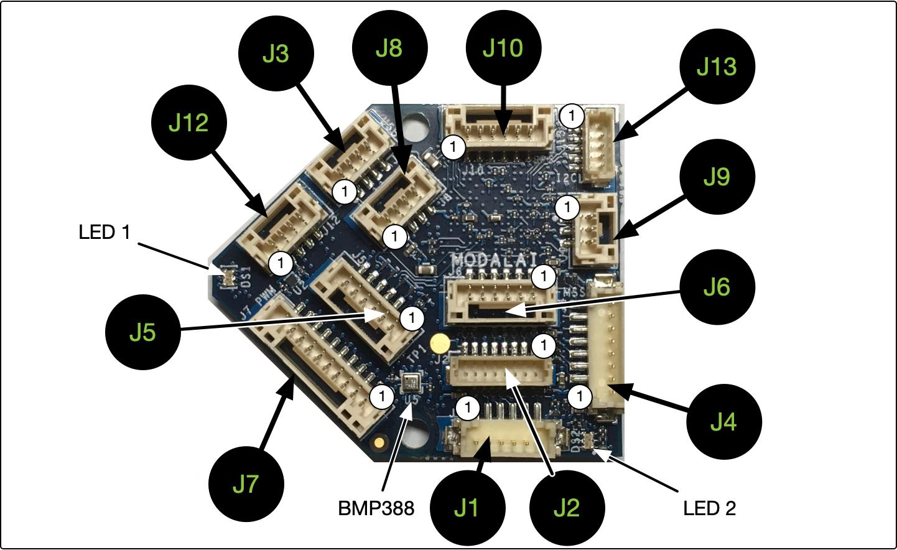
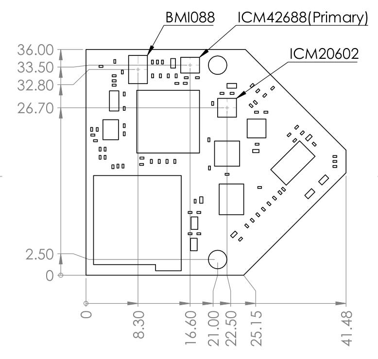
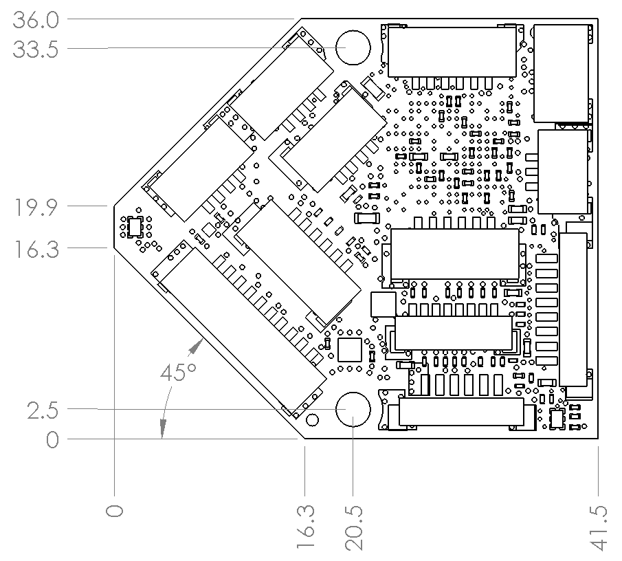
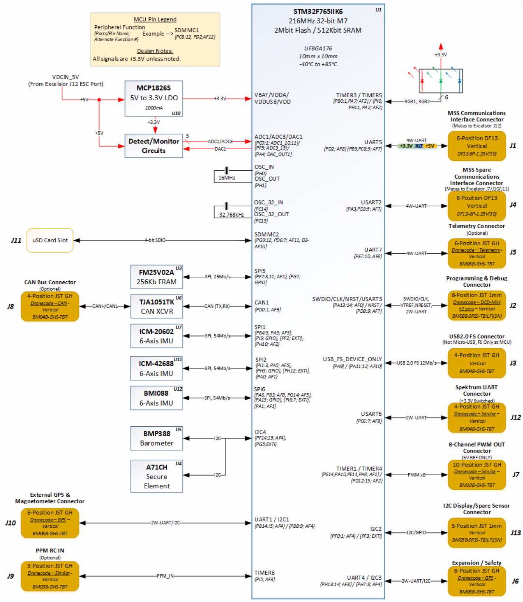

# ModalAI Flight Core v1 Controller

The [ModalAI](http://www.modalai.com/) FlightCore is a flight controller made in the USA. 
The Flight Core can be paired with ModalAI VOXL for obstacle avoidance and GPS-denied navigation, or used independently as a standalone flight controller.

Buy [Here](https://www.modalai.com/products/flight-core)

See Flight Core Documentation [Here](https://docs.modalai.com/flight-core/)

See Flight Core Datasheet [Here](https://docs.modalai.com/flight-core-datasheets/)

## Features

| Feature          | Details                                                                                                                                                         |
|:-----------------|:----------------------------------------------------------------------------------------------------------------------------------------------------------------|
| Weight           | 6 g                                                                                                                                                             |
| MCU              | 216MHz, 32-bit ARM M7 [STM32F765II](https://www.st.com/en/microcontrollers-microprocessors/stm32f765ii.html)                                                    |
| Memory           | 256Kb FRAM                                                                                                                                                      |
|                  | 2Mbit Flash                                                                                                                                                     |
|                  | 512Kbit SRAM                                                                                                                                                    |
| IMUs             | [ICM-20602](https://www.invensense.com/products/motion-tracking/6-axis/icm-20602/) (SPI1)                                                                       |
|                  | [ICM-42688-P](https://invensense.tdk.com/products/motion-tracking/6-axis/icm-42688-p/) (SPI2)                                                                   |
|                  | [BMI088](https://www.bosch-sensortec.com/bst/products/all_products/bmi088_1) (SPI6)                                                                             |
| Barometer        | [BMP388](https://www.bosch-sensortec.com/bst/products/all_products/bmp388) (I2C4)                                                                               |
| Secure Element   | [A71CH](https://www.nxp.com/products/security-and-authentication/authentication/plug-and-trust-the-fast-easy-way-to-deploy-secure-iot-connections:A71CH) (I2C4) |
| microSD Card     | [Information on supported cards](https://dev.px4.io/v1.9.0/en/log/logging.html#sd-cards)                                                                        |
| Inputs           | GPS/Mag                                                                                                                                                         |
|                  | Spektrum                                                                                                                                                        |
|                  | Telemetry                                                                                                                                                       |
|                  | CAN bus                                                                                                                                                         |
|                  | PPM                                                                                                                                                             |
| Outputs          | 6 LEDs (2xRGB)                                                                                                                                                  |
|                  | 8 PWM Channels                                                                                                                                                  |
| Extra Interfaces | 3 serial ports                                                                                                                                                  |
|                  | I2C                                                                                                                                                             |
|                  | GPIO                                                                                                                                                            |

## Pinout

For detailed pinout descriptions see [FlightCore Pinout](https://docs.modalai.com/flight-core-datasheets-connectors/)

## Dimensions

## Block Diagram

## UART Mapping

The UARTs are marked Rn and Tn in the above pinouts. The Rn pin is the
receive pin for UARTn. The Tn pin is the transmit pin for UARTn.

 - SERIAL0 -> USB
 - SERIAL1 -> UART7 (Telem1)
 - SERIAL2 -> UART5 (Telem2)
 - SERIAL3 -> USART1 (GPS)
 - SERIAL4 -> UART4 (GPS2)
 - SERIAL5 -> USART2
 - SERIAL6 -> USART6 (spektrum RCIN)
 - SERIAL7 -> USART3
 - SERIAL8 -> USB2

## RC Input

RC input is configured on both the PPM input pin and the "spektrum"
USART6 UART. The PPM pin supports all one-way RC protocols. For
protocols requiring half-duplex serial to transmit telemetry (such as
FPort) you should use the spektrum port, mapped to SERIAL6. Both PPM
and spektrum ports are enabled for RCIN by default.

## PWM Output

The ModalAI_v1 supports up to 8 PWM outputs on the PWM output connector

The PWM is in 2 groups:

 - PWM 1, 2, 3, 4 in group1
 - PWM 5, 6, 7, 8 in group2

Channels within the same group need to use the same output rate. If
any channel in a group uses DShot then all channels in the group need
to use DShot.

## Power Monitoring

In addition to the normal range of ArduPilot power monitoring options,
the modalAI build supports two I2C power monitors, the INA231 and the
LTC2946. The FlightCore board comes with the INA231 and you should set
BATTERY_MONITOR to 21. For the LTC2946 based power brick you should
set BATTERY_MONITOR to 22.

## Compass

The ModalAI_v1 does not have a built-in compass, but you can attach an
external compass

