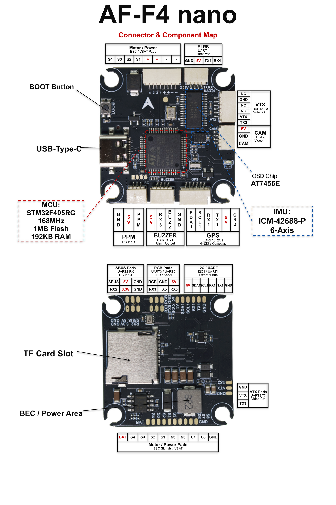

# novaX AF-F4 nano Flight Controller

The novaX AF-F4 nano is a STM32F405-based FPV flight controller by novaX.



## Specifications

- **MCU:** STM32F405RG (168MHz, 1MB Flash, 192KB RAM)
- **IMU:** ICM-42688-P on SPI1
- **Barometer:** SPL06 on I2C1 (0x76)
- **OSD:** AT7456E (MAX7456 compatible) on SPI2
- **SD Card:** SPI3 (TF card slot)
- **USB:** Type-C
- **Motor Outputs:** 8 PWM (M2/M4 bidirectional DShot capable)
- **UARTs:** 6 (USART1/2/3/6, UART4/5)
- **ADC:** Battery voltage/current, RSSI
- **LED Strip:** WS2812 on PA8
- **GPS / Compass:** external on the P3 connector (u-blox MAX-M10S + QMC5883P)

## UART Mapping

The Connector column lists the board's silkscreen connector, not CPU pins.

| Serial  | Port   | Connector           | Default Protocol |
|---------|--------|---------------------|------------------|
| SERIAL0 | USB    | USB-C               | MAVLink2         |
| SERIAL1 | USART1 | GPS                 | GPS              |
| SERIAL2 | USART2 | SBUS / RC pads      | RCIN             |
| SERIAL3 | USART3 | VTX                 | None             |
| SERIAL4 | UART4  | ELRS                | None             |
| SERIAL5 | UART5  | ESC telemetry       | ESC Telemetry    |
| SERIAL6 | USART6 | spare pads          | None             |

## RC Input

Serial RC defaults to SERIAL2 (the **SBUS** pads), which is set to `RCIN` and
accepts SBUS, CRSF and other serial protocols. The **ELRS** connector is on
SERIAL4 and defaults to `None`; set `SERIAL4_PROTOCOL 23` to run an ELRS/CRSF
receiver there instead.

## Battery Monitoring

A single battery monitor is enabled by default with voltage and current
sensing (`BATT_VOLT_MULT` 11.0, `BATT_CURR_SCALE` 25.0). Adjust to match the
connected power module / ESC current sensor.

## Motor Outputs

Outputs 1-8 are available. Set `MOT_PWM_TYPE` to a DShot mode to use DShot;
outputs 2 and 4 (TIM4/TIM3) additionally support bidirectional DShot. Output 9
(PA8, TIM1) drives the WS2812 LED strip (enabled by default via
`SERVO9_FUNCTION 120`).

## Additional I/O

- Analog RSSI input on ADC pin 15 (`BOARD_RSSI_ANA_PIN`); set `RSSI_TYPE 1` to use it.
- Camera control / user relay output on PB14 (`RELAY2`).
- ESC telemetry input on SERIAL5 (UART5 RX).

## Building

```bash
./waf configure --board novaX-AF-F4_nano
./waf copter
```
