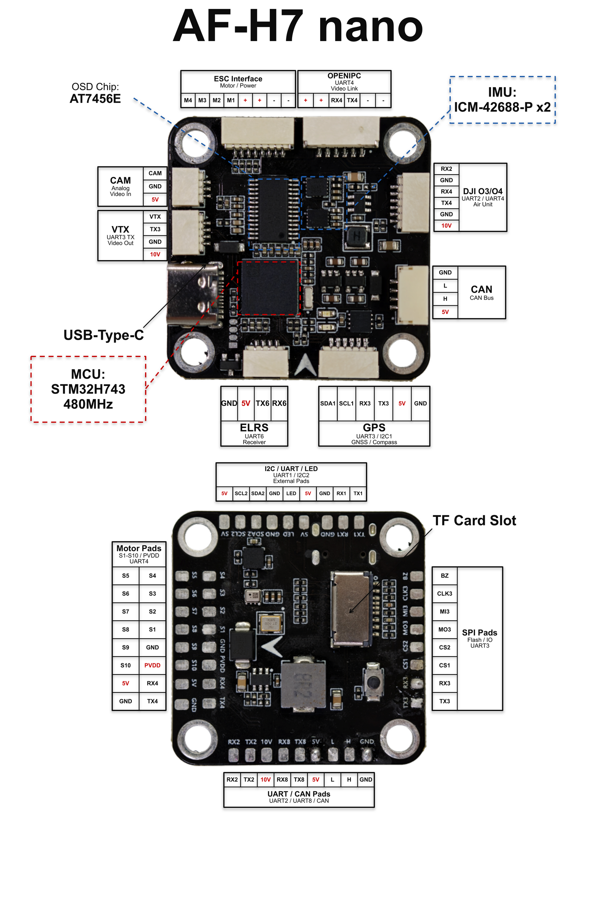

# novaX AF-H7 nano Flight Controller

The novaX AF-H7 nano is a STM32H743-based flight controller by novaX.



## Specifications

- **MCU:** STM32H743VIH6 (480MHz, 2MB Flash, TFBGA-100)
- **IMU:** Dual ICM-42688-P on SPI1 + SPI4
- **Barometer:** DPS310 or SPA06-003 on I2C2 (0x76)
- **Compass:** onboard IST8310 on I2C2 (0x0E)
- **OSD:** AT7456E (MAX7456 compatible) on SPI2
- **CAN:** FDCAN1 with TJA1051TK/3 transceiver
- **SD Card:** SDMMC1 (4-bit)
- **USB:** Type-C (OTG_FS)
- **Motor Outputs:** 10 PWM (M1-M4 bidirectional DShot capable)
- **UARTs:** 7 (USART1/2/3/6, UART4/7/8)
- **ADC:** Dual battery voltage/current, RSSI, airspeed
- **LED Strip:** WS2812 on PA8

## UART Mapping

The Connector column lists the board's silkscreen connector, not CPU pins.

| Serial  | Port   | Connector                  | Default Protocol       |
|---------|--------|----------------------------|------------------------|
| SERIAL0 | USB    | USB-C                      | MAVLink2               |
| SERIAL1 | USART1 | I2C/UART external pads     | MAVLink2               |
| SERIAL2 | USART2 | DJI O3/O4 air unit         | MAVLink2               |
| SERIAL3 | USART3 | GPS                        | GPS                    |
| SERIAL4 | UART4  | OpenIPC / DJI O3 (video)   | MSP DisplayPort        |
| SERIAL6 | USART6 | ELRS / RC                  | RCIN                   |
| SERIAL7 | UART7  | spare pads                 | MAVLink2               |
| SERIAL8 | UART8  | spare pads                 | MAVLink2               |

## RC Input

The RC receiver connector (silkscreen **ELRS**) is on SERIAL6 (USART6) and
defaults to `RCIN`, supporting CRSF/ELRS, SBUS and other serial protocols. To
take RC from the DJI O3/O4 air unit on SERIAL2 instead, set `SERIAL2_PROTOCOL 23`.

## GPS and Compass

The **GPS** connector is on SERIAL3 (USART3) plus I2C1 for an external compass.
An onboard IST8310 is present on the internal I2C bus.

## Video / OSD

- Onboard AT7456E analog OSD (`OSD_TYPE 1`).
- SERIAL4 (UART4) defaults to MSP DisplayPort for the OpenIPC / DJI O3 digital
  video link. The VTX pad exposes USART3 TX for analog VTX control if SERIAL3 is
  repurposed from GPS.

## Battery Monitoring

Battery monitor 1 is enabled by default with voltage and current sensing
(divider 11.0, current scale 40.0 A/V). A second battery input (BATT2 voltage
and current pins) is wired but left disabled; set `BATT2_MONITOR` to enable it.

## Motor Outputs

Outputs 1-10 are available. Outputs 1-4 support bidirectional DShot (M1-M2 on
TIM3, M3-M4 on TIM5). M5-M6 share the TIM5 group, M7-M10 are on TIM4, and the
WS2812 LED strip is output 11 (PA8, TIM1). DShot on M7-M10 shares a DMA stream
with the OSD SPI.

## Additional I/O

- Analog RSSI input on ADC pin 8 (`BOARD_RSSI_ANA_PIN`); set `RSSI_TYPE 1` to use it.
- Analog airspeed input on ADC pin 4.
- Four user GPIOs, `PINIO1`-`PINIO4`, usable as relays or servo outputs.
- Buzzer output, and a GPIO to control the CAN transceiver silent pin.

## Building

```bash
./waf configure --board novaX-AF-H7_nano
./waf copter
```
