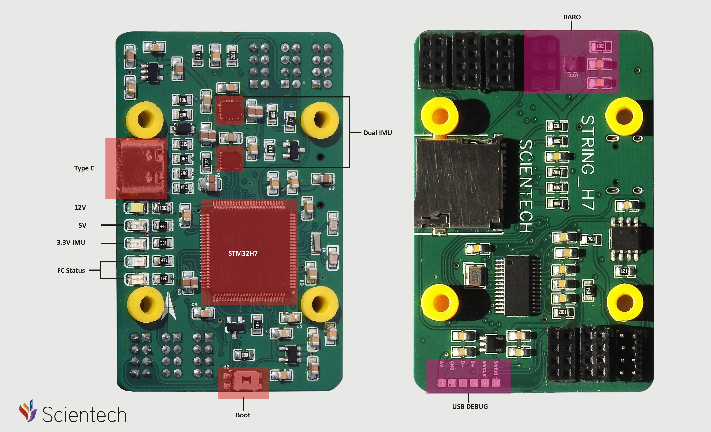
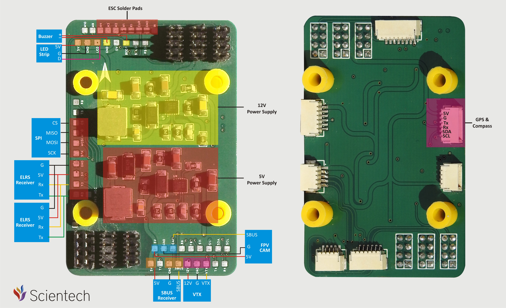

# Scientech H743-STRING (scientechH7v1)

Scientech H743-STRING flight controller board definition for ArduPilot (ChibiOS).

This README documents the hardware mapping as defined in:
`libraries/AP_HAL_ChibiOS/hwdef/scientechH7v1/hwdef.dat`

---

## Overview

- Board name: Scientech H743-STRING (`scientechH7v1`)
- MCU: STM32H743xx (STM32H7xx)
- Clock: 8 MHz external oscillator
- Flash: 2048 KB
- Bootloader reserve: 128 KB (`FLASH_RESERVE_START_KB 128`)
- USB: OTG1 (USB VCP enabled)

USB strings:
- Manufacturer: Scientech
- Product: scientechH7v1_String

---

## Features

- Dual IMU (SPI):
  - IMU1: Invensensev3 on SPI1 (CS = PC15)
  - IMU2: Invensensev3 on SPI4 (CS = PE11)
- Barometer:
  - DPS310 on I2C bus 0 (I2C2), address `0x76`
- OSD:
  - AT7456E/MAX7456 compatible OSD on SPI2 (CS = PB12)
- microSD:
  - SDMMC1 with FATFS enabled (`FATFS_HAL_DEVICE SDCD1`, `HAL_OS_FATFS_IO 1`)
- CAN:
  - CAN1 on PD0/PD1, Silent GPIO on PD3
- Analog inputs:
  - Battery voltage on PC0
  - Battery current on PC1
  - Analog airspeed on PC4
  - Analog RSSI on PC5
- Indicators:
  - LED0 (blue) on PE9
  - LED1 (green) on PA7
- Buzzer:
  - Alarm output on PA15 (TIM2_CH1)

---

## Board Images / Pinout




---

## Serial Port Mapping (SERIALx)

`SERIAL_ORDER OTG1 UART7 USART1 USART2 USART3 UART8 UART4 USART6 OTG2`

> Note: OTG2 is listed in SERIAL_ORDER but OTG2 pins are not defined in hwdef. OTG1 (USB) is the USB VCP interface.

| ArduPilot Port | Peripheral | Pins | Intended Use / Notes | Default Protocol |
|---|---|---|---|---|
| SERIAL0 | OTG1 (USB VCP) | PA11/PA12 | MAVLink / Setup | MAVLink (via USB) |
| SERIAL1 | UART7 | RX=PE7, TX=PE8 | GPS | GPS |
| SERIAL2 | USART1 | RX=PA10, TX=PA9 | ESC Telemetry (NODMA) | ESCTelemetry |
| SERIAL3 | USART2 | RX=PD6, TX=PD5 | SBUS on RX (optional) | None |
| SERIAL4 | USART3 | RX=PD9, TX=PD8 | Telemetry2 / MAVLink (optional) | None |
| SERIAL5 | UART8 | RX=PE0, TX=PE1 | ELRS/CRSF receiver (recommended) | RCIN |
| SERIAL6 | UART4 | RX=PB8, TX=PB9 | VTX (optional) | None |
| SERIAL7 | USART6 | RX=PC7, TX=PC6 | Air Unit / UART device (optional) | None |

---

## RC Input

### Recommended: CRSF / ELRS on SERIAL5 (UART8)
Connect your CRSF receiver to:
- RX: PE0 (UART8_RX)
- TX: PE1 (UART8_TX)

Typical parameters:
- `SERIAL5_PROTOCOL = 23`  (RCIN)
- `SERIAL5_BAUD = 420`     (common CRSF rate)

If CRSF is not detected, enable it in `RC_PROTOCOLS` (depending on ArduPilot version).

### Optional: SBUS on SERIAL3 (USART2 RX)
Connect SBUS signal to:
- RX: PD6 (USART2_RX)

Typical parameters:
- `SERIAL3_PROTOCOL = 23` (RCIN)

If your SBUS line requires inversion and your hardware does not invert it, set the appropriate `SERIAL3_OPTIONS` inversion bit (depends on your wiring/inverter).

> Do not run two receivers at once unless you intentionally configure redundancy.

---

## PWM Outputs

The board provides 12 motor/servo outputs plus one LED-strip output:

### Outputs 1–12
| Output # | MCU Pin | Timer Channel |
|---:|---|---|
| 1 | PB0 | TIM8_CH2N |
| 2 | PB1 | TIM8_CH3N |
| 3 | PA0 | TIM5_CH1 |
| 4 | PA1 | TIM5_CH2 |
| 5 | PA2 | TIM5_CH3 |
| 6 | PA3 | TIM5_CH4 |
| 7 | PD12 | TIM4_CH1 |
| 8 | PD13 | TIM4_CH2 |
| 9 | PD14 | TIM4_CH3 |
| 10 | PD15 | TIM4_CH4 |
| 11 | PE5 | TIM15_CH1 |
| 12 | PE6 | TIM15_CH2 |

### LED Strip Output (WS2812)
| Output # | MCU Pin | Timer Channel | Notes |
|---:|---|---|---|
| 13 | PA8 | TIM1_CH1 | WS2812 LED strip |

---

## OSD

OSD is enabled in hwdef:
- `OSD_ENABLED = 1`
- `HAL_OSD_TYPE_DEFAULT = 1` (MAX7456/AT7456E)

SPI wiring:
- SPI2 SCK/MISO/MOSI: PB13/PB14/PB15
- CS: PB12 (`MAX7456_CS`)

---

## microSD / Logging

microSD is enabled via SDMMC1:
- D0..D3: PC8..PC11
- CK: PC12
- CMD: PD2
- `FATFS_HAL_DEVICE SDCD1`
- `HAL_OS_FATFS_IO 1`

Use a FAT32-formatted card for best compatibility.

---

## Battery Monitor / Power

Battery sensing is configured:
- Voltage sense: PC0 (ADC1)
- Current sense: PC1 (ADC1)

Defaults from hwdef:
- `BATT_MONITOR = 4`
- `BATT_VOLT_PIN = 10`
- `BATT_CURR_PIN = 11`
- `BATT_VOLT_MULT = 11.0`
- `BATT_AMP_PERVLT = 40.0`

Calibration:
1. Measure battery voltage with a multimeter and tune `BATT_VOLT_MULT`.
2. Verify current with a known load and tune `BATT_AMP_PERVLT`.

---

## Airspeed (Analog)

Analog airspeed input:
- PC4 (ADC1)
- Default pin: `HAL_DEFAULT_AIRSPEED_PIN = 4`

---

## RSSI (Analog)

Analog RSSI input:
- PC5 (ADC1)
- `BOARD_RSSI_ANA_PIN = 8`

---

## CAN

CAN1:
- RX: PD0
- TX: PD1
- Silent pin: PD3 (`GPIO_CAN1_SILENT`)

---

## LEDs / Buzzer

- LED0 (blue): PE9
- LED1 (green): PA7
- Buzzer/Alarm: PA15 (TIM2_CH1)

---

## Building Firmware (Developer)

From ArduPilot repo root:

```bash
./waf distclean
./waf configure --board scientechH7v1
./waf copter

## Loading Firmware

Initial firmware load can be done with DFU by plugging in USB with the bootloader button pressed. Then you should load the "with_bl.hex" firmware, using your favourite DFU loading tool.

Once the initial firmware is loaded you can update the firmware using any ArduPilot ground station software. Updates should be done with the *.apj firmware files.
