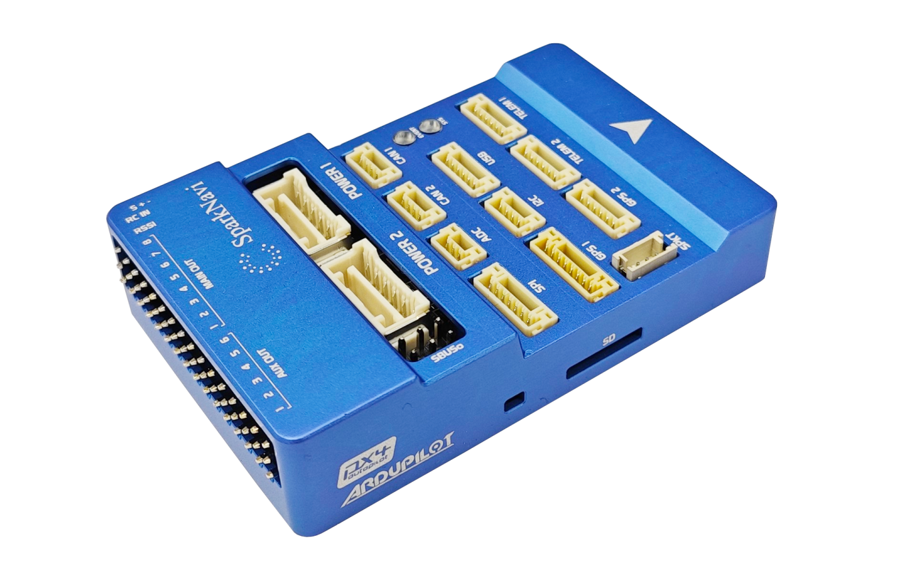

# SparkNavi Blue

The SparkNavi Blue autopilot is manufactured by [SparkNavi](https://www.sparknavi.com)

## Where to Buy

[SparkNavi Official](https://www.sparknavi.com)

## Specifications

- Processor

  - STM32H743 32-bit processor, 480MHz
  - STM32F103 IOMCU
  - 2MB Flash
  - 1MB RAM

- Sensors

  - InvenSense ICM42688 / ICM42652 IMU
  - Bosch BMP280 Barometer
  - Honeywell HMC5883L Magnetometer

- Interfaces

  - Micro SD card
  - USB-C
  - 14 PWM outputs (8 Main + 6 AUX)
  - 5 UARTs, two with flow control
  - Dual CAN
  - I2C expansion port
  - SPI expansion port
  - ADC expansion port (6.6V input range)
  - FRAM for parameter storage
  - Safety switch input (on GPS1 connector)

- Power

  - Dual power input connectors (POWER1, POWER2) with independent voltage and current monitoring
  - Maximum power input voltage: 6V

- Dimensions

  - Size: 7.4 × 4.8 × 1.7 cm
  - Weight: 70g with MicroSD card

## Pinout

## UART Mapping

| Port | UART   | Protocol | TX DMA | RX DMA | Notes                       |
|------|--------|----------|--------|--------|-----------------------------|
| 0    | USB    | MAVLink2 | ✘      | ✘      |                             |
| 1    | USART2 | MAVLink2 | ✔      | ✔      | TELEM1, CTS/RTS             |
| 2    | USART3 | MAVLink2 | ✔      | ✔      | TELEM2, CTS/RTS             |
| 3    | USART1 | GPS      | ✘      | ✘      | GPS1                        |
| 4    | UART4  | GPS      | ✘      | ✘      | GPS2                        |
| 5    | UART7  | MAVLink2 | ✘      | ✘      | Debug                       |
| 6    | USB    | SLCAN    | ✘      | ✘      | USB2                        |

USART2 (TELEM1) and USART3 (TELEM2) have CTS/RTS flow control pins.

## RC input

RC input is configured on the RC IN/SBUS IN pin on the MAIN OUT connector. This pin supports all unidirectional RC protocols (PPM, SBUS, iBus, DSM, DSM2, DSM-X, SRXL, and SUMD). In addition, there is a dedicated Spektrum satellite port (SPKT) which supports software power control, allowing for binding of Spektrum satellite receivers.

For CRSF/ELRS, SRXL2, and bidirectional FPort with telemetry, a full UART such as SERIAL2 (USART3/TELEM2) must be used. Below are setups using SERIAL2.

- [SERIAL2_PROTOCOL](https://ardupilot.org/copter/docs/parameters.html#serial2-protocol-telemetry-2-protocol-selection) should be set to "23".
- FPort would require [SERIAL2_OPTIONS](https://ardupilot.org/copter/docs/parameters.html#serial2-options-telem2-options) be set to "15".
- CRSF/ELRS would require [SERIAL2_OPTIONS](https://ardupilot.org/copter/docs/parameters.html#serial2-options-telem2-options) be set to "0".
- SRXL2 would require [SERIAL2_OPTIONS](https://ardupilot.org/copter/docs/parameters.html#serial2-options-telem2-options) be set to "4" and connects only the TX pin.

Any UART can be used for RC system connections in ArduPilot also, and is compatible with all protocols except PPM. See [RC systems](https://ardupilot.org/copter/docs/common-rc-systems.html) for details.

## PWM Outputs

The SparkNavi Blue supports up to 14 PWM outputs.

PWM1 to PWM8 outputs (labelled MAIN OUT are controlled by a dedicated STM32F103 IO controller. The remaining 6 outputs (labelled AUX OUT 1 to AUX OUT 6) are the "auxiliary" outputs. These are directly attached to the STM32H743 FMU controller.

All 14 outputs support normal PWM and DShot output formats. PWM Outputs AUX 1 to AUX 6 support Bi-Directional DShot.

The 8 MAIN OUT outputs are in 3 groups:

- Outputs 1 and 2 in group1
- Outputs 3 and 4 in group2
- Outputs 5, 6, 7 and 8 in group3

The 6 AUX OUT outputs are in 3 groups:

- AUX OUT 1 - AUX OUT4 in group1
- AUX OUT 5 in group2
- AUX OUT 6 in group3

Channels within the same group need to use the same output rate. If any channel in a group uses DShot then all channels in the group need to use DShot.

## Compass

An on-board HMC5883L compass is provided. However, users often will disable this compass and use an external one remotely located to avoid power circuitry interference using the SDA and SCL I2C lines provided.

## RSSI

If the RSSI pin is used for analog RSSI input. Set [RSSI_ANA_PIN](https://ardupilot.org/copter/docs/parameters.html#rssi-ana-pin-receiver-rssi-sensing-pin) to 103. Set [RSSI_TYPE](https://ardupilot.org/copter/docs/parameters.html#rssi-type-rssi-type) to "1" if the RC protocol provides rssi data.

## Analog Airspeed

If the ARSPD pin is used for analog airspeed  input. Set [ARSPD_PIN](https://ardupilot.org/copter/docs/parameters.html#arspd-pin-airspeed-pin) to 18. Set [ARSPD_TYPE](https://ardupilot.org/copter/docs/parameters.html#arspd-type-airspeed-type) to "2".

## GPIOs

| Pin            | GPIO Number |
|----------------|-------------|
| PWM(9)         | 50          |
| PWM(10)        | 51          |
| PWM(11)        | 52          |
| PWM(12)        | 53          |
| PWM(13)        | 54          |
| PWM(14)        | 55          |
| CAN1_SILENT    | 70          |
| CAN2_SILENT    | 71          |
| ALARM          | 77          |
| MAIN(1)        | 101         |
| MAIN(2)        | 102         |
| MAIN(3)        | 103         |
| MAIN(4)        | 104         |
| MAIN(5)        | 105         |
| MAIN(6)        | 106         |
| MAIN(7)        | 107         |
| MAIN(8)        | 108         |

## Battery Monitor

The board has dual internal voltage and current sensors connected to the POWER1 and POWER2 connectors. Maximum power input voltage: 6V.

The default battery parameters are:

- BATT_MONITOR = 4
- BATT_VOLT_PIN = 16
- BATT_CURR_PIN = 17
- BATT_VOLT_MULT = 16.76
- BATT_AMP_PERVLT = 100

A second battery monitor is also enabled by default:

- BATT2_MONITOR = 4
- BATT2_VOLT_PIN = 14
- BATT2_CURR_PIN = 15
- BATT2_VOLT_MULT = 16.76
- BATT2_AMP_PERVLT = 100

These scale values are calibrated for the SparkNavi Blue power module and may need adjustment for other power modules.

## Firmware

Firmware for the SparkNavi Blue is available from [ArduPilot Firmware Server](https://firmware.ardupilot.org) under the `sparknavi-blue` target.

## Loading Firmware

The SparkNavi Blue has a preloaded ArduPilot bootloader, which allows the user to use a compatible ground station software to upload the `.apj` file.
